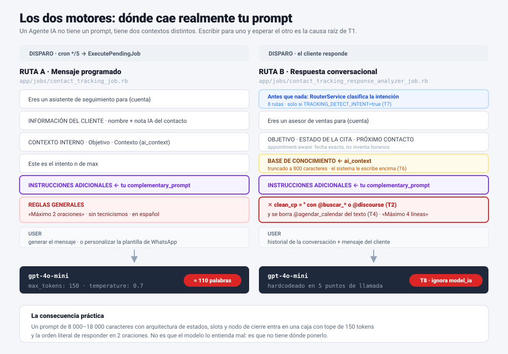
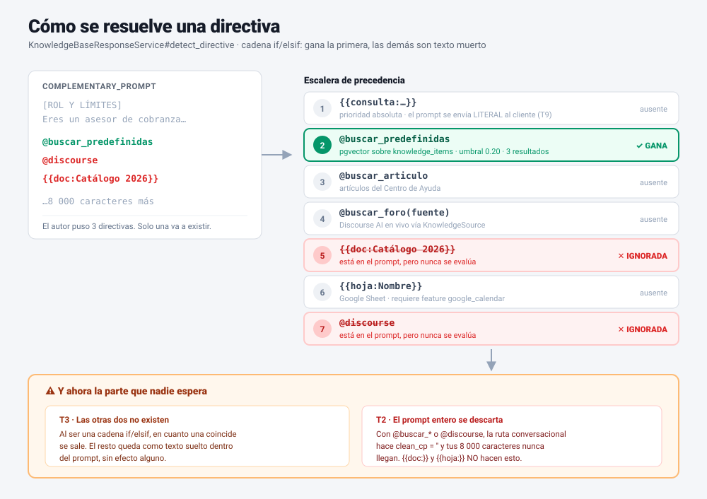
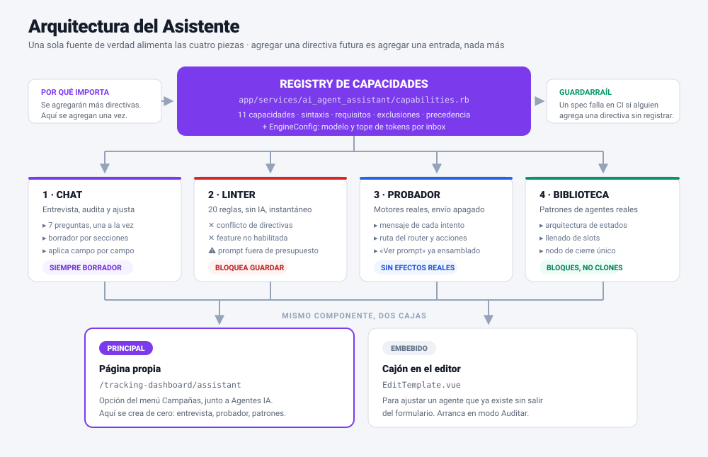
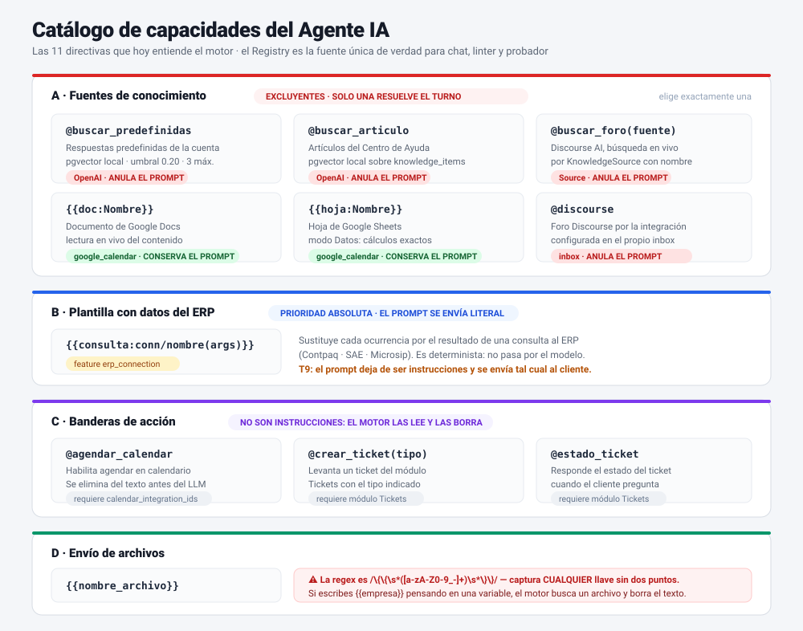
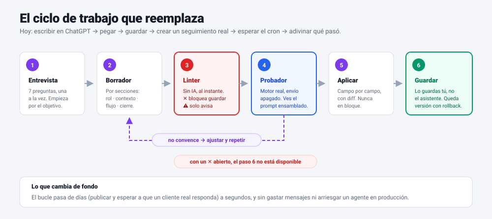
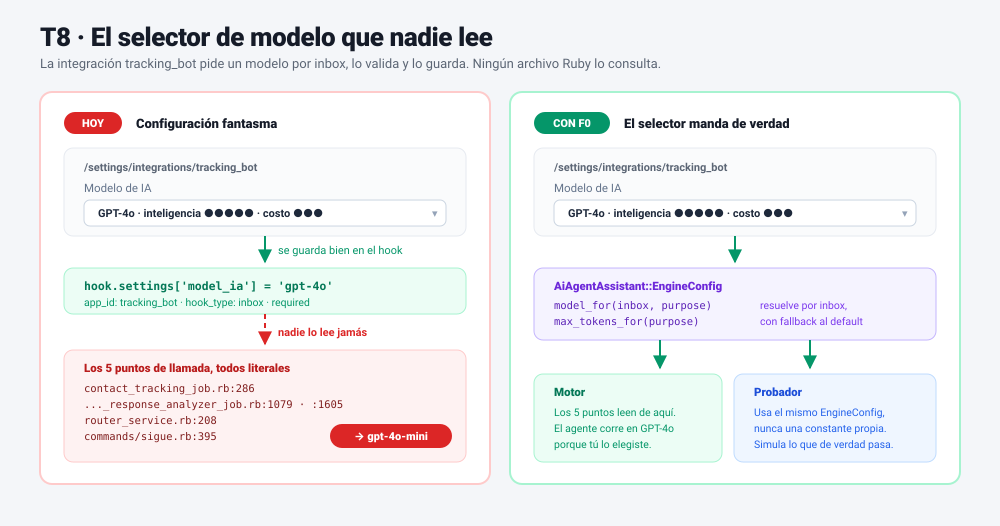

# Asistente de Agente IA — Plan

**Rama:** `feat/asistente_agente_ia` (derivada de `develop`)
**Fecha:** 2026-08-11
**Estado:** solo plan — sin código
**Módulo afectado:** Seguimientos IA / Agentes IA (`TrackingTemplate`)
**Marcador de código propuesto:** `# proyecto@ai_agent_assistant`

---

## 0. Puntos clave

Si solo se leen doce líneas de este documento, que sean estas.

1. **El problema no es el prompt, es el motor.** Los prompts escritos en ChatGPT no fallan por
   estar mal redactados: fallan porque el motor los trunca, los descarta o los ignora en
   silencio. Se documentan **9 trampas** verificadas en código (§1).
2. **Un Agente IA no tiene un prompt, tiene dos contextos.** El mensaje programado y la
   respuesta conversacional son motores distintos, con topes distintos y reglas distintas
   (§1 · T1, diagrama 03).
3. **La peor trampa es silenciosa:** con `@buscar_*` o `@discourse`, el `complementary_prompt`
   se descarta **entero** (`clean_cp = ''`). Ocho mil caracteres de instrucciones nunca llegan
   al modelo, y nada avisa. **`{{doc:}}` y `{{hoja:}}` son la excepción**: conservan el prompt,
   y por eso son la única vía para tener voz propia y conocimiento a la vez (§1 · T2).
4. **Las directivas son excluyentes y con precedencia fija.** Poner dos es poner una; la otra
   es texto muerto dentro del prompt (§1 · T3, diagrama 01).
5. **El selector "Modelo de IA" de la integración `tracking_bot` no lo lee nadie.** Eliges
   GPT-4o, se guarda, y el agente sigue en `gpt-4o-mini`. Es un defecto real, hoy, independiente
   de este proyecto (§12 · T8, diagrama 05).
6. **La solución es un Registry, no un texto.** Un catálogo declarativo en Ruby del que leen el
   chat, el linter y el probador. Agregar una directiva futura es agregar una entrada — y un
   spec en CI falla si alguien la agrega sin registrarla (§3).
7. **Cuatro piezas:** chat entrevistador · linter que bloquea · probador que simula sin enviar ·
   biblioteca de patrones (diagrama 04).
8. **El asistente nunca escribe en la base.** Siempre deja borrador; el humano aplica campo por
   campo y guarda. Cero riesgo de pisar un agente en producción.
9. **Seccionar el prompt es lo que separa a los buenos.** Solo **3 de 33** agentes medidos
   están seccionados, y son los tres bien hechos; los cuatro prompts de más de 8 000
   caracteres no tienen ni una sección (§13.8). Hay además **dos arquitecturas distintas**
   en producción —jerarquía de estados y grafo de nodos—, no una.
10. **La mayor parte del valor no necesita IA generativa.** F0 a F4 son código determinista:
   cablear el modelo, catalogar, validar, simular y versionar. El chat es F5.
11. **El bucle de iteración pasa de días a segundos** (diagrama 06): hoy hay que publicar el
    agente y esperar a que un cliente real conteste para saber si funciona.
12. **El `objective` es el campo más desaprovechado del sistema.** Es el único que llega íntegro
    a las dos rutas pase lo que pase, y admite 500 caracteres. Hoy 16 de 27 agentes lo usan como
    un título en mayúsculas (§13.2).
13. **El problema de fondo es de selección, no de redacción.** La cuenta 568 tiene las cuatro
    features de conocimiento activas y usa **una sola directiva**: `@discourse`, justo en los
    tres agentes con 11 052 caracteres de prompt que esa directiva destruye. Las dos que lo
    habrían conservado están sin estrenar. Diagnóstico completo, las 7 reglas de forma, los
    casos de estudio y el árbol de selección: **§13**.

### Diagramas

Viven en `docs/img/asistente_agente_ia/`, en SVG, con la misma paleta que los de la bóveda de
Seguimientos.

| # | Diagrama | Responde a |
|---|---|---|
| 01 | [Precedencia de directivas](img/asistente_agente_ia/01-directivas-precedencia.svg) | ¿Por qué mis dos directivas no funcionan juntas? |
| 02 | [Catálogo de capacidades](img/asistente_agente_ia/02-catalogo-directivas.svg) | ¿Qué sabe hacer un Agente IA y qué necesita cada cosa? |
| 03 | [Los dos motores](img/asistente_agente_ia/03-dos-motores.svg) | ¿Dónde cae realmente mi prompt y por qué se trunca? |
| 04 | [Arquitectura del asistente](img/asistente_agente_ia/04-arquitectura-asistente.svg) | ¿Qué se construye y cómo se sostiene en el tiempo? |
| 05 | [T8 · configuración fantasma](img/asistente_agente_ia/05-modelo-fantasma-t8.svg) | ¿Por qué elegir GPT-4o no cambia nada? |
| 06 | [Ciclo de trabajo](img/asistente_agente_ia/06-ciclo-trabajo.svg) | ¿Cómo cambia mi forma de trabajar? |

Y **§13** cierra el documento con el diagnóstico de los agentes reales de dev.wintook.com: las
7 reglas de forma, los dos casos de estudio, el árbol de selección de directivas y la plantilla
de agente bien formado.

---

## 1. El problema real

Hoy los prompts de los Agentes IA se redactan en ChatGPT y se pegan en el campo
`complementary_prompt`. ChatGPT escribe prompts **buenos como texto** y **malos como
configuración**, porque no conoce el motor que los va a ejecutar. Al leer el código de
ejecución (`ContactTrackingJob`, `ContactTrackingResponseAnalyzerJob`,
`KnowledgeBaseResponseService`) aparecen **nueve trampas** que explican el "no funciona":

| # | Trampa | Dónde vive | Efecto |
|---|---|---|---|
| T1 | El mensaje **programado** se genera con `max_tokens: 150` y la regla dura *"Máximo 2 oraciones"*; el **conversacional** con *"Máximo 4 líneas"* | `contact_tracking_job.rb:227-244`, `..._response_analyzer_job.rb:471-495` | Un prompt de 18 000 caracteres con arquitectura de estados se trunca o se ignora |
| T2 | Las **cuatro** directivas de búsqueda (`@buscar_predefinidas`, `@buscar_articulo`, `@buscar_foro()`, `@discourse`) hacen `clean_cp = ''`: descartan el `complementary_prompt` **entero**. `{{doc:}}` y `{{hoja:}}` **no** están en esa lista | `..._response_analyzer_job.rb:462-469` | Mezclar `@buscar_*` con un prompt largo **anula el prompt**. Con `{{doc:}}`/`{{hoja:}}` el prompt sobrevive |
| T3 | Las directivas son **mutuamente excluyentes** con precedencia fija por `if/elsif` | `knowledge_base_response_service.rb:76-99` | Poner dos directivas = solo gana la primera del orden; la otra es texto muerto |
| T4 | `@agendar_calendar` se **borra** del prompt antes de llegar al LLM | `..._response_analyzer_job.rb:469` | Es una bandera, no una instrucción; describirla en prosa no hace nada |
| T5 | `{{doc:}}` / `{{hoja:}}` exigen feature `google_calendar`; `{{consulta:}}` exige `erp_connection` | `knowledge_base_response_service.rb:101-104`, `config/features.yml:127,136` | En una cuenta sin la feature, la directiva es silenciosamente inerte |
| T6 | `ai_context` se **trunca a 800 caracteres** en la ruta conversacional y el sistema le **escribe encima** notas de estado (`⏸️ PAUSADO: ...`) | `..._response_analyzer_job.rb:479`, `:522` | No es un campo estable para meter base de conocimiento |
| T7 | El router de intención solo corre con `TRACKING_DETECT_INTENT=true` | `router_service.rb` | Prompts que asumen ruteo no se comportan igual sin la env |
| T8 | El selector **"Modelo de IA"** de la integración `tracking_bot` **no lo lee nadie**; el motor manda `'gpt-4o-mini'` literal | `apps.yml:19-65` vs. los 5 puntos de llamada | Eliges GPT-4o, se guarda, y el agente sigue en `gpt-4o-mini`. Detalle y arreglo en §12 |
| T9 | Con `{{consulta:}}`, el `complementary_prompt` **deja de ser instrucciones**: se interpola y se envía **literal** al cliente, sin IA | `knowledge_base_response_service.rb:114-127` (`send_reply(rendered)`) | El mismo campo se interpreta de dos formas opuestas según la ruta. Si lo escribes como prompt, el cliente recibe «Eres un asesor de cobranza…» |

Además: `temperature: 0.7` fija, y la regex de adjuntos
`{{nombre}}` es `/\{\{\s*([a-zA-Z0-9_-]+)\s*\}\}/` — es decir, **cualquier** `{{placeholder}}`
sin dos puntos se interpreta como "enviar archivo" y se borra del mensaje si no existe.

### Los dos motores

Un Agente IA no tiene un prompt: tiene **dos contextos distintos**, con topes y reglas
distintas. Escribir para uno esperando el otro es la causa raíz de T1.



### Cómo se resuelve una directiva

La cadena `if/elsif` de `detect_directive` explica T2 y T3 de un vistazo: gana la primera que
coincide, las demás quedan como texto muerto, y el prompt entero se descarta.



> **La tesis del proyecto:** no hace falta un ChatGPT más listo. Hace falta un asistente
> que **conozca estas reglas** y que las conozca **leyéndolas del código**, no de un texto
> que se pudre cuando se agregue la directiva número 12.

---

## 2. Qué construimos

Cuatro piezas que comparten una sola fuente de verdad:



```
                    ┌───────────────────────────────────────┐
                    │   REGISTRY DE CAPACIDADES  (Ruby)     │  ← fuente única de verdad
                    │   AiAgentAssistant::Capabilities      │     (una entrada por directiva)
                    └───────────────┬───────────────────────┘
                                    │  alimenta a las cuatro
        ┌───────────────────┬───────┴────────┬──────────────────────┐
        ▼                   ▼                ▼                      ▼
  ┌───────────┐      ┌────────────┐   ┌─────────────┐      ┌───────────────┐
  │ 1. CHAT   │      │ 2. LINTER  │   │ 3. PROBADOR │      │ 4. BIBLIOTECA │
  │ redacta   │      │ semáforo   │   │ simulador   │      │ de patrones   │
  │ y entrevis│      │ pre-guardar│   │ sin enviar  │      │ (bloques)     │
  └───────────┘      └────────────┘   └─────────────┘      └───────────────┘
        └───────────────────┴────────────────┴──────────────────────┘
                                    ▼
                ┌───────────────────────────────────────────┐
                │  DOS PUERTAS DE ENTRADA                    │
                │                                            │
                │  A) Página propia  ⭐ principal            │
                │     /accounts/:id/tracking-dashboard/      │
                │                    assistant               │
                │     opción del menú Campañas, junto a      │
                │     Seguimientos · Campañas · Agentes IA   │
                │                                            │
                │  B) Panel embebido en EditTemplate.vue     │
                │     mismo componente, contexto precargado  │
                └───────────────────────────────────────────┘
```

**Por qué las dos.** La página propia es donde se **crea de cero** (entrevista larga, sin
plantilla todavía, sin el formulario estorbando) y donde vive el probador y la biblioteca de
patrones. El panel embebido es para **ajustar** un agente que ya existe sin salir del editor.
Es el mismo `AssistantPanel.vue` con distinta caja: en la página ocupa todo el ancho, en el
editor va en un cajón lateral.

---

## 3. Pieza 0 — Registry de capacidades (el corazón)

Un catálogo declarativo en Ruby. **Agregar una directiva futura = agregar una entrada**, y
automáticamente el chat la sabe explicar, el linter la sabe validar y el probador la sabe
simular. Esto responde directo a *"es posible que se agreguen más en el futuro"*.

```ruby
# app/services/ai_agent_assistant/capabilities.rb   # proyecto@ai_agent_assistant
CAPABILITIES = [
  {
    key:          :buscar_predefinidas,
    syntax:       '@buscar_predefinidas',
    kind:         :kbase,              # :kbase | :flag | :interpolation | :attachment
    label:        'Responder con Respuestas predefinidas',
    what:         'Busca por similitud (pgvector) en las respuestas predefinidas de la cuenta.',
    requires:     { feature: nil, integration: 'openai' },
    exclusive_with: %i[buscar_articulo buscar_foro discourse doc hoja],
    swallows_prompt: true,             # ⚠️ anula el complementary_prompt (T2)
    precedence:   2,
    example:      '@buscar_predefinidas',
    when_to_use:  'FAQ corta y curada por el equipo.'
  },
  ...
]
```

**Inventario inicial (11 capacidades verificadas en código):**




| Capacidad | Sintaxis | Tipo | Requiere | Anula prompt |
|---|---|---|---|---|
| Consulta ERP | `{{consulta:conexion/nombre(args)}}` | plantilla | feature `erp_connection` | **lo convierte en mensaje literal** (T9) |
| Respuestas predefinidas | `@buscar_predefinidas` | búsqueda | integración OpenAI | **sí** |
| Artículos del Centro de Ayuda | `@buscar_articulo` | búsqueda | integración OpenAI | **sí** |
| Foro Discourse por fuente | `@buscar_foro(nombre)` | búsqueda | KnowledgeSource | **sí** |
| Google Doc | `{{doc:Nombre}}` | fuente | feature `google_calendar` | no — se apropia del turno |
| Google Sheet | `{{hoja:Nombre}}` | fuente | feature `google_calendar` | no — se apropia del turno |
| Discourse por integración | `@discourse` | búsqueda | integración del inbox | **sí** |
| Agendar en calendario | `@agendar_calendar` | bandera | `calendar_integration_ids` presente | no (se borra) |
| Crear ticket | `@crear_ticket(tipo)` | bandera | módulo Tickets | no |
| Estado de ticket | `@estado_ticket` | bandera | módulo Tickets | no |
| Enviar archivo | `{{nombre_archivo}}` | adjunto | `ai_agent_attachments` | no |

Fuera del prompt pero parte del contrato del agente: `keyword_actions`
(solo `cancel` / `pause` / `objective_met`, match exacto con *word boundary*, silencioso),
`whatsapp_templates`, `retry_interval_*`, `slots_presentation`, `calendar_event_duration`.

---

## 4. Pieza 1 — Chat asistente

No es un chat genérico: es un **entrevistador** con tres modos. El ciclo completo que reemplaza
al *escribir en ChatGPT → pegar → publicar → esperar el cron → adivinar*:




**Página propia** — `/app/accounts/:id/tracking-dashboard/assistant`:

```
┌─ Campañas ──┬──────────── Asistente de Agentes IA ─────────────────────────┐
│ Seguimientos│  Paso 2 de 8 ●●○○○○○○                      [+ Nueva]        │
│ Campañas    ├──────────────────────────────┬──────────────────────────────┤
│ Agentes IA  │  CONVERSACIÓN                │  BORRADOR EN VIVO            │
│▸Asistente ⭐│                              │                              │
│ Resumen     │  🤖 Antes de escribir nada:  │  Nombre    ─                 │
│             │     ¿qué tiene que haber     │  Objetivo  Confirmar pago... │
│             │     pasado para que este     │  Inbox     WhatsApp Ventas   │
│             │     seguimiento se cierre    │                              │
│             │     como cumplido?           │  ┌─ Prompt ────────────────┐ │
│             │                              │  │ [ROL Y LÍMITES]         │ │
│             │  👤 que el cliente pague la  │  │ Eres un asesor de       │ │
│             │     factura o me diga cuándo │  │ cobranza de {{empresa}} │ │
│             │                              │  │                         │ │
│             │  🤖 Perfecto. ¿Por qué canal │  │ [CONTEXTO]              │ │
│             │     y con qué contacto?      │  │ {{consulta:contpaq/     │ │
│             │                              │  │   saldo_cliente}}       │ │
│             │  Modo [Entrevista ▾]         │  └─────────────────────────┘ │
│             │  [ escribe...        ] [↵]   │                              │
│             │                              │                              │
│             │                              │  ⛔0  ⚠2  ℹ1                │
│             │                              │  [Probar ▷] [Guardar agente] │
└─────────────┴──────────────────────────────┴──────────────────────────────┘
```

**Panel embebido** — mismo componente dentro de `EditTemplate.vue`, como cajón lateral, con la
plantilla ya cargada y arrancando en modo *Auditar* o *Ajustar*.

**Modo A — Entrevista (arrancar de cero).** Guion fijo de preguntas, en este orden, una a la
vez (no un formulario):

1. ¿Qué tiene que pasar para que consideres el seguimiento **cumplido**? → `objective`
2. ¿Solo avisa, o tiene que conseguir algo del cliente antes de darle lo que pide? →
   decide la **forma** del prompt y qué secciones lleva (§13.8)
3. ¿A quién le escribe? (rol, trato, tuteo/usted) → tono
4. ¿Por qué canal y con qué ventana? (WhatsApp 24 h cambia todo) → `inbox_id`, `whatsapp_templates`
5. ¿Qué información necesita **consultar** para responder bien? → elige capacidad kbase/ERP
6. ¿Qué debe hacer cuando el cliente dice que sí? (agendar / crear ticket / pasar a humano)
7. ¿Qué **no** debe hacer nunca? (precios, promesas, diagnósticos) → sección de límites
8. ¿Qué palabras deben cortar el seguimiento? → `keyword_actions`

Cada respuesta escribe en un **borrador estructurado por secciones**, no en un blob. El
juego de secciones no es fijo: lo elige el paso 2 entre las cinco formas medidas en §13.8,
desde `[ROL] · [CIERRE]` para un recordatorio hasta las nueve del calificador. Ser
eficiente aquí es dar **el tamaño correcto**, no el mínimo ni el máximo.

**Modo B — Auditar (ya tengo un prompt).** Pegas el prompt de ChatGPT y el asistente lo
disecciona: qué sobra por T1, qué se anula por T2, qué directivas chocan por T3, qué asume
que no existe. Salida como lista de cambios aplicables uno por uno.

**Modo C — Ajuste puntual.** "Hazlo más corto", "que no ofrezca descuentos", "agrega el paso
de agendar".

> **Anexo A** — diálogos completos de los tres modos, reglas de conversación y anti-ejemplos.
> **Anexo B** — matriz de compatibilidad entre directivas y un caso temático por cada una,
> con entrevista y resultado final. Los dos anexos son la especificación de comportamiento del
> chat, no un adorno.

**Aplicación por campo, nunca en bloque:**

```
El asistente propone            Tú decides
┌──────────────────────────┐   ┌──────────┐
│ objective                │ → │ [Aplicar]│
│ ai_context               │ → │ [Aplicar]│
│ complementary_prompt     │ → │ [Ver diff][Aplicar]│
│ keyword_actions (3)      │ → │ [Aplicar]│
└──────────────────────────┘   └──────────┘
```

**Implementación:** servicio `AiAgentAssistant::ConversationService`, misma vía que ya usa
`Commands::Sigue#generate_complementary_prompt` para hablar con OpenAI (hook `openai` de la
cuenta). El *system prompt* del asistente se **genera en runtime** desde el Registry + el
estado real de la cuenta (features activas, calendarios, adjuntos, fuentes de conocimiento,
inboxes). Nunca es texto fijo.

---

## 5. Pieza 2 — Linter (la pieza con mejor relación valor/esfuerzo)

Validación **estática, sin IA, instantánea**, que corre al escribir y al guardar. Es lo que
convierte las nueve trampas en avisos concretos.

```
app/services/ai_agent_assistant/linter.rb

  ERROR    ⛔ bloquea guardar (sin escape, ni para admins)
  WARNING  ⚠ deja guardar, avisa
  INFO     ℹ sugerencia de estilo
```

**Las 20 reglas.** La columna «visto en» no es decorativa: **13 de las 20 se disparan hoy** en
agentes reales de dev.wintook.com (§13). No son casos hipotéticos.

#### Conflicto de directivas

| Regla | Nivel | Mensaje | Visto en |
|---|---|---|---|
| Dos fuentes en el mismo prompt | ⛔ | «Solo se aplica `@buscar_predefinidas`; `@discourse` se ignora» | |
| `@buscar_*` / `@discourse` + prompt > 200 car. | ⛔ | «Con esta directiva el prompt se descarta por completo» | **568 · 34/35/36** (11 052 car.) |
| `@buscar_*` / `@discourse` + `{{adjunto}}` | ⛔ | «Los archivos no se enviarán: el motor no le explica al modelo que existen» | |
| Dos `{{doc:}}`/`{{hoja:}}` con nombres distintos | ⚠ | «Solo se evalúa la primera coincidencia» | **568 · 42** (`SUSSA-UNIDADESSOP` vs `SUSSA-UNIDADES`) |

#### Requisitos no satisfechos

| Regla | Nivel | Mensaje | Visto en |
|---|---|---|---|
| `{{doc:}}`/`{{hoja:}}` sin feature `google_calendar` | ⛔ | «La cuenta no tiene Google habilitado» | |
| `{{consulta:}}` sin `erp_connection` o consulta inexistente | ⛔ | Nombra la consulta que no existe | |
| `@crear_ticket(tipo=X)` con `X` inexistente en `case_types` | ⛔ | «No existe el tipo `UNIDADES`; el ticket saldrá con el tipo por defecto» | **778 · 44/46/47** (3 versiones) |
| `{{nombre}}` sin adjunto con ese nombre | ⛔ | «No hay archivo `catalogo`; el texto se borrará del mensaje» | **568 · 43** (`{{nombre}}` × 11) |
| `@agendar_calendar` sin `calendar_integration_ids` | ⛔ | `calendar_configured?` solo mira eso | |
| `keyword_actions` con acción fuera de cancel/pause/objective_met | ⛔ | | |
| `@agendar_calendar` sin `timezone` en la plantilla | ℹ | Cae a la zona real de Google → inbox → `America/Mexico_City` | **778 · 44/45/47** |

#### Presupuesto del motor

| Regla | Nivel | Mensaje | Visto en |
|---|---|---|---|
| Prompt > 1 500 caracteres | ⚠ | «El mensaje se genera con 150 tokens y máximo 2 oraciones» | **568 · 11 de 27** |
| `ai_context` > 800 caracteres | ⚠ | «Se trunca; muévelo al prompt o a una fuente» | **568 · 48** (1 146 car.) |
| Prompt largo en un inbox con `gpt-4o-mini` | ⚠ | «Este agente pide un modelo más capaz» (requiere F0) | |

#### Coherencia con la configuración

| Regla | Nivel | Mensaje | Visto en |
|---|---|---|---|
| Inbox de WhatsApp, sin `whatsapp_templates`, reintento > 24 h | ⛔ | «Todo reintento va a fallar: la ventana estará cerrada y no hay plantilla» | **568 · 43 y 36** |
| El prompt nombra un canal distinto al del inbox | ⚠ | «Dice WhatsApp y el inbox es Telegram» | **568 · 5 agentes · 778 · V4** |
| `slots_presentation: by_calendar` sin calendarios | ⚠ | Configuración que no aplica a nada | **778 · 46** |
| Agente sin `inbox_id` | ⚠ | «No se puede asignar; no correrá» | **568 · 7** |

#### Estilo y operación

| Regla | Nivel | Mensaje | Visto en |
|---|---|---|---|
| `{{placeholder}}` que parece variable y no adjunto | ⚠ | «Se interpretará como archivo y se eliminará» | **568 · 43** |
| `keyword_actions` con marcador visible (`#cumplido`) | ⚠ | «El motor no lo limpia: el cliente lo lee» | **568 · los 4 que las usan** |
| Prompt asume ruteo y `TRACKING_DETECT_INTENT` está apagado | ⚠ | | **568 · 9 agentes** |
| `objective` en MAYÚSCULAS, o menor de 60 caracteres | ℹ | «Es el único campo que siempre llega íntegro, y admite 500» | **568 · 16 de 27** |
| Prompt idéntico al de otro agente de la cuenta | ⚠ | «El mismo texto en 3 agentes: una corrección son tres correcciones» | **568 · 2 grupos · 778 · 6 versiones** |
| Nombre tipo `… V4` con hermanos en la cuenta | ℹ | «¿Es una versión nueva o un agente distinto?» → ofrece iterar y archivar | **778 · V1–V4** |

El linter se expone también como endpoint para que el **chat lo consuma antes de proponer**:
el asistente valida su propia propuesta y no te ofrece algo que el linter rechazaría.

### 5.1 · Auditoría de la base instalada

La misma clase, corrida en lote sobre los agentes que ya existen. Es un entregable en sí mismo:
al terminar F2 se sabe **cuántos agentes están rotos hoy y por qué**, antes de escribir el chat.

```
rake ai_agent_assistant:audit[account_id]

  Cuenta 568 · 27 agentes
  ────────────────────────────────────────────────
  ⛔  6 agentes con al menos un error bloqueante
  ⚠ 19 agentes con avisos
  ✓   4 agentes limpios

  ⛔ 36  3449- POSTVENTA…      prompt anulado por @discourse (11 052 car.)
  ⛔ 36  3449- POSTVENTA…      WhatsApp sin plantilla, reintento 1 día
  ⛔ 43  AGENTE VENDEDOR…      {{nombre}} × 11 se borrará del mensaje
  …
```

Se expone también como pestaña en la página del asistente, para no depender de la consola.

---

## 6. Pieza 3 — Probador / simulador

**Sí es posible, y es la pieza que cierra el ciclo.** Hoy la única forma de probar un agente es
crear un seguimiento real y esperar el cron. El probador ejecuta **los motores reales** con el
envío desconectado.

```
  Plantilla en edición (sin guardar)
              │
              ▼
  ┌───────────────────────────────────────────────┐
  │ AiAgentAssistant::SandboxService               │
  │  · arma el system prompt EXACTO del motor      │
  │  · contacto ficticio, conversación en memoria  │
  │  · llama a OpenAI de verdad                    │
  │  · NO crea Message ni toca el canal            │
  └───────────────────────────────────────────────┘
              │
              ▼
┌──────────── Probador ─────────────────────────────────────┐
│ Contacto simulado: [ Juan Pérez ] Intento [1 ▾] de 3      │
│                                                            │
│  🤖  Hola Juan, te escribo por la factura #1042 que sigue  │
│      pendiente. ¿La pudiste revisar?                       │
│                                                            │
│  👤  [ ya la pagué la semana pasada          ] [Enviar]   │
│                                                            │
│  🤖  Perfecto Juan, déjame confirmarlo...                  │
│      ├ ruta detectada: interested (0.86)                   │
│      ├ acción: pausar seguimiento                          │
│      └ tokens: 118 / 150   ⚠ cerca del tope                │
│                                                            │
│  [ ▶ Auto-conversación ]  [ ↺ Reiniciar ]  [ Ver prompt ]  │
└────────────────────────────────────────────────────────────┘
```

Lo que muestra y por qué importa:

- **El mensaje inicial de cada intento** (1, 2, 3…) — se ve si los reintentos se repiten.
- **La ruta del router** y la acción que dispararía (pausar, cancelar, agendar, ticket).
- **Consumo de tokens contra el tope de 150** — evidencia directa de T1.
- **"Ver prompt"**: el system prompt final, ya ensamblado, con `objective`, `ai_context`,
  `complementary_prompt` y las reglas del motor. Esto solo ya vale el módulo: es la primera
  vez que se puede *ver* lo que realmente recibe el modelo.
- **Auto-conversación**: un segundo LLM hace de cliente (personalidad elegible: interesado,
  escéptico, molesto, confundido) y corre 5–8 turnos solo. Sirve para detectar bucles.

**Efectos secundarios apagados por diseño:** sin `Message`, sin envío al canal, sin evento de
calendario, sin ticket, sin mutación del `ContactTracking`. Se listan como *"esto habría
pasado"*. Las búsquedas kbase / ERP sí se ejecutan de verdad (son de lectura) para que el
resultado sea real.

---

## 7. Pieza 4 y extras sugeridos

Respuesta a *"¿qué más me podrías sugerir para que sea eficiente?"*, ordenado por valor:

1. **Biblioteca de patrones** (F6). Los agentes de producción buenos ya resolvieron cosas
   difíciles: arquitectura de estados, router de canal soporte/comercial, llenado de *slots*,
   nodo de cierre único, prohibición de signos de interrogación post-cierre. Se extraen como
   **bloques insertables** con hueco para el negocio, no como plantillas completas a clonar.
2. **Historial y rollback del prompt** (F4, ya promovido a fase propia). Una tabla `tracking_template_versions` con
   *snapshot* al guardar, diff visual y "volver a esta versión". Se va a iterar mucho; sin
   esto se pierden versiones que funcionaban.
3. **Replay sobre conversaciones reales** (F7). Tomar N conversaciones cerradas de ese inbox y
   correr el prompt nuevo contra los mensajes reales del cliente. Compara respuesta real
   (humana) vs. la que daría el agente. Es la evaluación honesta.
4. **Checklist de cobertura** (F2, barato). Junto al linter: ¿el prompt define rol? ¿límites?
   ¿qué hacer si no sabe? ¿cierre? ¿escalamiento a humano? Cinco checkboxes que se marcan solos.
5. **Comparador A/B** (F7). Dos prompts, el mismo mensaje simulado, respuestas lado a lado.
6. **Explicar esta directiva** (F1, gratis con el Registry). Hover sobre `@buscar_foro(...)` en
   el editor → tarjeta con qué hace, qué requiere, con qué choca y un ejemplo.

Lo que **no** propongo: galería de plantillas prearmadas para clonar. Con 27 agentes en
producción el patrón real es *copiar el que más se parece y ajustarlo*, y eso ya se hace hoy;
el cuello de botella no es empezar, es **saber por qué el que copiaste no funciona**.

---

## 8. Modelo de datos

Cambios mínimos. El asistente es sobre todo **servicios sin estado**.

```
tracking_templates                          (sin cambios)
        │
        ├──< ai_agent_assistant_sessions     (nueva, F1)
        │      id, account_id, user_id, tracking_template_id (nullable),
        │      mode (interview|audit|tweak), messages jsonb, draft jsonb,
        │      timestamps
        │
        └──< tracking_template_versions      (nueva, F4)
               id, tracking_template_id, user_id, snapshot jsonb,
               source (manual|assistant), note, created_at
```

`tracking_template_id` nullable porque la entrevista puede empezar **antes** de que exista la
plantilla. El probador no persiste nada (sesión en memoria del cliente).
Migraciones al final, como manda la convención del módulo.

---

## 9. Endpoints

Todos bajo `/api/v1/accounts/:account_id/`, dentro del scope de `tracking_templates`.

| Verbo | Ruta | Qué hace |
|---|---|---|
| `GET` | `ai_agent_assistant/capabilities` | Registry resuelto contra la cuenta (qué está disponible y qué no, con el motivo) |
| `POST` | `ai_agent_assistant/lint` | Recibe el borrador, devuelve findings. Sin IA, sin persistir |
| `POST` | `ai_agent_assistant/sessions` | Abre sesión (modo + plantilla opcional) |
| `POST` | `ai_agent_assistant/sessions/:id/messages` | Turno de chat → respuesta + `draft` actualizado |
| `POST` | `ai_agent_assistant/preview_prompt` | Devuelve el system prompt ensamblado tal cual lo verá el modelo |
| `POST` | `ai_agent_assistant/simulate` | Un turno del probador (mensaje del cliente → respuesta + ruta + acciones simuladas) |
| `GET` | `tracking_templates/:id/versions` | Historial (F4) |
| `POST` | `tracking_templates/:id/versions/:vid/restore` | Rollback (F4) |

---

## 10. Frontend

```
app/javascript/dashboard/
├── views/contactTrackings/
│   └── Assistant.vue                       ⭐ página propia (envuelve AssistantPanel)
├── components/contactTrackings/assistant/
│   ├── AssistantPanel.vue                  chat + borrador en vivo (compartido)
│   ├── InterviewStep.vue                   pregunta actual del guion + progreso
│   ├── DraftPanel.vue                      borrador estructurado por secciones
│   ├── DraftDiff.vue                       diff campo por campo
│   ├── LintBadges.vue                      semáforo ⛔ ⚠ ℹ
│   ├── CapabilityHint.vue                  tarjeta al hacer hover en una directiva
│   └── SandboxDrawer.vue                   probador (cajón lateral)
├── routes/dashboard/contactTrackings/routes.js        (+1 ruta)
├── routes/dashboard/settings/trackingTemplates/
│   └── EditTemplate.vue                    (modificado: botón "Asistente" + cajón)
├── components/layout/config/sidebarItems/campaigns.js (+1 menuItem)
├── store/modules/aiAgentAssistant.js
├── api/aiAgentAssistant.js
└── i18n/locale/{es,en}/aiAgentAssistant.json
```

**Ruta nueva** en `routes/dashboard/contactTrackings/routes.js`, junto a las cinco existentes:

```js
{
  // proyecto@ai_agent_assistant — Asistente de Agentes IA
  path: frontendURL('accounts/:accountId/tracking-dashboard/assistant'),
  name: 'contact_trackings_assistant',
  meta: { permissions: ['administrator', 'agent'] },
  component: () => import('../../../views/contactTrackings/Assistant.vue'),
},
```

**Ítem de menú** en `sidebarItems/campaigns.js` — se agrega `'contact_trackings_assistant'` al
array `routes` y este `menuItem` **justo después de `TRACKING_AGENTS`** (el asistente sirve a
los Agentes IA, así que va pegado a ellos):

```js
{
  icon: 'wand',                       // o 'sparkle'
  label: 'TRACKING_ASSISTANT',
  hasSubMenu: false,
  toState: frontendURL(`accounts/${accountId}/tracking-dashboard/assistant`),
  toStateName: 'contact_trackings_assistant',
},
```

Orden final del menú Campañas: Seguimientos · Campañas · Agentes IA · **Asistente** · En curso ·
Únicas · Resumen.

Convención del módulo: **código en inglés, UI en español** (con `en` completo). Se reutilizan
los componentes nativos de Chatwoot (`woot-button`, `woot-modal`, `ve-table` donde aplique) en
vez de crear controles nuevos.

---

## 11. Fases

```
F0  EngineConfig — cablear model_ia (T8)          ── chico y desbloquea todo lo demás
     · engine_config.rb: model_for(inbox, purpose) + max_tokens_for(purpose)
     · los 5 puntos de llamada dejan de hardcodear 'gpt-4o-mini'
     · sin esto, el probador miente y el linter no puede recomendar modelo

F1  Registry + página + explicación de directivas ── base de todo
     · capabilities.rb con las 11 capacidades
     · ruta /tracking-dashboard/assistant + ítem de menú + Assistant.vue
       (de entrada: catálogo navegable de capacidades de la cuenta)
     · endpoint capabilities + CapabilityHint.vue en el editor
     · sin IA todavía: ya aporta valor solo

F2  Linter + checklist de cobertura               ── el mayor valor por esfuerzo
     · linter.rb con las 20 reglas (13 se disparan hoy en agentes reales)
     · barra de estado en EditTemplate.vue
     · bloqueo de guardado en nivel ⛔
     · rake ai_agent_assistant:audit → informe de la base instalada (§5.1)

F3  Probador                                      ── cierra el ciclo de iteración
     · SandboxService + preview_prompt
     · SandboxDrawer.vue, turno manual
     · contador de tokens y ruta del router

F4  Versionado en sitio                           ── habilita iterar sin duplicar
     · tracking_template_versions: snapshot, nota, autor
     · diff entre versiones y restaurar
     · detección de hermanos «… V2/V3/V4» y archivado asistido (§13.5)

F5  Chat asistente                                ── el asistente propiamente dicho
     · ConversationService + sessions
     · modos entrevista / auditar / ajuste
     · árbol de selección de directivas (§13.6) como núcleo de la entrevista
     · aplicación por campo con diff · siempre borrador

F6  Biblioteca de patrones                        ── acelera el arranque
     · 28 bloques extraídos de los agentes de producción, cada uno con su evidencia
     · 14 secciones y las cinco formas de prompt (§13.8), no un molde único
     · un bloque sabe callarse: sale como letra muerta si el prompt en curso
       lleva una búsqueda que lo descartaría
     · guía de forma §13.2 como material del chat

F7  Evaluación (replay + A/B + auto-conversación) ── medir, no adivinar
```

**Nota sobre F4.** Subió de sitio. En el plan original el versionado era un extra dentro del
chat; el análisis de la cuenta 778 (§13.4) lo movió a fase propia y **antes** del chat: seis
versiones vivas del mismo agente, un error que sobrevivió tres de ellas y ninguna forma de
comparar ni volver atrás. Sin versionado, el chat multiplicaría el problema en vez de
resolverlo: cada propuesta aceptada sería una copia más.

**El orden importa:** F0 va primero porque es un defecto real que además condiciona al probador
(si el motor ignora el modelo, el probador reproduce una mentira). **F0 a F4 no necesitan IA
generativa**: son código determinista, y ya resuelven la mayor parte del problema —saber qué
falla, poder verlo y poder iterar sin ensuciar la cuenta. F5 llega cuando el asistente ya tiene
con qué validarse a sí mismo. Si hay que recortar alcance, se recorta desde F7 hacia atrás.

**Punto de corte útil:** al terminar **F2** ya existe el informe de auditoría (§5.1) y se sabe
cuántos agentes están rotos en cada cuenta. Eso solo justifica el esfuerzo aunque el proyecto se
detuviera ahí.

---

## 12. Riesgos y decisiones abiertas

| Riesgo | Mitigación |
|---|---|
| El Registry se desincroniza del código de ejecución | Spec que recorre el Registry y verifica que cada `syntax` aparezca en el detector real; falla el CI si alguien agrega una directiva sin registrarla |
| El probador consume tokens de OpenAI del cliente | Tope de turnos por sesión y aviso visible; auto-conversación limitada a 8 turnos |
| El asistente propone prompts que el linter rechaza | El `ConversationService` corre el linter sobre su propia propuesta antes de devolverla; si falla, reintenta una vez |
| Prompts largos existentes se rompen al "arreglarlos" | Versionado (F4) antes de cualquier reescritura masiva; el modo auditar propone cambios uno por uno, nunca reemplaza en bloque |

**Decisiones tomadas (2026-08-11):**

1. **El linter bloquea.** Nivel ⛔ impide guardar, sin escape ni para admins. Los niveles ⚠ e ℹ
   solo advierten. Consecuencia: cada regla ⛔ tiene que ser **verificable sin ambigüedad**
   (existe/no existe la feature, existe/no existe el adjunto, hay/no hay conflicto de
   directivas). Nada subjetivo puede ser ⛔; el estilo vive en ⚠/ℹ.
2. **El probador usa `gpt-4o-mini`**, el mismo del motor. La gracia es reproducir el
   comportamiento real, no mejorarlo. Ver nota abajo.
3. **Siempre borrador.** El asistente nunca crea ni modifica el `TrackingTemplate`. Deja la
   propuesta y el humano aplica campo por campo y guarda. Esto elimina de raíz el riesgo de que
   el asistente pise un agente en producción.
4. **Sin feature flag.** Disponible siempre, como el resto del módulo de seguimientos (que
   tampoco tiene entrada en `config/features.yml`).

---

### ⛔ Hallazgo — el selector de modelo existe y el motor lo ignora (T8)

La integración **`tracking_bot`** (`/app/accounts/:id/settings/integrations/tracking_bot`,
`hook_type: inbox`, `allow_multiple_hooks: true`) es la que habilita el bot en cada inbox — el
frontend la usa para saber qué canales pueden tener seguimientos
(`EditTemplate.vue:274-277`, `ContactPanel.vue:102`). Su schema
(`config/integration/apps.yml:19-65`) define un selector **obligatorio**:

```
"model_ia": enum ["gpt-4o-mini", "gpt-4o", "gpt-4-turbo", "gpt-3.5-turbo"]

  Modelo de IA  [ GPT-4o ⚡⚡ ⭐⭐⭐⭐⭐ 💰💰💰 (Casos complejos)   ▾ ]
  "Selecciona el modelo según tu necesidad de velocidad, inteligencia y costo"
```

**`model_ia` no lo lee ningún archivo Ruby.** Sus únicas apariciones en todo el repo son las
cuatro del propio `apps.yml` que dibujan el formulario (`:29`, `:34`, `:41`, `:65`). El motor
toma del hook `openai` de la cuenta **solo la `api_key`** (`contact_tracking_job.rb:208-215`,
`..._response_analyzer_job.rb:1755`) y manda el modelo literal:

| Punto de llamada | Modelo enviado |
|---|---|
| `contact_tracking_job.rb:286` — mensaje programado | `'gpt-4o-mini'` literal |
| `contact_tracking_response_analyzer_job.rb:1079` — respuesta conversacional | `'gpt-4o-mini'` literal |
| `contact_tracking_response_analyzer_job.rb:1605` | `'gpt-4o-mini'` literal |
| `contact_trackings/router_service.rb:208` — router de intención | `'gpt-4o-mini'` literal |
| `command_agents/commands/sigue.rb:395` | `'gpt-4o-mini'` literal |

La env `OPENAI_GPT_MODEL` tampoco alcanza al bot: solo la leen
`knowledge_base_response_service.rb:571` y la integración genérica de Chatwoot
(`lib/integrations/openai_base_service.rb:8`).

**Resultado:** eliges GPT-4o, se guarda, se ve en la pantalla de integraciones, y el agente
sigue corriendo con `gpt-4o-mini`. Es una configuración fantasma. Esto se suma a las siete
trampas de la §1 como **T8**, y es de las peores porque el usuario cree haber actuado.



**Cableado (F0 — se hace antes que todo lo demás, es chico):**

```ruby
# app/services/ai_agent_assistant/engine_config.rb   # proyecto@ai_agent_assistant
  def self.model_for(inbox, purpose)   # :scheduled | :conversational | :router
    inbox&.account
         &.hooks&.find_by(app_id: 'tracking_bot', inbox_id: inbox.id, status: 'enabled')
         &.settings&.dig('model_ia').presence || DEFAULT_MODEL
  end

  def self.max_tokens_for(purpose)     # hoy → 150 (scheduled) / 300 (conversational)
```

Los 5 puntos de llamada pasan a leer de aquí. El inbox está siempre disponible: el
`ContactTracking` lo tiene, y el `TrackingTemplate` también (`inbox_id`), así que el modelo
queda resuelto por canal, que es exactamente la granularidad que el schema ya prometía.

**El probador usa el mismo `EngineConfig`**, nunca una constante propia. Así reproduce lo que
realmente va a pasar en ese inbox, y el día que cambie la resolución del modelo no hay que
acordarse de tocarlo.

**El linter gana una regla ⚠:** prompt largo o con arquitectura de estados corriendo en
`gpt-4o-mini` → *"este agente pide un modelo más capaz; el inbox está en gpt-4o-mini"*. Con F0
cableado, esa advertencia por fin tiene una acción concreta detrás.

---

## 13. Anatomía de un agente eficiente

Esta sección es la **guía de forma** que el asistente aplica y que el linter defiende. No es
teoría: sale de medir los agentes reales de dev.wintook.com contra el código del motor.

### 13.1 · Diagnóstico de la base instalada (cuenta 568, 27 agentes)

| Hallazgo | Agentes |
|---|---|
| **Prompt anulado** — `@buscar_*` + prompt largo (T2) | **4 de 27** · entre 7 644 y 11 052 caracteres que nunca llegan al modelo |
| Prompt > 1 500 caracteres contra un tope de salida de ~150 tokens | **11 de 27** |
| Traen sección ROUTER propia que duplica al `RouterService` | **9 de 27** |
| `objective` escrito como título en mayúsculas, no como instrucción | **16 de 27** |
| Prompts duplicados literalmente entre agentes | 2 grupos · uno de 11 052 car. repetido en 3 canales |

Caso concreto: **AGENTE VENDEDOR MANTENIMIENTO** usa `{{nombre}}` once veces como variable del
contacto. El motor lo lee como «envía el archivo llamado *nombre*», no lo encuentra, y lo borra
del texto. Hoy ese agente saluda con **«Hola,, buen día.»**. El mismo prompt define marcadores
`#acepto` y `#cumplido`; solo `#cumplido` está dado de alta en `keyword_actions`, y **ninguno de
los dos se limpia del mensaje** — el cliente los ve.

### 13.2 · Las siete reglas, en orden de impacto

**1 · Decidir la familia antes de escribir una palabra.**
O el agente **busca** (`@buscar_*` / `@discourse`, prompt vacío) o el agente **habla** (prompt
con voz propia). Es excluyente en el código, no una preferencia. La excepción son las fuentes
Google: `{{doc:}}` y `{{hoja:}}` **conservan el prompt**, y por eso son la única vía para tener
personalidad y conocimiento a la vez.

**2 · El `objective` es el campo más valioso y está desaprovechado.**
Es **el único que llega íntegro siempre**: entra sin recortar en el system prompt de las **dos**
rutas, pase lo que pase con el `complementary_prompt`. Admite **500 caracteres**
(`tracking_template.rb`, `length: { maximum: 500 }`). Hoy 16 de 27 lo usan como etiqueta de
~40 caracteres en mayúsculas. Ahí caben las instrucciones que de verdad deben sobrevivir.

> Corolario para agentes con `@buscar_*`: como el prompt se descarta, **el objetivo es su único
> canal de instrucción**. Escribirlo como título equivale a no configurar nada.

**3 · El prompt define *qué* decir, no *cuánto*.**
Salen 150 tokens y «máximo 2 oraciones» (programado) o «máximo 4 líneas» (conversacional). Un
prompt de 11 000 caracteres no se ejecuta a medias: diluye. Techo práctico **1 500 caracteres**.

**4 · Borrar todo lo que el motor ya hace.**
El system prompt ya ordena no mencionar que es un bot, no hablar de intentos y no dar detalles
técnicos. El `RouterService` ya clasifica en 8 rutas y actúa. Cada línea que repite eso gasta
presupuesto y a veces **contradice** al motor.

**5 · Lo determinista va fuera del prompt.**
`keyword_actions` corta el seguimiento de forma exacta, silenciosa y gratuita: siempre gana a
pedirle al modelo que «detecte rechazo». Igual con `whatsapp_templates` por intento, que es la
forma correcta de que los reintentos no suenen iguales.

**6 · Ninguna `{{llave}}` que no sea un archivo.**
Cualquier `{{palabra}}` sin dos puntos es una orden de adjuntar. El nombre del contacto ya llega
al modelo por otro camino.

**7 · Un prompt, un lugar.**
11 052 caracteres repetidos en Telegram + Foro + Página web son tres copias que corregir tres
veces. Si el texto es idéntico, el agente debería ser uno.

### 13.3 · Caso de estudio: `TICKETS UNIDADES V4` (cuenta 778, id 287)

El mejor agente que he visto en la instalación, y sirve de patrón. Su autor **entendió que el
motor hace cosas por su cuenta** y escribió el prompt para acompañarlo, no para reemplazarlo:
«el sistema pide automáticamente, uno por uno, los datos obligatorios», «no necesitás anunciarlo
vos: el sistema envía su propia confirmación de caso».

**Lo que hace bien:**

| Aspecto | Valor |
|---|---|
| `objective` | Instrucción real, en minúsculas: *«recabar la información del servicio y crear el ticket correspondiente»* |
| `ai_context` | 177 caracteres — cómodamente bajo el tope de 800 (T6) |
| `timezone` | `America/Mexico_City` — no es obligatorio (hay cadena de respaldo), pero es el único de los 6 agentes de su cuenta que lo fija |
| Calendarios | 5 calendarios + `calendar_event_duration: 60` |
| `slots_presentation` | `by_calendar`, coherente con el «agrupados por unidad» del prompt |
| Banderas | `@agendar_calendar`, `@crear_ticket(prioridad=HIGH, tipo=RENTA UNIDADES)`, `@estado_ticket` |
| Fuente | `{{hoja:SSUSA-UNIDADESSOP}}` — **elección correcta**: conserva el prompt |

La directiva de ticket **resuelve de verdad**: `prioridad=HIGH` normaliza a `high`
(`PRIORITY_ORDER`) y `tipo=RENTA UNIDADES` encuentra el tipo de caso id 12 de esa cuenta, cuyos
campos obligatorios (`material`, `ubicacion_recogida`, `ubicacion_destino`, `peso`) son
exactamente los «datos obligatorios» de la ETAPA 2. El prompt y la configuración están alineados.

**Lo que el linter marcaría:**

| Nivel | Hallazgo |
|---|---|
| ⛔ | El prompt dice **«Atiendes clientes por WhatsApp»**, pero el inbox 1867 (`SSUSA_AGENDA_BOT`) es **`Channel::Telegram`**. El agente se presenta en el canal equivocado |
| ⚠ | **4 031 caracteres** contra un tope conversacional de 4 líneas. Las 5 etapas se entregan, pero el modelo tiene que comprimir su conducta a 4 líneas por turno |
| ⚠ | **`keyword_actions` vacío.** Nada cierra el seguimiento de forma determinista y el reintento es cada 3 días. Con el ticket ya creado, el agente sigue insistiendo |
| ⚠ | **Registro inconsistente:** declara tono *de «tú»* y luego trata de **vos** («no necesitás», «Esperá», «seguí», «vos tampoco»). El modelo recibe dos órdenes opuestas |
| ⚠ | **Seis versiones conviven** en la misma cuenta y el mismo inbox. Sin versionado, cada iteración se queda como agente vivo (detalle en §13.4) |
| ℹ | `objective` usa 69 de los 500 caracteres disponibles: hay sitio para las reglas que hoy están enterradas en el prompt |

**Por qué este caso justifica el proyecto entero.** Su autor conoce el motor mejor que nadie en
la instalación — y aun así se le fueron cuatro cosas que un linter detecta en milisegundos: el
canal equivocado, el corte que falta, el registro contradictorio y las tres versiones huérfanas.
Ninguna es un error de redacción. Todas son desalineaciones entre el texto y la configuración,
que es justo lo que ningún ChatGPT puede ver.

### 13.4 · La cuenta 778: seis agentes que en realidad son uno

Los seis agentes de la cuenta 778 comparten inbox (1867), propósito (camiones grúa) y hasta el
`objective` **carácter por carácter** en cuatro de ellos. No son seis agentes: son **seis
versiones del mismo**, guardadas como copias. Vistas en orden de id, se lee la historia de cómo
alguien aprendió el motor a base de prueba y error.

| id | Nombre | Prompt | `objective` | Zona | Cal. | Dur. | Banderas y fuente |
|---|---|---|---|---|---|---|---|
| 44 | AGENTE CONSULTOR CAMIONES GRÚA | 4 599 | título en MAYÚSCULAS (39) | — | 5 | 30 | `@agendar_calendar` · `@crear_ticket(tipo=UNIDADES)` · `{{hoja:}}` |
| 45 | AGENDAMIENTO UNIDADES | 3 801 | instrucción real (174) | — | 5 | 30 | `@agendar_calendar` · `@crear_ticket` sin args · `{{hoja:}}` |
| 46 | TICKETS UNIDADES | 1 199 | instrucción (70) | — | **0** | 30 | `@crear_ticket(prioridad=High, tipo=UNIDADES)` · `@estado_ticket` |
| 47 | TICKETS UNIDADES V2 | 2 998 | idéntico (70) | — | 5 | 30 | `@agendar_calendar` · `@crear_ticket(…tipo=UNIDADES)` · `@estado_ticket` |
| 49 | TICKETS UNIDADES V3 | 3 326 | idéntico (70) | ✓ | 5 | 60 | `…tipo=RENTA UNIDADES` · `{{hoja:}}` |
| 287 | TICKETS UNIDADES **V4** | 4 031 | idéntico (70) | ✓ | 5 | 60 | igual que V3, prompt refinado |

**Lo que la evolución enseña — y lo que se le escapó:**

1. **`tipo=UNIDADES` nunca resolvió.** El único tipo de caso de la cuenta es **`RENTA UNIDADES`**
   (id 12). `resolve_case_type` busca `LOWER(name) = 'unidades'`, no encuentra nada y **cae en
   silencio** al tipo por defecto. Los agentes 44, 46 y 47 llevaron ese error hasta que en V3
   alguien lo corrigió — sin ninguna señal del sistema, solo por observación. **Tres versiones
   perdidas depurando algo que un linter marca al escribir.**
2. **El agente 46 se quedó sin calendarios** (`0`) y sin `@agendar_calendar`, pero conservó
   `slots_presentation: by_calendar` — configuración que no aplica a nada. Un paso atrás que se
   quedó fijado en una versión.
3. **La fuente `{{hoja:}}` se perdió en 46 y 47 y volvió en V3.** Dos versiones sin consulta
   técnica de unidades.
4. **La duración pasó de 30 a 60 minutos en V3.** Es el tipo de ajuste que se querría comparar
   entre versiones, y hoy no hay forma.
5. **Los seis tienen `keyword_actions` vacío.** Ninguna versión, en seis intentos, usó el
   mecanismo determinista de cierre. Es la funcionalidad más desconocida del módulo.
6. **Cuatro comparten el `objective` literal de 70 caracteres.** Cuando en V3 se aprendió algo
   nuevo, el objetivo no se actualizó: todo el aprendizaje se fue al prompt, que es el campo más
   frágil, y no al que siempre sobrevive.

> **Conclusión operativa:** seis agentes vivos en el mismo inbox, sin marca de cuál está
> asignado, sin registro de qué cambió entre uno y otro y sin forma de volver atrás. Ese es
> exactamente el problema que F4 (versionado) y F2 (linter) resuelven.

### 13.5 · Cómo debería ser el versionado

Hoy «mejorar un agente» significa **duplicarlo**. Conviene saber por qué eso no hace falta y
qué cuesta:

**El miedo que motiva la copia no existe.** `ContactTracking` tiene sus **propias** columnas
`objective`, `ai_context` y `complementary_prompt`: al crear un seguimiento se **copian** desde
el Agente IA (`bulk_assign_service.rb:157`, `action_service.rb:136`,
`contact_tracking_import_service.rb:266`). Editar la plantilla **no toca los seguimientos ya en
curso** — siguen con el texto que tenían el día que arrancaron. No hace falta duplicar para no
romper lo que está corriendo.

**Lo que la copia sí cuesta:**

| Coste | Evidencia en la 778 |
|---|---|
| Nadie sabe cuál está asignado | 6 agentes vivos, mismo inbox |
| El error viaja a las copias | `tipo=UNIDADES` sobrevivió 3 versiones |
| No hay diff | ¿Qué cambió de V3 a V4? Hay que comparar 3 326 vs 4 031 caracteres a ojo |
| No hay vuelta atrás real | Volver a V2 es reasignar a mano y recordar cuál era |
| El ruido crece | 6 agentes en la lista para un solo caso de uso |

**Lo que propone el plan (F4):**

```
   HOY                              CON F4
   ───                              ──────
   Agente V1  ← ¿asignado?          Agente «Tickets Unidades»   ← uno solo, vivo
   Agente V2  ← ¿asignado?             │
   Agente V3  ← ¿asignado?             ├─ v6  2026-08-11  «prompt refinado»   ← actual
   Agente V4  ← ¿asignado?             ├─ v5  2026-07-02  «tipo corregido a RENTA UNIDADES»
     ...                               ├─ v4  2026-06-18  «duración 30 → 60»
   6 filas en la lista                 └─ v3  …                    [Ver diff] [Restaurar]
```

`tracking_template_versions` guarda un *snapshot* al guardar, con nota y autor. Iteras **en
sitio**, ves el diff entre versiones y restauras con un clic. La lista deja de tener seis
entradas para un caso de uso.

**Cuándo sí duplicar, y el asistente debe saber distinguirlo:**

- **Otro canal** con texto realmente distinto (no el mismo prompt copiado a tres inboxes).
- **Otro objetivo** de negocio, aunque se parezca.
- **Prueba A/B deliberada**, con las dos versiones asignadas a propósito y medidas.

Fuera de esos tres casos, duplicar es deuda. La pregunta que hará el asistente al detectar un
nombre tipo `… V4`: *«¿esto es una versión nueva del mismo agente, o un agente distinto?»* — y
si es lo primero, ofrece iterar sobre el original y archivar las copias.

### 13.6 · La cuenta 568 en detalle: un problema de selección, no de redacción

Los 27 agentes de la 568 no fallan por estar mal escritos —hay prompts excelentes ahí— sino por
**elegir mal la directiva, o no elegir ninguna**. La cuenta tiene las cuatro features de
conocimiento activas (`help_center`, `canned_responses`, `google_calendar`, `erp_connection`) y
esto es lo que usa:

| Capacidad | Agentes que la usan |
|---|---|
| `@buscar_predefinidas` | **0** de 27 (con `canned_responses` activo) |
| `@buscar_articulo` | **0** de 27 (con `help_center` activo) |
| `@buscar_foro(fuente)` | **0** de 27 |
| `{{doc:}}` | **0** de 27 (con `google_calendar` activo) |
| `{{consulta:}}` | **0** de 27 (con `erp_connection` activo) |
| `@crear_ticket` / `@estado_ticket` | **0** de 27 |
| `{{hoja:}}` | 1 |
| `@agendar_calendar` | 4 |
| `@discourse` | **3** |

**La paradoja que resume todo:** de las siete directivas disponibles para dar conocimiento a un
agente, la cuenta usa **una sola** —`@discourse`— y la usa exactamente en los **tres** agentes
que tienen un prompt de **11 052 caracteres**. Es decir: **la única directiva de búsqueda que
eligieron es la que les destruye el prompt**, y las que lo habrían conservado (`{{doc:}}`,
`{{hoja:}}`) están sin estrenar. No es un problema de redacción. Es de selección.

#### Las cuatro familias, y la directiva que les corresponde

| Familia | Agentes | Qué usan hoy | Qué deberían usar |
|---|---|---|---|
| **Postventa / soporte** | 34 · 35 · 36 (11 052 car. c/u) | `@discourse` → prompt anulado | `{{doc:}}` con el manual, o `@buscar_articulo` **y** aceptar prompt vacío moviendo las reglas al `objective` |
| **Vendedor consultivo** | 288 · 39 · 43 · 25 · 32 · 26 · 48 | nada: todo el conocimiento embutido en 8 000–17 940 car. de prompt | `{{doc:}}` o `{{hoja:}}` para catálogo y precios — **conservan el prompt**, que es lo que estos agentes necesitan |
| **Agenda / operación** | 42 (grúas) · 41 (dental) | `@agendar_calendar` ✓ · `{{hoja:}}` ✓ | añadir `@crear_ticket` como en la cuenta 778 |
| **Serie SEG01–SEG10 + licencias** | 10 · 11 · 12 · 13 · 14 · 15 · 16 · 17 · 18 · 19 · 2 · 3 · 4 · 5 | ninguna, prompts de 505–760 car. | **correctos por diseño.** Los de licencias (2 · 3 · 4 · 5) son candidatos naturales a `{{consulta:}}`: el vencimiento y el saldo viven en el ERP |

Vale la pena subrayar la última fila: **los 10 agentes más simples de la cuenta son los mejor
formados.** Prompts de 500–760 caracteres, objetivos escritos como instrucción en minúsculas
(74–82 caracteres), sin directivas que no necesitan. Están dentro del presupuesto del motor.
Los que fallan son los ambiciosos.

#### Hallazgos concretos por agente

| Nivel | Agente | Hallazgo |
|---|---|---|
| ⛔ | 34 · 35 · 36 | `@discourse` + 11 052 car. → **el prompt no se usa**. Además los tres son el **mismo texto** en Telegram, WebWidget y WhatsApp |
| ⛔ | 43 (WhatsApp) | Reintento cada **3 días** y **cero plantillas de WhatsApp**: pasadas las 24 h la ventana está cerrada, así que **todo reintento falla**. Por definición, ninguno puede funcionar |
| ⛔ | 36 (WhatsApp) | Igual, reintento cada **1 día** y sin plantillas |
| ⛔ | 43 | `{{nombre}}` × 11 como variable → el motor lo borra → saluda «Hola,, buen día» |
| ⚠ | 42 | Dos nombres de hoja distintos en el mismo prompt: `SUSSA-UNIDADESSOP` (×5) y `SUSSA-UNIDADES` (×1). **Solo la primera coincidencia se evalúa**; la otra es texto muerto. Además la cuenta 778 llama a esa hoja `SSUSA-…` — una de las dos tiene un error de tecleo |
| ⚠ | 34 · 35 · 32 · 42 · 10 | El prompt dice **«WhatsApp»** pero el inbox es **Telegram** o **WebWidget** |
| ⚠ | 41 | El prompt dice **«Telegram»** pero el inbox es **WebWidget** |
| ⚠ | 48 | `ai_context` de **1 146 caracteres**: se truncan a 800, se pierden **346** en la ruta conversacional |
| ⚠ | 43 · 3 · 25 · 2 | Los **únicos 4** con `keyword_actions`, y todos usan marcadores tipo `#cumplido`, `#objetivo`, `#NoInteres`, `#humano`. **El motor no los limpia del mensaje**: el cliente los ve escritos |
| ⚠ | 7 | Agente huérfano: prompt vacío y **sin inbox asignado** |
| ℹ | 16 de 27 | `objective` en MAYÚSCULAS como título |

#### El árbol de selección que aplica el asistente

Esta es la lógica que el chat recorre en la pregunta 4 de la entrevista, alimentada por el
Registry y por el estado real de la cuenta:

```
¿El agente necesita saber algo que no cabe en 1 500 caracteres?
│
├─ NO ──────────────► sin directiva de conocimiento
│                     (familia SEG01-SEG10: la más sana)
│
└─ SÍ
   │
   ├─ ¿Es un DATO EXACTO de un sistema (saldo, vencimiento, folio)?
   │     └─► {{consulta:}}   ⚠ el prompt pasa a ser el mensaje literal (T9)
   │
   ├─ ¿El agente necesita VOZ PROPIA, flujo o adjuntos?
   │     └─► {{doc:}} / {{hoja:}}   ✓ ÚNICA opción que conserva el prompt
   │
   └─ ¿Basta con que busque y responda, sin personalidad?
         ├─ acervo corto y curado por el equipo ─► @buscar_predefinidas
         ├─ artículos largos del Centro de Ayuda ─► @buscar_articulo
         ├─ una fuente concreta del foro ────────► @buscar_foro(nombre)
         └─ todo el foro del inbox ──────────────► @discourse
              ⚠ los cuatro descartan el prompt: las reglas se mueven al objective

   Y en cualquiera de las ramas se pueden sumar, sin coste:
   @agendar_calendar · @crear_ticket · @estado_ticket · keyword_actions
```

La pregunta que abre esa rama no es «¿qué directiva quieres?» sino **«¿tu agente necesita tener
voz propia, o solo necesita acertar?»**. De esa respuesta salen las dos familias, y de ahí la
directiva. Ninguno de los 27 agentes se hizo esa pregunta.

### 13.7 · Plantilla de agente bien formado

Lo que sigue es el **mínimo**, no el molde: la forma del prompt la decide §13.8 según lo que
el agente tenga que hacer. Los campos de arriba, en cambio, aplican siempre.

```
name                  <canal> · <caso>            ← sin duplicar por canal si el texto es igual
objective             instrucción de 200-500 car. ← SIEMPRE llega íntegro. Úsalo.
ai_context            ≤ 800 car. de contexto estable
inbox_id              el canal real (y el prompt debe nombrar ESE canal)
timezone              obligatorio si hay @agendar_calendar

complementary_prompt  ≤ 1 500 car.
                      [ROL Y LÍMITES]   quién es, trato, qué NO hace nunca
                      [FUENTE]          {{hoja:}} o {{doc:}} si necesita consultar
                      [BANDERAS]        @agendar_calendar · @crear_ticket(...)
                      [FLUJO]           solo lo que el motor NO hace ya
                      [CIERRE]          qué cuenta como logrado

keyword_actions       al menos un cancel y un objective_met
whatsapp_templates    una por intento, si el canal es WhatsApp
retry_interval        coherente con el ciclo real del negocio
```

---

### 13.8 · La arquitectura de secciones: medida sobre los 33 agentes

Los prompts buenos de la instalación **se estructuran en secciones con encabezado entre
corchetes**. Los malos no. Esta subsección es el conteo, no la impresión.

| Agente | Caracteres | Secciones |
|---|---:|---:|
| 48 · CONVOCATORIO PARTNER | 17 940 | **0** |
| 36 / 35 / 34 · POSTVENTA | 11 052 | **0** |
| 39 · VENDEDOR AIRES | 10 523 | **0** |
| 43 · MANTENIMIENTO AIRES | 8 282 | **0** |
| **25 / 32 · PRIMER CONTACTO** | 8 686 | **9** |
| **288 · DCI ATENCIÓN PROSPECTOS** | 8 058 | **13** |
| 42 · CAMIONES GRÚA | 7 644 | **0** |
| 287 · TICKETS UNIDADES V4 | 4 031 | 0 |
| SEG01–SEG10, licencias, vencimientos | 505–760 | 0 |

**3 de 33 agentes están seccionados.** Y los que no lo están son justamente los más
grandes: los cuatro prompts por encima de 8 000 caracteres sin una sola sección son
precisamente los que §13.1 ya señalaba como rotos. Seccionar no es lo que hace la
instalación: es lo que separa a los tres que están bien hechos del resto.

> **Matiz que importa para el asistente.** Los agentes sin secciones *funcionan* —los diez
> de la serie SEG son los mejor formados de la cuenta y no tienen ninguna—. Pero el
> objetivo del módulo no es replicar lo que hay: es que el asistente sepa de prompts más
> que quien los escribe hoy. Eficiente aquí significa **del tamaño correcto**, no mínimo ni
> máximo: un recordatorio de pago en cinco líneas y un calificador con nueve secciones son
> los dos la respuesta correcta a su caso.

#### Las dos arquitecturas que existen, y son distintas

**A · Jerarquía de estados** (agente 288, DCI). Trece secciones. Un orden de evaluación
explícito al principio —«evalúa cada turno bajo esta jerarquía estricta»— y luego módulos
que se encienden y apagan entre sí: el bloque de post-cierre apaga el de interrupciones y
el núcleo de calificación. El modelo redacta dentro de cada módulo.

**B · Grafo de nodos y rutas** (agentes 25 y 32). Nueve secciones:

```
[NODO: INICIO]
      │
      ├─ [RUTA PROBLEMA]      ┐
      ├─ [RUTA VENTAS]        │
      ├─ [RUTA AUTOMATIZACIÓN]├─► [NODO: CONVERGENCIA] ──► [NODO: CIERRE]
      ├─ [RUTA COSTO]         │                                  │
      └─ [RUTA INFORMACIÓN]   ┘                          [DISPARADOR AGENDADO]
```

Cada nodo abre con **«Responder EXACTAMENTE»**: el modelo elige el camino pero no redacta.
Es la filosofía opuesta a la A y resuelve otro problema —varias intenciones que deben
converger en un solo cierre—, no es una versión peor de la misma idea.

#### Las cinco formas, y las secciones que le tocan a cada una

De aquí sale el paso `purpose` de la entrevista (§4): no se pregunta «¿qué secciones
quieres?» —nadie sabe contestar eso— sino qué tiene que hacer el agente.

| Forma | Secciones | Caso real |
|---|---|---|
| **Solo avisar o recordar** | `[ROL]` `[CIERRE]` | SEG01–SEG10, licencias |
| **Responder dudas** | `[ROL]` `[FUENTE]` `[PROHIBIDO]` | postventa 34/35/36 (hoy sin ninguna) |
| **Reunir datos antes de entregar algo** | nueve, incluidas `[SLOTS]` `[POSTCIERRE]` `[NODOS]` | 288 · DCI |
| **Varias intenciones que convergen** | `[ROL]` `[ARQUITECTURA]` `[NODOS]` `[CIERRE]` | 25 / 32 |
| **Ejecutar al aceptar** | `[ROL]` `[BANDERAS]` `[FLUJO]` `[CIERRE]` | 287 · TICKETS UNIDADES V4 |

#### Cómo se detecta una sección, y por qué costó dos intentos

El primer detector daba **5 agentes seccionados**. Eran 3. El agente 39 escribe
`[fecha y hora confirmada por @agendar_calendar]` y el 42 `[horarios disponibles]`: ocupan
su línea entera igual que un encabezado, pero son **huecos a rellenar**. La regla que sí
discrimina, verificada contra los 33: el encabezado ocupa la línea completa **y va en
mayúsculas**. Los tres agentes seccionados lo hacen así sin una sola excepción.

---

## Anexo A — Ejemplos de conversación del asistente

Estos diálogos **son la especificación de comportamiento**: definen el tono, el ritmo y sobre
todo qué tiene derecho a decir el asistente. También sirven como material few-shot al construir
su system prompt.

### Reglas de conversación (invariantes)

1. **Una pregunta por turno.** Nunca un cuestionario. Si el usuario contesta dos cosas de golpe,
   se dan por buenas y se salta a la siguiente pendiente.
2. **Nunca inventa capacidades.** Solo nombra lo que está en el Registry **y disponible en esa
   cuenta**. Si algo requiere una feature apagada, lo dice en vez de proponerlo.
3. **Repregunta cuando la respuesta no es medible.** «Que me paguen» no es un objetivo
   verificable; «que confirme el pago o dé fecha compromiso» sí.
4. **Traduce el límite del motor a lenguaje de negocio.** No dice «max_tokens 150», dice «el
   mensaje que sale son dos oraciones».
5. **Propone por campo, con diff.** Nunca devuelve un bloque para copiar y pegar.
6. **No guarda nada.** Cierra ofreciendo probar, no guardar.
7. **Valida su propia propuesta con el linter** antes de mostrarla.

---

### Ejemplo 1 · Modo Entrevista — crear un agente de cobranza desde cero

Cuenta con `erp_connection` activa, inbox de WhatsApp, sin calendarios configurados.

```
🤖  Vamos a armar el agente. Primero lo más importante, y no es el texto:
    ¿qué tiene que haber pasado para que des este seguimiento por cumplido?

👤  que me paguen

🤖  ¿Cuenta como cumplido solo el pago confirmado, o también que el cliente
    se comprometa a una fecha?
    Lo pregunto porque de esto depende cuándo el agente deja de insistir.

👤  las dos cosas, si me da fecha ya no quiero que siga molestando

🤖  Anotado.
    ▸ objective: «Confirmar el pago de la factura vencida, o obtener una
      fecha compromiso de pago. Cualquiera de las dos cierra el seguimiento.»

    ¿A quién le escribe? ¿Es el dueño del negocio, alguien de cuentas por
    pagar, un contacto administrativo?

👤  normalmente contabilidad, gente que trabaja ahí, de usted

🤖  ¿Por qué canal sale este agente?

👤  whatsapp

🤖  Con WhatsApp hay una regla del canal que conviene resolver ahora: si
    pasaron más de 24 h desde el último mensaje del cliente, solo se puede
    enviar una plantilla aprobada. Sin plantilla, el intento falla.
    ¿Tienes una plantilla de cobranza aprobada para el primer contacto?

👤  si tengo una que dice el saldo

🤖  Perfecto, la enlazamos en el intento 1.
    Siguiente: ¿qué información necesita consultar el agente para responder
    bien? Por ejemplo el saldo real, la factura, los días de vencimiento.

👤  si, el saldo del cliente sale de contpaq

🤖  Tu cuenta tiene conexión a ERP, así que el saldo sale con
    {{consulta:contpaq/saldo_cliente}}.

    Aquí hay algo que cambia cómo vamos a escribir, y prefiero decírtelo
    antes que después: al usar esta directiva, lo que escribamos NO son
    instrucciones para la IA. Es el mensaje que el cliente recibe tal cual,
    con el saldo ya sustituido. Sin IA de por medio.

    Así que en vez de describirle a la IA cómo debe hablar, vamos a redactar
    el mensaje directamente, como si lo escribieras tú.

👤  ah, no sabia. entonces si lo escribo bonito sale bonito

🤖  Exacto, y sale idéntico siempre. Para cobranza eso juega a favor:
    la cifra es exacta y el texto no varía entre clientes.

🤖  Cuando el cliente dice que sí va a pagar, ¿qué debe pasar?
    Opciones disponibles en tu cuenta: crear un ticket de seguimiento
    (@crear_ticket) o simplemente cerrar y avisar al asesor.
    (Agendar cita no está disponible: este inbox no tiene calendarios.)

👤  que cierre y ya, el asesor lo ve en el dashboard

🤖  ¿Qué NO debe hacer nunca este agente?

👤  nunca dar descuentos ni prorrogas, ni decir que puede negociar

🤖  Última: ¿hay palabras que deban cortar el seguimiento en seco?
    Puedo configurar tres acciones: cancelar, pausar o marcar objetivo
    cumplido. El corte es silencioso, el cliente no recibe respuesta.

👤  si dicen "ya pagué" que se marque cumplido, y si dicen "no me escriban"
    que se cancele

🤖  Listo. Esto es lo que propongo:
```

```
┌─ PROPUESTA ─────────────────────────────────────────────┬──────────┐
│ objective                                               │ [Aplicar]│
│   Confirmar el pago de la factura vencida u obtener      │          │
│   fecha compromiso. Cualquiera cierra el seguimiento.    │          │
├─────────────────────────────────────────────────────────┼──────────┤
│ complementary_prompt        MENSAJE LITERAL AL CLIENTE  │ [Ver diff]│
│                                                          │ [Aplicar]│
│   Buen día. Le escribimos de cobranza de Kontrolya.      │          │
│                                                          │          │
│   Su saldo pendiente al día de hoy es:                   │          │
│   {{consulta:contpaq/saldo_cliente}}                     │          │
│                                                          │          │
│   ¿Nos confirma si ya fue programado el pago, o nos      │          │
│   indica una fecha estimada? Con cualquiera de las dos   │          │
│   dejamos de darle seguimiento.                          │          │
├─────────────────────────────────────────────────────────┼──────────┤
│ keyword_actions (2)                                     │ [Aplicar]│
│   "ya pagué"      → objective_met   · incoming           │          │
│   "no me escriban"→ cancel          · incoming           │          │
├─────────────────────────────────────────────────────────┼──────────┤
│ whatsapp_templates                                      │ [Aplicar]│
│   intento 1 → cobranza_saldo_vencido                     │          │
└─────────────────────────────────────────────────────────┴──────────┘

  ✕ 0    ⚠ 1    ℹ 0
  ⚠ El inbox está en gpt-4o-mini. Para este agente es suficiente.
```

```
🤖  Dos notas antes de probar:

    ▸ Nunca ofrece descuentos porque no se lo dijimos: el texto es fijo, no
      improvisa. Con {{consulta:}} esa garantía es gratis.
    ▸ El primer contacto sale por la plantilla de WhatsApp. Este texto es el
      que recibe cuando él ya respondió y la ventana está abierta.

    ¿Lo probamos? Puedo simular el intento 1, el 2 y una respuesta tipo
    «ya lo pasé a pagos» para ver qué contesta, sin enviar nada real.
```

---

### Ejemplo 2 · Modo Auditar — el prompt que vino de ChatGPT

**El caso que motiva el proyecto.** El usuario pega un prompt de 8 200 caracteres del estilo de
los que hoy están en producción.

```
👤  [pega 8 200 caracteres: ROL, ARQUITECTURA DE ESTADOS, ROUTER,
     NÚCLEO DCI con slots, NODO CIERRE, POST-CIERRE, más
     @buscar_predefinidas al final y varios {{empresa}}]

🤖  Lo revisé contra el motor. El prompt está bien escrito; el problema es
    dónde va a caer. Cuatro cosas, de la más grave a la menos:

    ✕ 1. Hoy este prompt no se usa. En absoluto.
       Tiene @buscar_predefinidas. Cuando hay una directiva de búsqueda, el
       motor descarta el complementary_prompt completo antes de llamar al
       modelo. Los 8 200 caracteres nunca llegan.
       → Hay que decidir: o buscas en respuestas predefinidas, o das
         instrucciones. Las dos a la vez no existen.

    ✕ 2. {{empresa}} y {{nombre_cliente}} se van a borrar.
       Cualquier {{palabra}} sin dos puntos se interpreta como «enviar el
       archivo llamado así». Como no existen esos archivos, el motor
       elimina el texto del mensaje.
       → Se escriben directo, o se pasan por el contexto del contacto.

    ⚠ 3. La arquitectura de estados no tiene dónde ejecutarse.
       El mensaje programado sale con un tope de dos oraciones, y la
       respuesta conversacional con cuatro líneas. Un flujo de 5 estados
       con llenado de slots y nodo de cierre necesita turnos largos que el
       motor no da.

    ⚠ 4. El router que describes ya existe fuera del prompt.
       El motor clasifica intención antes de responder (interesado,
       rechazo, reagendar, agendar cita, duda…) y actúa. Tu sección ROUTER
       compite con él y a veces lo contradice.

    ¿Cómo quieres que sigamos?
      A) Conservar la búsqueda en respuestas predefinidas → el agente
         responde con tu base y el prompt se reduce a casi nada.
      B) Conservar tus instrucciones → quito la directiva y el prompt manda.
      C) Partirlo: instrucciones aquí, conocimiento en la base.

👤  la c, pero no quiero perder el flujo de calificación

🤖  El flujo se conserva, pero cambia de sitio. Te muestro el reparto:

    ▸ Se queda en el prompt (comprimido, ~600 caracteres):
      rol, límites, tono, qué datos hay que obtener, y la regla de cierre.

    ▸ Se va a keyword_actions:
      «no me interesa» → cancel · «ya agendé» → objective_met.

    ▸ Se elimina, porque el motor ya lo hace:
      la sección ROUTER completa, y las reglas de POST-CIERRE sobre no
      repetir (el motor no reenvía tras objetivo cumplido).

    ▸ Se va a la base de conocimiento, no al prompt:
      los 3 200 caracteres de descripción de producto y objeciones.

    Un aviso honesto: comprimido de 8 200 a 600 caracteres, el agente NO va
    a calificar con la finura del texto original. El motor no da para eso.
    Si necesitas esa profundidad, la conversación es otra: subir el modelo
    del inbox y revisar los topes, no reescribir el prompt.
```

---

### Ejemplo 3 · Modo Ajuste — cambio quirúrgico

```
👤  que no salude con "estimado", suena acartonado

🤖  Cambio una línea del bloque [ROL Y LÍMITES]:
```

```diff
  [ROL Y LÍMITES]
  Eres del área de cobranza. Trato de usted, directo y respetuoso.
- Saluda con «Estimado {nombre}».
+ Saluda por el nombre de pila, sin fórmulas: «Buen día, Laura».
  Nunca ofreces descuentos, prórrogas ni negociación.
```

```
🤖  ✕ 0  ⚠ 0  ℹ 0 · [Aplicar a complementary_prompt]  [Descartar]

    Ojo: el motor ya recibe el nombre del contacto por separado, así que no
    hace falta que el prompt lo repita.
```

---

### Anti-ejemplos — lo que el asistente NO debe hacer

| Conducta prohibida | Por qué |
|---|---|
| Devolver un prompt largo «por si acaso» | El motor lo trunca. Un prompt largo es un defecto, no generosidad |
| Proponer `@buscar_foro(...)` sin verificar que exista esa `KnowledgeSource` | Directiva inerte que además anula el prompt |
| Explicar `max_tokens`, `clean_cp` o nombres de jobs al usuario | Habla de mensajes y oraciones, no de internals |
| Decir «ya lo guardé» o «lo dejé configurado» | Nunca escribe. Siempre borrador |
| Ofrecer agendar cuando el inbox no tiene calendarios | Solo ofrece lo disponible en esa cuenta |
| Prometer que el agente hará algo que el motor no hace | Se ciñe al Registry |
| Aceptar «que me paguen» como objetivo | Repregunta hasta que sea verificable |
| Rehacer el prompt entero cuando piden un cambio puntual | Diff mínimo |

---

## Anexo B — Ejemplos por directiva y combinaciones

### B.0 · Matriz de compatibilidad (verificada en código)

Qué se puede juntar con qué. Esta matriz es la que el linter implementa.

| Combinación | ¿Funciona? | Por qué |
|---|---|---|
| Dos fuentes cualesquiera (`@buscar_*`, `@discourse`, `{{doc:}}`, `{{hoja:}}`) | **✕ No** | Cadena `if/elsif` de `detect_search_directive`: gana la primera del orden, la otra es texto muerto |
| `@buscar_*` / `@discourse` + instrucciones | **✕ No** | `clean_cp = ''` — el prompt se descarta entero (T2) |
| `@buscar_*` / `@discourse` + `{{adjunto}}` | **✕ No** | La instrucción que enseña al modelo a emitir `{{nombre}}` está condicionada a `clean_cp`, que quedó vacío. El modelo nunca sabe que existen archivos |
| **`{{doc:}}` / `{{hoja:}}` + instrucciones + adjuntos** | **✓ Sí** | No están en la lista de `has_kbase_directive` (`analyzer:463-466`). El prompt sobrevive; la fuente solo resuelve el turno en que aplica |
| Cualquier fuente + `@agendar_calendar` / `@crear_ticket` / `@estado_ticket` | **✓ Sí** | Las banderas leen el prompt **crudo** (`analyzer:302`, `ticket_creator:117`, `ticket_status:67`), no el limpio |
| Cualquier cosa + `keyword_actions` | **✓ Sí** | Viven en su propia columna, fuera del prompt |
| `{{consulta:}}` + instrucciones | **✕ No** | El prompt se envía literal al cliente (T9). No hay dónde poner instrucciones |
| `{{consulta:}}` + kbase | **✕ No** | `{{consulta:}}` tiene prioridad absoluta; la búsqueda nunca corre |
| `{{consulta:}}` + banderas y keywords | **✓ Sí** | Se leen aparte del texto enviado |
| `{{adjunto}}` + instrucciones + banderas | **✓ Sí** | **La combinación más rica posible** sin perder el prompt |
| Varias `{{consulta:}}` en un mismo texto | **✓ Sí** | Se sustituyen todas, mezcladas con texto normal |
| Varios `{{adjunto}}` | **✓ Sí** | Hasta `AI_AGENT_MAX_ATTACHMENTS` (5 por defecto) |

**La regla de oro que el asistente repite:** *o el agente **busca**, o el agente **habla**.*
Aplica a las cuatro directivas `@buscar_*` / `@discourse`. Las fuentes Google (`{{doc:}}`,
`{{hoja:}}`) son la excepción valiosa: **conservan la voz del agente**, así que son la forma
correcta de darle conocimiento a un agente que además tiene personalidad y flujo propio.

```
                    ¿Qué necesita el agente?
                              │
        ┌─────────────────────┼─────────────────────┐
        ▼                     ▼                     ▼
  Un dato exacto        Buscar en un          Conversar con
  de un sistema         acervo propio         criterio propio
        │                     │                     │
  {{consulta:}}         @buscar_* o           complementary_prompt
        │               @discourse                  │
        ▼                     ▼                     ▼
  El prompt ES el      El prompt NO se       El prompt manda
  mensaje (T9)         usa (T2)              y lleva {{adjuntos}}
                                                    │
                              ┌─────────────────────┘
                              ▼
                   Y si además necesita consultar
                   un Doc o una Hoja de Google:
                   {{doc:}} / {{hoja:}} SÍ conviven
                   con el prompt. Es la única forma
                   de tener voz propia + conocimiento.
        └─────────────────────┴─────────────────────┘
                              │
              En los tres casos se pueden sumar:
        @agendar_calendar · @crear_ticket · @estado_ticket
                    · keyword_actions ·
```

---

### B.1 · Soporte técnico nivel 1
`@buscar_articulo` + `@crear_ticket(soporte)` + `@estado_ticket`

**Entrevista (turnos clave):**

```
🤖  ¿Qué tiene que pasar para dar el seguimiento por cumplido?
👤  que el cliente resuelva su problema o que quede levantado un ticket

🤖  ¿De dónde salen las respuestas? Veo dos acervos en tu cuenta:
    artículos del Centro de Ayuda (312) y respuestas predefinidas (48).
👤  los articulos, estan mas completos

🤖  Entonces el agente busca, no improvisa. Eso significa que no vamos a
    escribir instrucciones de tono ni de flujo: con una directiva de
    búsqueda activa el motor ignora ese texto por completo.
    Lo que sí puedo sumarte encima, y sí funciona: crear ticket cuando no
    haya respuesta, y consultar el estado del ticket si el cliente pregunta.
👤  las dos
```

**Resultado final:**

```
objective            Resolver la duda técnica del cliente con el Centro de
                     Ayuda, o dejar levantado un ticket de soporte.

complementary_prompt @buscar_articulo
                     @crear_ticket(soporte)
                     @estado_ticket

                     ← tres líneas. No hay más, y no debe haberlo:
                       cualquier texto extra aquí es letra muerta.

keyword_actions      "ya se resolvió"  → objective_met · incoming
                     "gracias"         → (ninguna, demasiado ambiguo)

ℹ  El tono lo fija el motor, no tú. Si necesitas un tono propio, hay que
   renunciar a @buscar_articulo y pasar el conocimiento a otra parte.
```

---

### B.2 · FAQ comercial de respuesta rápida
`@buscar_predefinidas`

**Entrevista:**

```
🤖  ¿Cuántas preguntas distintas esperas y qué tan estables son las
    respuestas?
👤  como 30 preguntas, siempre las mismas, precios horarios cobertura

🤖  Para eso son las respuestas predefinidas: son cortas y las controla tu
    equipo. Los artículos sirven mejor para explicaciones largas.
    Con 30 respuestas fijas, ¿alguna vez cambian de un mes a otro?
👤  los precios si

🤖  Entonces conviene que el precio NO viva en la respuesta predefinida.
    Si los tienes en una hoja de cálculo, {{hoja:}} los lee en vivo.
    Y hay una diferencia importante entre las dos opciones:
    ▸ @buscar_predefinidas te quita la voz propia: el prompt se descarta.
    ▸ {{hoja:}} la conserva. Puedes tener tono, reglas y la hoja a la vez.
    Eso sí, no puedes usar las dos: solo una fuente resuelve el turno.
👤  mejor la hoja entonces
```

> Este turno es el que hace útil al asistente: el usuario iba a montar dos
> directivas incompatibles y sale con una decisión consciente. Sigue en B.3.

---

### B.3 · Precios vigentes desde hoja de cálculo
`{{hoja:Precios 2026}}`

**Resultado final:**

```
objective            Responder consultas de precio y cobertura con la lista
                     vigente, y detectar quién pide cotización formal.

complementary_prompt {{hoja:Precios 2026}}

                     Eres asesor comercial. Tono cercano, de tú.
                     Los precios salen de la hoja: nunca los estimes ni
                     los redondees. Si el cliente pide algo que no está
                     en la lista, ofrécele pasarlo con un asesor.

                     ← el prompt SÍ se conserva: {{hoja:}} no lo anula.

whatsapp_templates   intento 1 → saludo_comercial

keyword_actions      "quiero cotización" → objective_met · incoming
                     "ya no"             → cancel        · incoming

⚠  Requiere feature google_calendar en la cuenta (las fuentes Google
   reutilizan esa conexión). Sin ella la directiva es inerte y el agente
   responde como si no existiera.
```

---

### B.4 · Comunidad / foro
`@buscar_foro(Manual Kontrolya)` — variante: `@discourse`

```
🤖  ¿La respuesta está en tu foro de Discourse o en un acervo interno?
👤  en el foro, ahi esta todo documentado

🤖  Dos formas y cambian en algo importante:
    ▸ @buscar_foro(nombre) apunta a una fuente concreta que ya tengas dada
      de alta. Más preciso.
    ▸ @discourse usa la integración del inbox y busca en todo el foro.
    ¿Quieres acotarlo a una fuente?
👤  si, al manual nada mas

objective            Resolver dudas de uso del producto con el manual
                     publicado en el foro.
complementary_prompt @buscar_foro(Manual Kontrolya)
                     @crear_ticket(soporte)
```

---

### B.5 · Políticas y condiciones desde un documento
`{{doc:Políticas de garantía}}`

```
🤖  ¿El texto de referencia lo edita alguien seguido?
👤  legal lo actualiza cada trimestre

🤖  Entonces {{doc:}} es mejor que copiarlo aquí: lee el documento en vivo,
    así que cuando legal lo edite el agente responde con la versión nueva
    sin que nadie toque el agente.

objective            Explicar las condiciones de garantía y determinar si
                     el caso aplica.
complementary_prompt {{doc:Políticas de garantía}}
                     @crear_ticket(garantia)
keyword_actions      "no aplica"     → objective_met · outgoing
```

---

### B.6 · Agendar demostración
`@agendar_calendar` + `timezone` + calendarios — **con instrucciones, porque no hay kbase**

```
🤖  ¿Quién atiende la demostración y en qué horario?
👤  el equipo comercial, de 9 a 6, hora de méxico

🤖  Necesito dos cosas obligatorias del Agente IA: los calendarios donde
    buscar hueco y la duración del evento. Sin calendarios la directiva no
    opera. La zona horaria es opcional —el motor la toma de Google— pero
    conviene fijarla para que no dependa de cómo esté configurada la agenda.
👤  30 minutos, america/mexico_city, el calendario de comercial

🤖  Como aquí no usamos ninguna directiva de búsqueda, tus instrucciones SÍ
    se respetan. ¿Qué debe lograr antes de ofrecer el horario?
👤  saber a que se dedican y cuanta gente son
```

**Resultado final:**

```
objective            Agendar una demostración de 30 minutos con el equipo
                     comercial, tras conocer giro y tamaño de la empresa.

timezone             America/Mexico_City
calendar_event_duration  30
booking_calendar_ids     [comercial]

complementary_prompt @agendar_calendar

                     Eres asesor comercial. Trato cercano, de tú.
                     Antes de ofrecer horarios necesitas dos datos: a qué
                     se dedica la empresa y cuántas personas la usarían.
                     Si ya los tienes, ofrece agendar sin más preguntas.
                     No des precios: eso se ve en la demostración.

keyword_actions      "no me interesa" → cancel · incoming

ℹ  @agendar_calendar se borra del texto antes de llegar al modelo: es una
   bandera. No hace falta explicarle a la IA cómo agendar, lo hace el motor.
```

---

### B.7 · Envío de catálogo y ficha técnica
`{{catalogo}}` + `{{ficha_tecnica}}` (adjuntos) + instrucciones

```
🤖  ¿Qué archivos debe poder enviar y cuándo?
👤  el catalogo cuando pidan ver productos, y la ficha si preguntan medidas

🤖  Los tienes cargados en la pestaña Archivos del Agente IA como
    "catalogo" y "ficha_tecnica". Los nombro en el prompt y el motor le
    enseña a la IA a mandarlos.
    Un cuidado: cualquier {{palabra}} sin dos puntos se interpreta como
    archivo. Si escribes {{empresa}} pensando en una variable, el motor
    busca un archivo llamado así y borra el texto del mensaje.
👤  entonces no uso llaves para otra cosa
```

**Resultado final:**

```
complementary_prompt Eres asesor de ventas. Tono cercano, sin tecnicismos.

                     Cuando el cliente pida ver productos, envía {{catalogo}}.
                     Cuando pregunte medidas o especificaciones, envía
                     {{ficha_tecnica}}.
                     Nunca prometas existencias ni tiempos de entrega.

⚠  Esta combinación NO admite directivas de búsqueda. Si más adelante
   agregas @buscar_articulo, los adjuntos dejan de enviarse: el motor ya no
   le explica al modelo que existen.
```

---

### B.8 · El máximo legal combinado
`{{adjunto}}` + `@agendar_calendar` + `@crear_ticket` + instrucciones + keywords

El agente más completo que el motor permite **sin perder el prompt**:

```
objective            Reactivar al cliente que pidió información, resolver
                     su duda y agendar una visita técnica.

timezone             America/Mexico_City

complementary_prompt @agendar_calendar
                     @crear_ticket(comercial)

                     Eres asesor técnico-comercial. Trato de usted.
                     Si pide ver equipos, envía {{catalogo}}.
                     Si pide precios, no los des: ofrece la visita técnica.
                     Si detectas una queja de un equipo ya instalado, no
                     intentes resolverla.

keyword_actions      "agendado"      → objective_met · outgoing
                     "no insistan"   → cancel        · incoming

✓ 4 capacidades activas y el prompt intacto.
✕ En el momento en que se agregue cualquier @buscar_… o {{doc:}}/{{hoja:}},
  se pierden el texto completo y el envío de archivos.
```

---

### B.9 · Postventa sin ninguna directiva
Solo `objective` + `complementary_prompt` + `keyword_actions`

El caso más común y el que mejor funciona hoy, porque no pelea con nada:

```
objective            Confirmar que el cliente recibió su pedido completo y
                     en buen estado.

complementary_prompt Eres del área de postventa. Tono breve y cordial.
                     Pregunta una sola cosa por mensaje.
                     Si reporta un faltante o daño, discúlpate, no ofrezcas
                     compensación y avisa que un asesor lo contactará.

retry_interval       2 días · máximo 3 intentos

keyword_actions      "todo bien"  → objective_met · incoming
                     "falta"      → pause         · incoming
```

---

### B.10 · Tabla resumen de los ejemplos

| # | Tema | Directivas | Prompt utilizable | Adjuntos |
|---|---|---|---|---|
| A.1 | Cobranza con saldo de ERP | `{{consulta:}}` | es el mensaje (T9) | ✕ |
| B.1 | Soporte nivel 1 | `@buscar_articulo` `@crear_ticket` `@estado_ticket` | ✕ | ✕ |
| B.2 | FAQ comercial | `@buscar_predefinidas` | ✕ | ✕ |
| B.3 | Precios en vivo | `{{hoja:}}` | ✓ | ✓ |
| B.4 | Comunidad / foro | `@buscar_foro()` `@crear_ticket` | ✕ | ✕ |
| B.5 | Políticas de garantía | `{{doc:}}` `@crear_ticket` | ✓ | ✓ |
| B.6 | Agendar demostración | `@agendar_calendar` | ✓ | ✓ |
| B.7 | Catálogo y ficha | adjuntos | ✓ | ✓ |
| B.8 | Máximo combinado | `@agendar_calendar` `@crear_ticket` + adjuntos | ✓ | ✓ |
| B.9 | Postventa | ninguna | ✓ | ✓ |

Se lee de un vistazo el patrón que hoy nadie tiene claro: **con `@buscar_*` o `@discourse` se
pierde la voz propia del agente y la capacidad de enviar archivos; con `{{doc:}}` o `{{hoja:}}`
no.** Quien necesite personalidad, flujo propio **y** conocimiento, tiene una sola vía abierta:
las fuentes Google. Es exactamente lo que hace `TICKETS UNIDADES V4` (§13).

---

## Anexo C — Cómo se ensambla hoy el prompt (referencia)

Lo que el modelo recibe realmente, para que el asistente no tenga que adivinarlo.

**Ruta A — mensaje programado** (`ContactTrackingJob`, cron `*/5`):

```
system: Eres un asistente de seguimiento al cliente para {cuenta}.
        INFORMACIÓN DEL CLIENTE: - Nombre: {contacto}
                                 {nota IA del contacto, si existe}
        CONTEXTO INTERNO (no mencionar al cliente):
        - Objetivo:  {objective}
        - Contexto:  {ai_context}
        - Este es el intento {n} de {max}
        INSTRUCCIONES ADICIONALES DEL AGENTE:
        {complementary_prompt}          ← aquí entra lo que escribes
        REGLAS GENERALES:
        - Nunca menciones "intentos" ni detalles técnicos
        - Máximo 2 oraciones  ← ⚠ T1
        - En español
[historial de la conversación, si GPT_HISTORY_ENABLED]
user:   {tarea: generar el mensaje, o personalizar la plantilla WhatsApp}

modelo gpt-4o-mini · max_tokens 150 · temperature 0.7
```

**Ruta B — respuesta conversacional** (`ContactTrackingResponseAnalyzerJob`):

```
system: Eres un asesor de ventas para {cuenta}.
        OBJETIVO DE LA CONVERSACIÓN: {objective}
        ESTADO DE LA CITA: {resumen appointment-aware}
        PRÓXIMO CONTACTO PROGRAMADO: {fecha}
        BASE DE CONOCIMIENTO: {ai_context truncado a 800}   ← ⚠ T6
        INSTRUCCIONES ADICIONALES: {complementary_prompt}
              └─ = "" si hay directiva kbase                 ← ⚠ T2
              └─ sin @agendar_calendar (se borra)            ← ⚠ T4
        ENVÍO DE ARCHIVOS: {solo si hay {{directiva}} de adjunto}
user:   {historial} + mensaje del cliente + "Máximo 4 líneas"
```

**Antes de la ruta B** corre el `RouterService` (si `TRACKING_DETECT_INTENT=true`) que clasifica
en una de 8 rutas — `rejected`, `interested`, `reschedule`, `book_appointment`,
`cancel_appointment`, `kbase`, `botseller`, `tracking` — y una `appointment_action`
(`query` / `book_new` / `move` / `cancel`). La ruta decide si se responde con el LLM, con la
kbase, o si se pausa/cancela el seguimiento.
