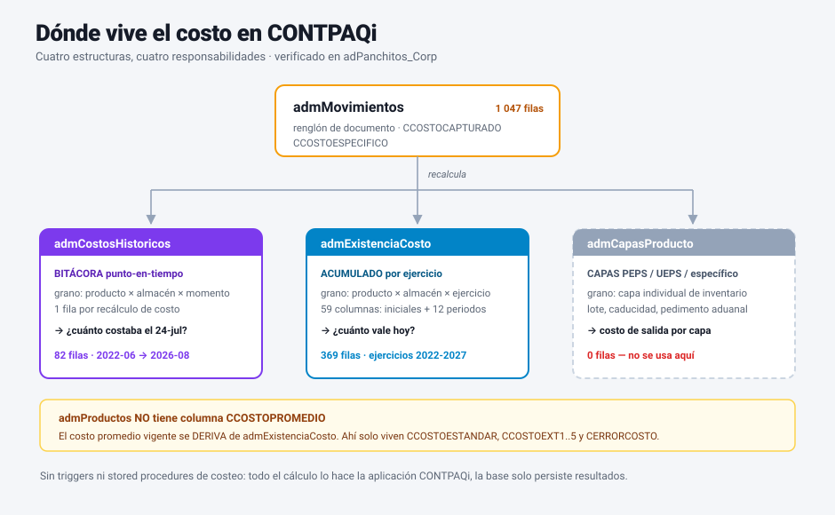
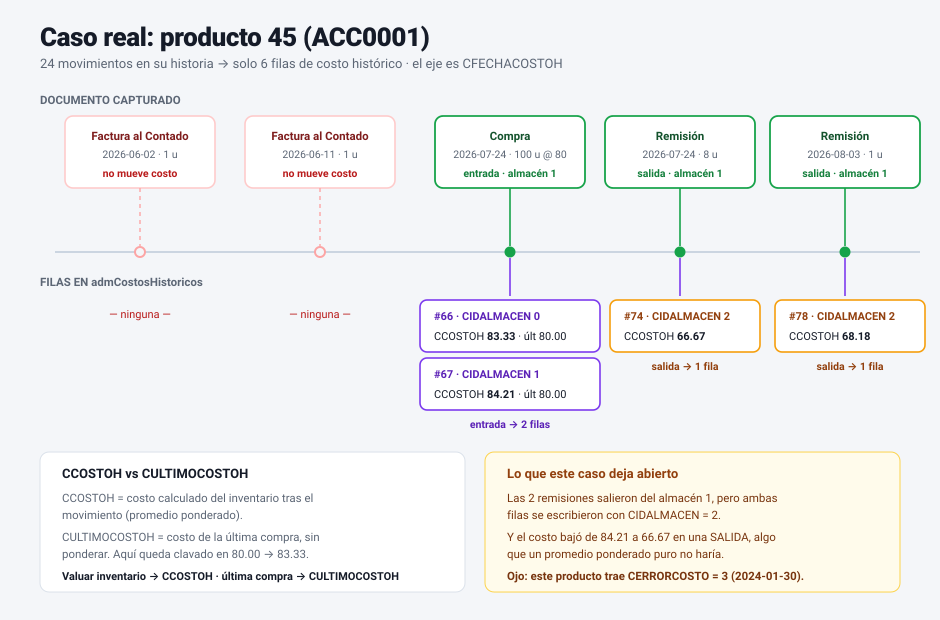
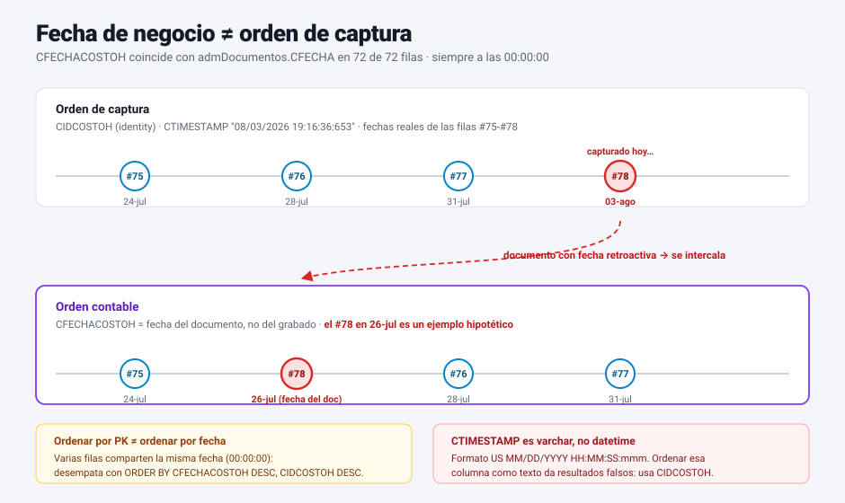
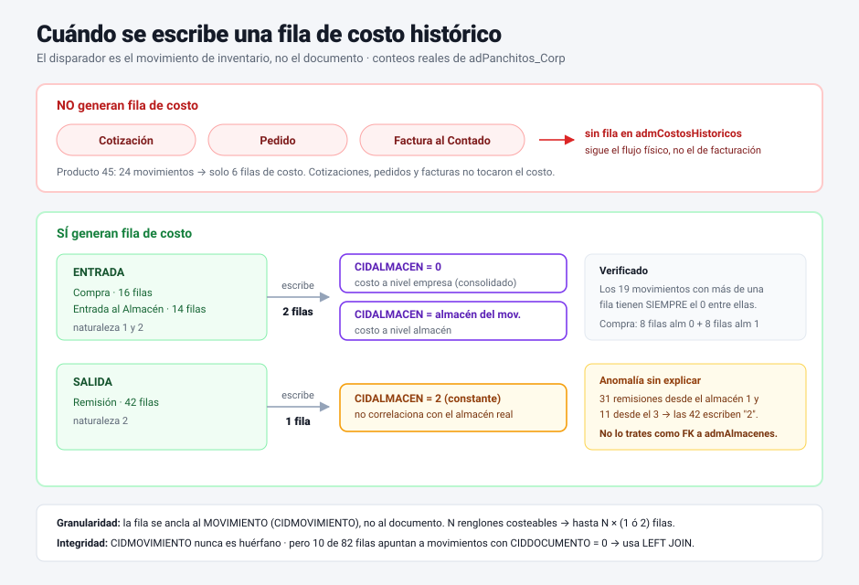
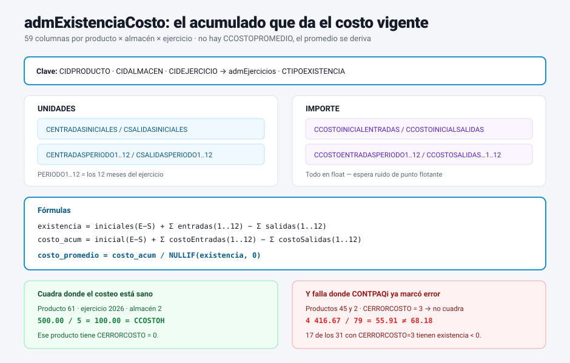

# CONTPAQi Comercial — Costos históricos de inventario

**Referencia técnica para desarrolladores.**
Base analizada en vivo: `adPanchitos_Corp` (SQL Server 2008 R2, `dragon856.startdedicated.com:6072`).
Fecha del análisis: **2026-08-04**. Empresa demo: 78 productos, 1 047 movimientos, 82 filas de costo histórico (2022-06-30 → 2026-08-03).

> Todo lo marcado ✅ está verificado con consultas reales contra esa base. Lo marcado ⚠️ es
> comportamiento observado que **no** pude explicar del todo con los datos disponibles, y lo marcado
> ❓ es algo que no se puede deducir del esquema y hay que confirmar con documentación de CONTPAQi
> o con una empresa de datos limpios. No asumas lo dudoso como cierto en producción.

---

## 1. Panorama: dónde vive el costo

CONTPAQi no guarda "el costo" en un solo lugar. Hay **cuatro** estructuras con responsabilidades distintas:



<sub>**Figura 1** — Las cuatro estructuras de costo y su relación. Los conteos son de `adPanchitos_Corp`.</sub>

| Tabla | Grano | Responde a |
|---|---|---|
| `admCostosHistoricos` | producto × almacén × **momento** | "¿qué costo tenía este producto el 24-jul?" |
| `admExistenciaCosto` | producto × almacén × **ejercicio** | "¿cuál es la existencia y el costo acumulado del año?" |
| `admCapasProducto` | capa individual de inventario | costeo PEPS/UEPS/lote/pedimento |
| `admMovimientos` | renglón de documento | costo capturado en la transacción |

**No existe** una columna `CCOSTOPROMEDIO` en `admProductos`. El costo promedio vigente **se deriva**
de `admExistenciaCosto` (§4). Lo único que `admProductos` guarda de costo es el estándar y extras:

```sql
CCOSTOESTANDAR, CCOSTOEXT1..CCOSTOEXT5, CERRORCOSTO, CFECHAERRORCOSTO
```

---

## 2. `admCostosHistoricos` — la bitácora

### 2.1 Esquema ✅

| Columna | Tipo | Significado |
|---|---|---|
| `CIDCOSTOH` | `int` | PK (clustered, identity secuencial) |
| `CIDPRODUCTO` | `int` | → `admProductos.CIDPRODUCTO` |
| `CIDALMACEN` | `int` | ámbito del costo — **ojo, no es un FK limpio**, ver §2.4 |
| `CFECHACOSTOH` | `datetime` | **fecha del documento** (fecha de negocio), a medianoche |
| `CCOSTOH` | `float` | costo del producto **resultante** de ese movimiento |
| `CULTIMOCOSTOH` | `float` | último costo de adquisición conocido |
| `CIDMOVIMIENTO` | `int` | → `admMovimientos.CIDMOVIMIENTO` (el disparador) |
| `CTIMESTAMP` | `varchar` | momento real de grabado, `MM/DD/YYYY HH:MM:SS:mmm` |

### 2.2 Índices ✅

```
PK_admCostosHistoricos   CLUSTERED UNIQUE (CIDCOSTOH)
IPRODALMACENFECHA        NONCLUSTERED    (CIDPRODUCTO, CIDALMACEN, CFECHACOSTOH)
```

El índice secundario declara la intención de diseño: **la consulta canónica es
"costo de un producto, en un almacén, a una fecha"**. Cualquier query que escribas debe apoyarse en
ese orden de columnas o hará scan.

### 2.3 `CCOSTOH` vs `CULTIMOCOSTOH` ✅

Son cosas distintas y divergen:

```
CIDCOSTOH  PROD  ALM  CFECHACOSTOH   CCOSTOH   CULTIMOCOSTOH
    66      45    0    2026-07-24     83.33        80.00
    67      45    1    2026-07-24     84.21        80.00
    74      45    2    2026-07-24     66.67        83.33
    78      45    2    2026-08-03     68.18        83.33
```

- `CCOSTOH` = costo **calculado** del inventario tras el movimiento (promedio ponderado en esta empresa).
- `CULTIMOCOSTOH` = costo de la **última entrada/compra**, sin ponderar.

Para valuación de inventario usa `CCOSTOH`. Para "¿a cómo me costó la última vez?" usa `CULTIMOCOSTOH`.



<sub>**Figura 2** — Historia real del producto 45 (`ACC0001`): qué documentos escribieron fila y cuáles no,
y con qué valores. Es el mismo caso que ilustra §2.4 y §3.1.</sub>

### 2.4 ⚠️ `CIDALMACEN`: NO lo trates como FK a `admAlmacenes`

Este es el hallazgo más importante para quien programe contra la tabla. Distribución real:

```
CIDALMACEN   filas
    0         19
    1         13
    2         50
```

Cruzando cada fila con el almacén real del movimiento que la originó:

```
CONCEPTO              CIDALMACEN(costoh)   CIDALMACEN(movimiento)   filas
Compra                       0                      1                 8
Compra                       1                      1                 8
Entrada al Almacén           0                      1                 3
Entrada al Almacén           0                      2                 3
Entrada al Almacén           1                      1                 5
Entrada al Almacén           2                      2                 3
Remisión                     2                      1                31
Remisión                     2                      3                11
```

Dos comportamientos distintos:

- **Entradas** (`Compra`, `Entrada al Almacén`): se escriben **dos filas por movimiento**, una con
  `CIDALMACEN = 0` (costo a nivel **empresa**, consolidado) y otra con el almacén real del
  movimiento. Los 19 movimientos con más de una fila **siempre** tienen el 0 como mínimo. ✅
- **Salidas** (`Remisión`): se escribe **una sola fila** y su `CIDALMACEN` es **constante `2`**,
  incluso cuando el movimiento ocurrió en el almacén 1 o en el 3. ⚠️ No correlaciona con el almacén
  del movimiento.

No pude determinar qué significa el `2` en las filas de salida. La lectura de que el catálogo
`admAlmacenes` tiene `0=(Ninguno), 1=Almacen Uno, 2=Mercancía en Consignación, 3=Almacén general`
**no explica** que 42 remisiones de dos almacenes distintos apunten todas al 2.

> **Regla defensiva:** para leer costo por almacén, filtra por `CIDALMACEN = 0` (nivel empresa),
> que sí tiene semántica verificada, o valida el comportamiento contra la empresa real del cliente
> antes de confiar en el desglose por almacén.

### 2.5 Fecha de negocio vs fecha de sistema ✅



<sub>**Figura 3** — Los dos órdenes no coinciden. El carril de arriba son las fechas reales de las filas
#75–#78; el #78 en 26-jul del carril de abajo es un ejemplo hipotético para ilustrar la intercalación.</sub>

`CFECHACOSTOH` coincide con `admDocumentos.CFECHA` en **72 de 72** filas que tienen documento
(100 %), siempre a las `00:00:00`. `CTIMESTAMP` trae el instante real de grabado:

```
CIDCOSTOH  CFECHACOSTOH          CFECHA(doc)           CTIMESTAMP
   82      2026-08-03 00:00:00   2026-08-03 00:00:00   08/03/2026 19:16:36:653
   81      2026-08-03 00:00:00   2026-08-03 00:00:00   08/03/2026 19:14:26:717
```

Implicaciones:

1. La bitácora es **retroactiva por fecha de documento**. Si el usuario captura hoy un documento con
   fecha del mes pasado, la fila entra con la fecha vieja y **se intercala** en el histórico. Ordenar
   por `CIDCOSTOH` (orden de captura) y por `CFECHACOSTOH` (orden contable) **no da el mismo
   resultado**.
2. Varias filas pueden compartir exactamente la misma `CFECHACOSTOH` (medianoche). Para desempatar
   dentro de un mismo día usa `CIDCOSTOH DESC` como criterio secundario.
3. `CTIMESTAMP` es **`varchar`, no `datetime` ni `rowversion`**, y viene en formato **US
   `MM/DD/YYYY`**. Ordenar por esa columna como texto es incorrecto. Si necesitas ordenar por captura,
   usa `CIDCOSTOH`.

### 2.6 Cancelaciones ✅

```sql
select count(*) from admCostosHistoricos h
  join admMovimientos m on m.CIDMOVIMIENTO = h.CIDMOVIMIENTO
  join admDocumentos  d on d.CIDDOCUMENTO  = m.CIDDOCUMENTO
 where d.CCANCELADO <> 0;
-- 0
```

No hay ni una fila de costo histórico ligada a documento cancelado. ❓ No se puede distinguir con
estos datos si CONTPAQi **borra** las filas al cancelar o si simplemente esta empresa no tiene
cancelaciones sobre documentos que costearan. Si tu lógica depende de ello, pruébalo cancelando un
documento en una empresa de prueba.

### 2.7 Movimientos sin documento ⚠️

10 de las 82 filas apuntan a movimientos con `CIDDOCUMENTO = 0`:

```
CIDCOSTOH  PROD  ALM  FECHA        CCOSTOH   CIDMOVIMIENTO  CIDDOCUMENTO
   31       41    0   2024-07-09     0.00         609             0
   33       22    0   2024-07-09    19.26         611             0
   36       22    0   2024-08-20    18.22         720             0
   ...
```

Son movimientos no ligados a un documento (ajustes / saldos iniciales). **Usa `LEFT JOIN` hacia
`admDocumentos`**; un `INNER JOIN` te descarta silenciosamente el 12 % de la bitácora.

---

## 3. Cuándo se escribe una fila

### 3.1 Disparador ✅



<sub>**Figura 4** — Qué documentos escriben fila, cuántas escriben y con qué `CIDALMACEN`.</sub>

Una fila nace de un **movimiento de inventario**, no de cualquier documento. Conceptos que
efectivamente generaron filas:

```
CONCEPTO             CNATURALEZA  CUSACOSTOCAPTURADO   filas
Remisión                  2              1              42
Compra                    1              1              16
Entrada al Almacén        2              4              14
```

Y, sobre todo, los que **no** generan filas: `Cotización`, `Pedido`, `Factura al Contado`. Verificado
en el producto 45, que tiene 24 movimientos pero solo 6 filas de costo: sus cotizaciones, pedidos y
facturas no tocaron el costo; solo la Compra y las Remisiones lo hicieron.

> **Consecuencia de diseño:** el costo se mueve con el **flujo físico** de la mercancía, no con el
> flujo de facturación. Una factura que no mueve inventario (porque la remisión ya lo movió) no
> aparece en la bitácora. No intentes reconstruir costo de ventas cruzando por facturas.

### 3.2 Cardinalidad por movimiento ✅

- Entrada → **2 filas** (`CIDALMACEN = 0` + almacén del movimiento).
- Salida → **1 fila**.
- Un documento con N renglones costeables genera hasta N × (1 ó 2) filas: la granularidad es el
  **movimiento** (`CIDMOVIMIENTO`), no el documento.

### 3.3 Integridad ✅

`CIDMOVIMIENTO` nunca es huérfano: 0 filas sin movimiento correspondiente. Es un FK confiable
(a diferencia de `CIDALMACEN`).

### 3.4 Quién escribe ✅

```sql
select ROUTINE_NAME from INFORMATION_SCHEMA.ROUTINES where ROUTINE_NAME like '%osto%';
-- (vacío)
```

**No hay stored procedures ni triggers de costeo.** Todo el cálculo lo hace la **aplicación
CONTPAQi**; la base solo persiste resultados. Implicación directa: si insertas o modificas
movimientos por SQL directo, **el costo no se recalcula solo** y dejas la empresa inconsistente. Para
integraciones, el camino soportado es el SDK de CONTPAQi, no `INSERT`s.

---

## 4. `admExistenciaCosto` — el acumulado que da el costo vigente



<sub>**Figura 5** — Los cuatro grupos de columnas, las fórmulas y dónde cuadran (y dónde no).</sub>

59 columnas, patrón clásico de acumulado desnormalizado por ejercicio:

```
CIDPRODUCTO, CIDALMACEN, CIDEJERCICIO, CTIPOEXISTENCIA
CENTRADASINICIALES        / CSALIDASINICIALES          ← arranque, unidades
CCOSTOINICIALENTRADAS     / CCOSTOINICIALSALIDAS       ← arranque, importe
CENTRADASPERIODO1..12     / CSALIDASPERIODO1..12       ← unidades por mes
CCOSTOENTRADASPERIODO1..12/ CCOSTOSALIDASPERIODO1..12  ← importe por mes
CBANCONGELADO, CTIMESTAMP
```

`PERIODO1..12` son los **meses del ejercicio** (`admEjercicios`). En esta empresa hay ejercicios
2022 a 2027 y almacenes 1, 2 y 3, con `CTIPOEXISTENCIA = 1` en todas las filas.

### 4.1 Fórmulas

```
existencia   = CENTRADASINICIALES − CSALIDASINICIALES
             + Σ CENTRADASPERIODO(i) − Σ CSALIDASPERIODO(i)

costo_acum   = CCOSTOINICIALENTRADAS − CCOSTOINICIALSALIDAS
             + Σ CCOSTOENTRADASPERIODO(i) − Σ CCOSTOSALIDASPERIODO(i)

costo_prom   = costo_acum / NULLIF(existencia, 0)
```

Validado exacto en el producto 61, ejercicio 2026, almacén 2: `500.00 / 5 = 100.00`, idéntico a su
`CCOSTOH`. ✅

⚠️ **No cuadró** en los productos 45 y 2 (p. ej. producto 45, ejercicio 2026, almacén 2:
`4 416.67 / 79 = 55.91` contra un `CCOSTOH` de `68.18`).

**Pero la discrepancia tiene un patrón claro** ✅: el producto donde la fórmula cuadró exacto (61)
tiene `CERRORCOSTO = 0`, y los dos donde falló (45 y 2) tienen `CERRORCOSTO = 3`. Cruzando todo el
catálogo con existencia en 2026:

```
CERRORCOSTO   productos   con existencia negativa
     0             5                 0
     3            31                17
```

Es decir: **la fórmula falla exactamente donde CONTPAQi mismo marcó el costeo como roto**, y más de
la mitad de esos productos tienen existencia negativa. La lectura más probable es que la fórmula es
correcta y lo que está sucio son los datos. Aun así, **valídala contra la empresa real del cliente
antes de usarla para valuar**, y descarta siempre los productos con `CERRORCOSTO <> 0` (§7).

### 4.2 Cuidados

- `NULLIF(existencia, 0)`: hay productos con existencia 0 y con existencia negativa; la división
  revienta o da costos absurdos.
- Siempre filtra por ejercicio **y** almacén; sumar ejercicios duplica los saldos iniciales.
- Todo es `float`, no `decimal`. Espera ruido de punto flotante
  (`68.181818181818187`, `9498.2000000000007`). **Redondea al comparar**; nunca uses `=` sobre
  estos valores.

---

## 5. Costeo por capas: `admCapasProducto`

```
CIDCAPA, CIDALMACEN, CIDPRODUCTO, CFECHA, CTIPOCAPA,
CNUMEROLOTE, CFECHACADUCIDAD, CFECHAFABRICACION,
CPEDIMENTO, CADUANA, CFECHAPEDIMENTO, CNUMADUANA, CCLAVESAT,
CTIPOCAMBIO, CEXISTENCIA, CCOSTO, CIDCAPAORIGEN
```

Es la estructura para **PEPS / UEPS / costo específico**, con soporte de lote, caducidad y pedimento
aduanal. **En esta empresa tiene 0 filas** → no se usa costeo por capas aquí, pero tu código no debe
asumir eso: en un cliente con PEPS esta tabla es la fuente de verdad del costo de salida, y
`admCostosHistoricos` pasa a ser un derivado.

---

## 6. Configuración: `admParametros`

```
CCALCOSTO1        = 2     ← método de costeo de la empresa
CDECIMALESCOSTOS  = 2     ← decimales a mostrar/redondear
CPROTEGERCOSTOS   = 0     ← si 1, el costo no es editable por el usuario
CCOSTOMEN         = 0
```

❓ **No confirmé el mapeo del enum `CCALCOSTO1`** (promedio / UEPS / PEPS / específico). Que
`admCapasProducto` esté vacía apunta a **promedio**, y el comportamiento de `CCOSTOH` (promedio
ponderado que se mueve con cada entrada) es consistente con promedio — pero es **inferencia, no
dato**. Confírmalo en la UI de CONTPAQi (Configuración de la empresa → método de costeo) antes de
ramificar lógica sobre este valor.

`CDECIMALESCOSTOS` es el parámetro correcto para redondear al presentar; no hardcodees 2.

---

## 7. Señal de error: `CERRORCOSTO`

`admProductos` trae `CERRORCOSTO` (`int`) y `CFECHAERRORCOSTO` (`datetime`). En esta empresa:

```sql
select CERRORCOSTO, count(*) from admProductos group by CERRORCOSTO;
-- 0 → 47 productos    3 → 31 productos  (40 % del catálogo)
```

Solo toma dos valores en esta empresa: `0` y `3`. Es la marca de que CONTPAQi **no pudo costear**
correctamente ese producto (típicamente por salidas sin existencia suficiente): **17 de los 31
productos con `CERRORCOSTO = 3` tienen existencia negativa**, contra **0 de los que tienen `= 0`**.
`CFECHAERRORCOSTO` trae la fecha del fallo (`1899-12-30` es el centinela de "sin fecha").

> **Para cualquier reporte o bot que exponga costos: filtra o advierte sobre los productos con
> `CERRORCOSTO <> 0`.** Su costo es poco confiable. Que el 40 % del catálogo demo esté marcado da
> una idea de qué tan común es en la práctica.

---

## 8. Consultas de referencia

### 8.1 Costo de un producto a una fecha (la consulta canónica)

```sql
SELECT TOP 1 h.CCOSTOH, h.CULTIMOCOSTOH, h.CFECHACOSTOH
  FROM admCostosHistoricos h
 WHERE h.CIDPRODUCTO   = :producto
   AND h.CIDALMACEN    = 0            -- ámbito empresa (semántica verificada)
   AND h.CFECHACOSTOH <= :fecha
 ORDER BY h.CFECHACOSTOH DESC, h.CIDCOSTOH DESC;
```

El `CIDCOSTOH DESC` no es cosmético: desempata las filas del mismo día (§2.5).

### 8.2 Evolución del costo de un producto

```sql
SELECT h.CFECHACOSTOH, h.CIDALMACEN, h.CCOSTOH, h.CULTIMOCOSTOH,
       c.CNOMBRECONCEPTO, d.CSERIEDOCUMENTO, d.CFOLIO
  FROM admCostosHistoricos h
  JOIN admMovimientos m ON m.CIDMOVIMIENTO = h.CIDMOVIMIENTO
  LEFT JOIN admDocumentos d ON d.CIDDOCUMENTO = m.CIDDOCUMENTO   -- LEFT: CIDDOCUMENTO puede ser 0
  LEFT JOIN admConceptos  c ON c.CIDCONCEPTODOCUMENTO = d.CIDCONCEPTODOCUMENTO
 WHERE h.CIDPRODUCTO = :producto
 ORDER BY h.CFECHACOSTOH, h.CIDCOSTOH;
```

### 8.3 Costo promedio vigente (derivado del acumulado)

```sql
SELECT p.CCODIGOPRODUCTO,
       e.CENTRADASINICIALES - e.CSALIDASINICIALES
     + (e.CENTRADASPERIODO1+e.CENTRADASPERIODO2+e.CENTRADASPERIODO3+e.CENTRADASPERIODO4
       +e.CENTRADASPERIODO5+e.CENTRADASPERIODO6+e.CENTRADASPERIODO7+e.CENTRADASPERIODO8
       +e.CENTRADASPERIODO9+e.CENTRADASPERIODO10+e.CENTRADASPERIODO11+e.CENTRADASPERIODO12)
     - (e.CSALIDASPERIODO1+e.CSALIDASPERIODO2+e.CSALIDASPERIODO3+e.CSALIDASPERIODO4
       +e.CSALIDASPERIODO5+e.CSALIDASPERIODO6+e.CSALIDASPERIODO7+e.CSALIDASPERIODO8
       +e.CSALIDASPERIODO9+e.CSALIDASPERIODO10+e.CSALIDASPERIODO11+e.CSALIDASPERIODO12)
       AS existencia,
       e.CCOSTOINICIALENTRADAS - e.CCOSTOINICIALSALIDAS
     + (e.CCOSTOENTRADASPERIODO1+e.CCOSTOENTRADASPERIODO2+e.CCOSTOENTRADASPERIODO3
       +e.CCOSTOENTRADASPERIODO4+e.CCOSTOENTRADASPERIODO5+e.CCOSTOENTRADASPERIODO6
       +e.CCOSTOENTRADASPERIODO7+e.CCOSTOENTRADASPERIODO8+e.CCOSTOENTRADASPERIODO9
       +e.CCOSTOENTRADASPERIODO10+e.CCOSTOENTRADASPERIODO11+e.CCOSTOENTRADASPERIODO12)
     - (e.CCOSTOSALIDASPERIODO1+e.CCOSTOSALIDASPERIODO2+e.CCOSTOSALIDASPERIODO3
       +e.CCOSTOSALIDASPERIODO4+e.CCOSTOSALIDASPERIODO5+e.CCOSTOSALIDASPERIODO6
       +e.CCOSTOSALIDASPERIODO7+e.CCOSTOSALIDASPERIODO8+e.CCOSTOSALIDASPERIODO9
       +e.CCOSTOSALIDASPERIODO10+e.CCOSTOSALIDASPERIODO11+e.CCOSTOSALIDASPERIODO12)
       AS costo_acum
  FROM admExistenciaCosto e
  JOIN admProductos  p ON p.CIDPRODUCTO  = e.CIDPRODUCTO
  JOIN admEjercicios j ON j.CIDEJERCICIO = e.CIDEJERCICIO
 WHERE j.CEJERCICIO = :ejercicio AND e.CIDALMACEN = :almacen;
```

Divide `costo_acum / existencia` **en la aplicación**, con guarda de existencia ≤ 0.

### 8.4 Productos con costeo dudoso

```sql
SELECT CCODIGOPRODUCTO, CERRORCOSTO, CFECHAERRORCOSTO
  FROM admProductos WHERE CERRORCOSTO <> 0;
```

---

## 9. Checklist de gotchas

| # | Gotcha | Impacto |
|---|---|---|
| 1 | `CIDALMACEN` en salidas es constante `2`, sin correlación con el almacén real | desglose por almacén no confiable → usa `= 0` |
| 2 | `CFECHACOSTOH` es fecha **de documento**, no de captura; filas retroactivas se intercalan | ordenar por PK ≠ ordenar por fecha |
| 3 | `CTIMESTAMP` es `varchar` en formato US `MM/DD/YYYY` | ordenar como texto da resultados falsos |
| 4 | Varias filas comparten la misma fecha (00:00:00) | desempata con `CIDCOSTOH DESC` |
| 5 | `CIDDOCUMENTO = 0` en movimientos de ajuste (12 % de las filas) | usa `LEFT JOIN`, no `INNER` |
| 6 | Todos los costos son `float` | redondea antes de comparar; nunca `=` |
| 7 | Existencias negativas y ejercicios futuros poblados | divisiones por cero / costos absurdos |
| 8 | 40 % de productos con `CERRORCOSTO <> 0` | filtra o advierte en cualquier reporte |
| 9 | Sin triggers ni SPs: el costo lo calcula la app | no escribas movimientos por SQL directo |
| 10 | SQL Server 2008 R2 → solo habla **TDS 7.0** | `tiny_tds` 3.x lo rechaza; fija `~> 2.1` o `TDSVER=7.0` |

---

## 10. Pendientes de verificación

1. **Enum `CCALCOSTO1`** — qué método es el `2`. (UI de CONTPAQi o doc del SDK.)
2. **`CIDALMACEN = 2` en salidas** — qué representa realmente. Reproducir con remisiones desde
   almacenes distintos en una empresa limpia.
3. **Comportamiento en cancelación** — ¿se borra la fila de costo histórico o queda huérfana?
   Cancelar un documento costeado en una empresa de prueba y volver a contar.
4. **Fórmula del promedio** — parcialmente resuelto: falla solo en productos con `CERRORCOSTO = 3`
   (§4.1). Falta confirmar contra una empresa con datos limpios que en productos sanos cuadra
   siempre, no solo en el caso probado.

---

## Apéndice — cómo reproducir este análisis

```bash
TDSVER=7.0 tsql -H dragon856.startdedicated.com -p 6072 -U sa -P '<pass>' -D adPanchitos_Corp
```

La conexión está registrada en Chatwoot como `external_db_connections` id **12**
(`Contpaq adPanchitos`, `erp_type=3`, `engine=1`, `read_only=true`). Las credenciales viven en esa
fila; no se reproducen aquí.
