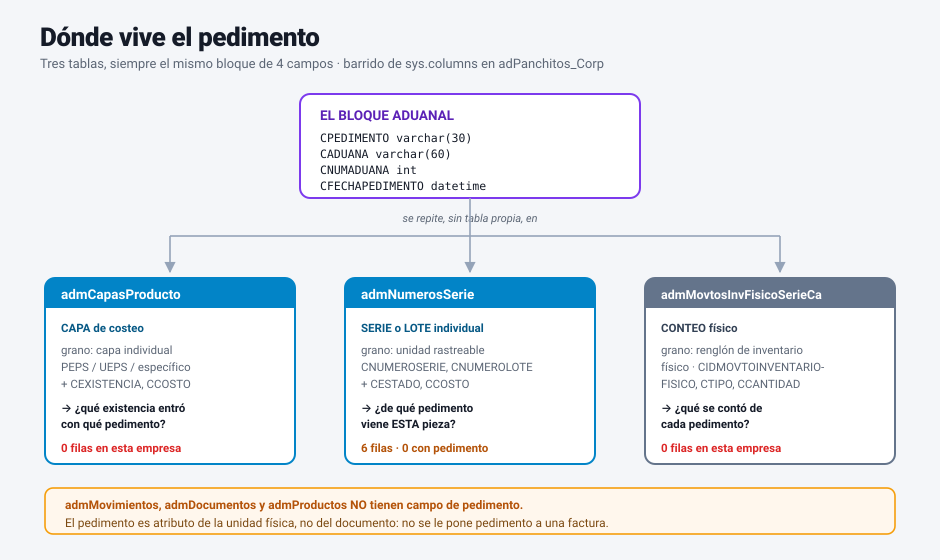
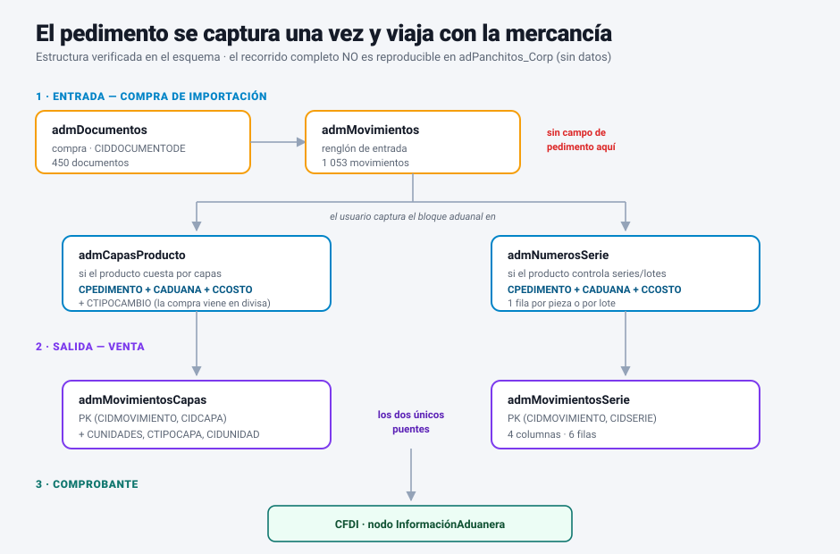

# CONTPAQi Comercial — Pedimentos aduanales en inventario

**Referencia técnica para desarrolladores.**
Base analizada en vivo: `adPanchitos_Corp` (SQL Server 2008 R2 SP2 Express, `dragon856.startdedicated.com:6072`).
Fecha del análisis: **2026-08-05**. Empresa demo: 78 productos (68 inventariables), 4 almacenes, 450 documentos, 1 053 movimientos, 6 números de serie, **0 capas de producto**.

> Todo lo marcado ✅ está verificado con consultas reales contra esa base. Lo marcado ⚠️ es
> comportamiento observado que **no** pude explicar del todo con los datos disponibles, y lo marcado
> ❓ es algo que no se puede deducir del esquema y hay que confirmar con documentación de CONTPAQi
> o con una empresa que sí importe. No asumas lo dudoso como cierto en producción.

> **Advertencia de alcance.** Esta empresa **no usa pedimentos**: cero filas con pedimento capturado
> en las tres tablas que lo soportan. Todo lo estructural (esquema, índices, puentes, ausencia de FKs)
> está verificado; el **recorrido de datos** de una importación real **no** se pudo observar. Donde el
> documento describe comportamiento en vez de estructura, está marcado ❓ o ⚠️.
>
> Complemento de [`contpaq_costos_historicos.md`](contpaq_costos_historicos.md), cuyo §5 toca
> `admCapasProducto` de pasada. Aquí se profundiza en el eje aduanal.

---

## 1. Panorama: el pedimento no tiene tabla propia ✅

Barrido de `sys.columns` sobre la base completa buscando `%PEDIM%` y `%ADUAN%`: aparecen en
**exactamente 3 tablas**, siempre como el mismo bloque de campos.



<sub>**Figura 1** — Las tres tablas que soportan pedimento y su grano. Los conteos son de `adPanchitos_Corp`.</sub>

```sql
-- consulta que produce la Figura 1
SELECT t.name AS tabla, c.name AS columna
FROM sys.columns c JOIN sys.tables t ON t.object_id = c.object_id
WHERE c.name LIKE '%PEDIM%' OR c.name LIKE '%ADUAN%'
ORDER BY t.name, c.name;
```

| Tabla | Grano | Responde a | Filas |
|---|---|---|---|
| `admCapasProducto` | capa individual de inventario | "¿qué existencia entró con qué pedimento y a qué costo?" | 0 |
| `admNumerosSerie` | serie o lote individual | "¿de qué pedimento viene **esta** pieza?" | 6 (0 con pedimento) |
| `admMovtosInvFisicoSerieCa` | renglón de inventario físico | "¿qué se contó de cada pedimento?" | 0 |

### 1.1 El bloque aduanal ✅

Los cuatro campos son idénticos en las tres tablas, y siempre viajan con un quinto que no es aduanal
pero es inseparable en la práctica:

| Campo | Tipo | Qué es |
|---|---|---|
| `CPEDIMENTO` | `varchar(30)` | número de pedimento |
| `CADUANA` | `varchar(60)` | nombre de la aduana (texto libre) |
| `CNUMADUANA` | `int` | clave numérica de la aduana |
| `CFECHAPEDIMENTO` | `datetime` | fecha del pedimento |
| `CTIPOCAMBIO` | `float` | tipo de cambio de la operación |

`CTIPOCAMBIO` está ahí porque una importación se pacta en divisa: el costo de la capa nace convertido,
y sin el tipo de cambio de ese momento no se puede auditar el costo en pesos.

⚠️ `CADUANA` es `varchar(60)` **libre** y `CNUMADUANA` es `int`, sin FK ni tabla de catálogo de aduanas
en la base. No hay nada que garantice que el nombre y la clave sean consistentes entre sí, ni que la
misma aduana se escriba igual dos veces. **Si vas a agrupar por aduana, agrupa por `CNUMADUANA`, no
por `CADUANA`.**

❓ `CCLAVESAT` (`varchar(30)`) aparece junto al bloque en `admCapasProducto` y `admNumerosSerie`. Por
posición parece de uso fiscal, pero no pude determinar si es la clave de producto/servicio del SAT, la
clave de unidad, o una clave de pedimento. Está vacía en las 6 filas existentes.

### 1.2 Lo que NO tiene pedimento ✅

Verificado por ausencia de columnas: **`admMovimientos`, `admDocumentos` y `admProductos` no tienen
ningún campo aduanal.** Tampoco `admParametros` tiene parámetro alguno de series, lotes, capas o
aduanas a nivel empresa.

Esa es la decisión de diseño central y hay que interiorizarla:

> **El pedimento es un atributo de la unidad física, no del documento.** No se le pone pedimento a una
> factura; se le pone a la capa o a la serie que la factura consume. Cualquier reporte que intente
> sacar el pedimento desde el documento hacia abajo está mal planteado — se saca desde la unidad
> física hacia arriba.

---

## 2. Cómo se conecta todo ✅



<sub>**Figura 2** — Recorrido estructural. Las cajas y las relaciones están verificadas contra el esquema; el recorrido de datos de una importación real no es observable en esta empresa.</sub>

### 2.1 Los dos puentes ✅

`admMovimientos` no tiene ninguna columna `CIDCAPA` ni `CIDSERIE` (verificado). El enlace entre un
movimiento y las unidades físicas que consumió existe **solo** a través de dos tablas puente, ambas
minúsculas:

```
admMovimientosSerie          PK (CIDMOVIMIENTO, CIDSERIE)
  CIDAUTOINCSQL, CIDMOVIMIENTO, CIDSERIE, CFECHA          ← 4 columnas, 6 filas

admMovimientosCapas          PK (CIDMOVIMIENTO, CIDCAPA)
  CIDAUTOINCSQL, CIDMOVIMIENTO, CIDCAPA, CFECHA,
  CUNIDADES, CTIPOCAPA, CIDUNIDAD                          ← 7 columnas, 0 filas
```

Diferencia importante: `admMovimientosSerie` **no** guarda cantidad, porque una serie **es** una pieza
— la fila misma es la unidad. `admMovimientosCapas` sí guarda `CUNIDADES`, porque de una capa se
consume una fracción.

**Consecuencia para consultas:** para saber qué pedimento salió en una venta hay siempre **tres saltos**
(`admDocumentos → admMovimientos → puente → capa/serie`), y el pedimento se lee en el último. No hay
atajo.

### 2.2 Ausencia total de FKs ⚠️

```sql
SELECT COUNT(*) FROM sys.foreign_keys
WHERE parent_object_id IN (OBJECT_ID('admNumerosSerie'), OBJECT_ID('admCapasProducto'),
      OBJECT_ID('admMovimientosSerie'), OBJECT_ID('admMovimientosCapas'),
      OBJECT_ID('admMovtosInvFisicoSerieCa'));
-- → 0
```

Cero constraints de integridad referencial en las cinco tablas. Es el mismo patrón que documentamos
para `admCostosHistoricos.CIDALMACEN`: **la integridad la sostiene la aplicación, no la base.** Usa
`LEFT JOIN` cuando cruces estas tablas y asume que puede haber huérfanos.

---

## 3. El pedimento es parte de la identidad de la capa ✅

Este es el hallazgo con más valor práctico del análisis, y sale de los **índices**, no de los datos.

`admCapasProducto` tiene 13 índices no-clustered. Tres son aduanales:

```
CPEDIMENTO                    (CPEDIMENTO, CIDCAPA)
IPRODALMACENPEDIMENTOLOTE     (CIDPRODUCTO, CIDALMACEN, CPEDIMENTO, CNUMEROLOTE, CIDCAPA)
IPRODUCTOFECHAPEDIMENTO       (CIDPRODUCTO, CFECHAPEDIMENTO, CIDCAPA)
```

Que exista `IPRODALMACENPEDIMENTOLOTE` dice algo que ninguna columna dice sola:

> CONTPAQi trata la tupla **(producto, almacén, pedimento, lote)** como la identidad natural de una
> capa. Dos recepciones del mismo producto en el mismo almacén bajo **pedimentos distintos** son
> **capas distintas**, con existencia y costo separados — aunque sea la misma pieza física a los ojos
> del usuario.

`admMovtosInvFisicoSerieCa` refuerza lo mismo con siete variantes del índice
`(CIDALMACEN, CIDPRODUCTO, CPEDIMENTO, CNUMEROLOTE, CIDCAPA)` — es decir, el conteo de inventario
físico también se lleva **por pedimento**. Un inventario físico en una empresa importadora no cuenta
"20 piezas del producto X": cuenta "12 del pedimento A y 8 del pedimento B".

`admNumerosSerie`, en cambio, **no** tiene índice por `CPEDIMENTO` (solo
`IPRODUCTOFECHAPEDIMENTO`). Coherente: la serie se busca por `CNUMEROSERIE` vía
`INUMEROSERIEPRODUCTO`; el pedimento ahí es dato de arrastre, no criterio de búsqueda.

⚠️ Cuidado con ese índice: `INUMEROSERIEPRODUCTO (CNUMEROSERIE, CIDPRODUCTO)` **no es único**
(`is_unique = 0`). De hecho, en las cinco tablas de este documento **el único índice único es la PK**.
Nada en la base impide dos filas con el mismo número de serie para el mismo producto — si construyes
una búsqueda "dame la serie X", asume que puede devolver más de una fila.

**Regla defensiva:** nunca agregues existencias de un producto sumando `CEXISTENCIA` sin agrupar por
`CPEDIMENTO` si el cliente importa. Perderías justo el desglose por el que instalaron el módulo.

---

## 4. Estructuras completas ✅

### 4.1 `admCapasProducto` (18 columnas)

```
CIDCAPA           int         PK
CIDALMACEN        int
CIDPRODUCTO       int
CFECHA            datetime    fecha de la capa (entrada)
CTIPOCAPA         int         ❓ enum sin mapear
CNUMEROLOTE       varchar(30)
CFECHACADUCIDAD   datetime
CFECHAFABRICACION datetime
CPEDIMENTO        varchar(30) ─┐
CADUANA           varchar(60)  │ bloque
CFECHAPEDIMENTO   datetime     │ aduanal
CNUMADUANA        int         ─┘
CTIPOCAMBIO       float
CEXISTENCIA       float       existencia VIVA de esta capa
CCOSTO            float       costo unitario de esta capa
CIDCAPAORIGEN     int         autorreferencia → capa de la que se derivó
CTIMESTAMP        varchar(23)
CCLAVESAT         varchar(30) ❓
```

`CIDCAPAORIGEN` es autorreferencial y tiene dos índices propios (`CIDCAPAORIGEN`,
`IALMACENCAPAORIGEN`). ❓ No pude verificar qué operación genera una capa derivada — el candidato
obvio es el traspaso entre almacenes (la capa se parte y la hija apunta a la madre), lo que
**conservaría el pedimento a través del traspaso**. Es inferencia razonable pero no verificada.

### 4.2 `admNumerosSerie` (17 columnas)

```
CIDSERIE          int         PK
CIDPRODUCTO       int
CNUMEROSERIE      varchar(30) ⚠️ indexado por producto, pero NO único
CIDALMACEN        int
CESTADO           int         ❓ enum sin mapear (las 6 filas tienen 1)
CESTADOANTERIOR   int         ❓
CNUMEROLOTE       varchar(30)
CFECHACADUCIDAD   datetime
CFECHAFABRICACION datetime
CPEDIMENTO        varchar(30) ─┐
CADUANA           varchar(60)  │ bloque
CFECHAPEDIMENTO   datetime     │ aduanal
CNUMADUANA        int         ─┘
CTIPOCAMBIO       float
CCOSTO            float
CTIMESTAMP        varchar(23)
CCLAVESAT         varchar(30) ❓
```

El par `CESTADO` / `CESTADOANTERIOR` con índice `IPRODALMACENESTADOSERIE` indica una máquina de
estados de la serie (disponible / vendida / en tránsito / devuelta, presumiblemente). ❓ El enum no es
deducible: las 6 filas están todas en `1`. **No filtres por `CESTADO` sin confirmar el mapeo**; si `1`
resultara ser "vendida" en vez de "disponible", un reporte de existencias saldría invertido.

### 4.3 `admMovtosInvFisicoSerieCa` (22 columnas)

```
CIDSERIECAPA             int      PK
CIDMOVTOINVENTARIOFISICO int      → cabecera del inventario físico
CIDPRODUCTO              int
CNUMEROSERIE             varchar
CIDALMACEN               int
CTIPO                    int      ❓ enum sin mapear
CNUMEROLOTE              varchar
CFECHACADUCIDAD          datetime
CFECHAFABRICACION        datetime
CPEDIMENTO               varchar  ─┐ bloque aduanal
CADUANA                  varchar   │ (sin CNUMADUANA aquí)
CFECHAPEDIMENTO          datetime ─┘
CTIPOCAMBIO              float
CCANTIDAD                float
CIDCAPA                  int      → capa contada
```

⚠️ Es la única de las tres **sin `CNUMADUANA`**: guarda el nombre de la aduana pero no su clave
numérica. Si construyes un reporte de inventario físico por aduana, la clave hay que recuperarla
uniendo contra la capa (`CIDCAPA`), no desde esta tabla.

---

## 5. Qué configura que un producto use pedimento ⚠️

No hay bandera "usa pedimentos". El pedimento se habilita indirectamente, por dos campos de
`admProductos` cuyos enums **no son deducibles desde la base**:

```sql
SELECT CMETODOCOSTEO, CCONTROLEXISTENCIA, COUNT(*) AS productos
FROM admProductos WHERE CTIPOPRODUCTO = 1
GROUP BY CMETODOCOSTEO, CCONTROLEXISTENCIA ORDER BY 1, 2;
```

Distribución real en la empresa (productos inventariables, `CTIPOPRODUCTO = 1`):

| `CMETODOCOSTEO` | productos | `CCONTROLEXISTENCIA` | productos |
|---|---|---|---|
| 1 | 63 | 0 | 20 |
| 6 | 5 | 1 | 32 |
| | | 2 | 5 |
| | | 3 | 6 |
| | | 4 | 4 |
| | | 17 | 1 |

`CTIPOPRODUCTO`: `1` = producto, `2` = paquete, `3` = servicio (inferido por los nombres:
`PAQUETE DE PRODUCTOS`, `SERVICIO 1`).

❓ **`CMETODOCOSTEO`**: 63 productos en `1` y 5 en `6`. El doc de costos infiere que la empresa costea
por **promedio** (§6, `CCALCOSTO1 = 2`), lo que encajaría con `1 = promedio`. Qué es `6`, no lo sé.

⚠️ **Anomalía sin explicar.** Los 5 productos con `CMETODOCOSTEO = 6` tienen además
`CBANMETODOCOSTEO = 1` (método propio, distinto al de la empresa), y **aun así `admCapasProducto`
tiene 0 filas**. Si `6` fuera un método por capas — PEPS, UEPS o costo específico — esos productos
deberían tener capas. O el `6` no es un método por capas, o las capas se crean solo al primer
movimiento costeado y estos productos nunca lo tuvieron. **No lo sé, y es justo el punto que hay que
resolver antes de escribir lógica de pedimentos.**

Los 5 productos con `CMETODOCOSTEO = 6`:

| `CIDPRODUCTO` | Código | Nombre | `CCONTROLEXISTENCIA` |
|---|---|---|---|
| 19 | `LIBRAYA100` | LIBRETA DE RAYA DE 100 HOJAS | 4 |
| 33 | `CRMZEUSDOS` | PRODUCTO CON SERIES | 4 |
| 58 | `012345678901234` | PRODUCTO CON CLAVE DE 15 CARACTERES | 17 |
| 95 | `GBOX16OZ` | Guante de Box 16 Onzas 123 | 4 |
| 96 | `CODPRUEBA` | codigo de prueba | 0 |

❓ **`CCONTROLEXISTENCIA`**: que `4` signifique "controla series" es **inferencia por el nombre** del
producto 33 (`PRODUCTO CON SERIES`), no evidencia. La distribución (`0,1,2,3,4,17`) sugiere una
máscara de bits donde `3 = 1|2` y `17 = 16|1`, pero es especulación. Confírmalo en la UI de CONTPAQi
(ficha del producto → control de existencias) antes de ramificar sobre este valor.

---

## 6. El único caso real disponible ✅

Las 6 filas de `admNumerosSerie` son captura de prueba, sin nada aduanal:

```
CIDSERIE 1–6 · CIDPRODUCTO 33 (CRMZEUSDOS "PRODUCTO CON SERIES")
CNUMEROSERIE 100000 … 100005 · CIDALMACEN 1 · CESTADO 1 · CCOSTO 0
CNUMEROLOTE '' · CPEDIMENTO '' · CADUANA '' · CCLAVESAT ''
```

Trazadas hacia atrás por el puente:

```sql
SELECT ms.CIDSERIE, ms.CIDMOVIMIENTO, m.CIDDOCUMENTO, m.CUNIDADES,
       d.CIDDOCUMENTODE, d.CFOLIO, co.CNOMBRECONCEPTO
FROM admMovimientosSerie ms
JOIN admMovimientos m ON m.CIDMOVIMIENTO = ms.CIDMOVIMIENTO
JOIN admDocumentos  d ON d.CIDDOCUMENTO  = m.CIDDOCUMENTO
JOIN admConceptos  co ON co.CIDCONCEPTODOCUMENTO = d.CIDDOCUMENTODE;
```

Las 6 series entraron por el **movimiento 1069**, documento **443**, concepto **19 = "Orden de
Compra"**, folio 4, del **2026-07-24**, 6 unidades a precio 0.

⚠️ Que las series estén ligadas a una **orden de compra** llama la atención: una orden de compra
normalmente no afecta inventario. Puede ser captura de prueba desordenada, o puede ser que CONTPAQi
reserve el número de serie desde el pedido y lo confirme al recibir. **No verificado.**

---

## 7. Consultas de referencia

Las cuatro devuelven vacío en `adPanchitos_Corp` — son correctas, pero esta empresa no tiene con qué
llenarlas. Están escritas para ejecutarse contra una empresa importadora.

### 7.1 Existencia por pedimento (el reporte canónico)

```sql
SELECT p.CCODIGOPRODUCTO, p.CNOMBREPRODUCTO, a.CNOMBREALMACEN,
       c.CPEDIMENTO, c.CADUANA, c.CNUMADUANA, c.CFECHAPEDIMENTO,
       c.CEXISTENCIA, c.CCOSTO, c.CTIPOCAMBIO,
       c.CEXISTENCIA * c.CCOSTO AS valor
FROM admCapasProducto c
JOIN admProductos  p ON p.CIDPRODUCTO = c.CIDPRODUCTO
LEFT JOIN admAlmacenes a ON a.CIDALMACEN = c.CIDALMACEN
WHERE LTRIM(RTRIM(ISNULL(c.CPEDIMENTO, ''))) <> ''
  AND c.CEXISTENCIA > 0
ORDER BY p.CCODIGOPRODUCTO, c.CFECHAPEDIMENTO;
```

### 7.2 Qué pedimento salió en cada venta

Los tres saltos de §2.1, por la vía de capas:

```sql
SELECT d.CFOLIO, d.CFECHA, p.CCODIGOPRODUCTO,
       mc.CUNIDADES, c.CPEDIMENTO, c.CADUANA, c.CCOSTO
FROM admDocumentos d
JOIN admMovimientos      m  ON m.CIDDOCUMENTO  = d.CIDDOCUMENTO
JOIN admMovimientosCapas mc ON mc.CIDMOVIMIENTO = m.CIDMOVIMIENTO
JOIN admCapasProducto    c  ON c.CIDCAPA        = mc.CIDCAPA
JOIN admProductos        p  ON p.CIDPRODUCTO    = m.CIDPRODUCTO
WHERE LTRIM(RTRIM(ISNULL(c.CPEDIMENTO, ''))) <> ''
ORDER BY d.CFECHA DESC;
```

Y por la vía de series (una fila por pieza, sin cantidad):

```sql
SELECT d.CFOLIO, d.CFECHA, p.CCODIGOPRODUCTO,
       s.CNUMEROSERIE, s.CNUMEROLOTE, s.CPEDIMENTO, s.CADUANA, s.CFECHAPEDIMENTO
FROM admDocumentos d
JOIN admMovimientos      m  ON m.CIDDOCUMENTO  = d.CIDDOCUMENTO
JOIN admMovimientosSerie ms ON ms.CIDMOVIMIENTO = m.CIDMOVIMIENTO
JOIN admNumerosSerie     s  ON s.CIDSERIE       = ms.CIDSERIE
JOIN admProductos        p  ON p.CIDPRODUCTO    = m.CIDPRODUCTO
WHERE LTRIM(RTRIM(ISNULL(s.CPEDIMENTO, ''))) <> ''
ORDER BY d.CFECHA DESC;
```

### 7.3 Existencia agregada por aduana

Agrupando por la clave numérica, no por el nombre libre (§1.1):

```sql
SELECT c.CNUMADUANA, MIN(c.CADUANA) AS nombre_ejemplo,
       COUNT(DISTINCT c.CPEDIMENTO) AS pedimentos,
       SUM(c.CEXISTENCIA)               AS piezas,
       SUM(c.CEXISTENCIA * c.CCOSTO)    AS valor
FROM admCapasProducto c
WHERE c.CEXISTENCIA > 0 AND LTRIM(RTRIM(ISNULL(c.CPEDIMENTO, ''))) <> ''
GROUP BY c.CNUMADUANA
ORDER BY valor DESC;
```

### 7.4 Detección: ¿esta empresa usa pedimentos?

La primera consulta que debe correr cualquier bot o reporte antes de ofrecer nada aduanal:

```sql
SELECT
  (SELECT COUNT(*) FROM admCapasProducto)  AS capas,
  (SELECT COUNT(*) FROM admCapasProducto
    WHERE LTRIM(RTRIM(ISNULL(CPEDIMENTO,''))) <> '') AS capas_con_pedimento,
  (SELECT COUNT(*) FROM admNumerosSerie)   AS series,
  (SELECT COUNT(*) FROM admNumerosSerie
    WHERE LTRIM(RTRIM(ISNULL(CPEDIMENTO,''))) <> '') AS series_con_pedimento;
-- adPanchitos_Corp → 0, 0, 6, 0
```

---

## 8. Checklist de gotchas

1. **No busques pedimento en documentos ni movimientos.** No existe ahí. Se llega desde la unidad
   física hacia arriba, nunca al revés.
2. **Siempre tres saltos** para relacionar una venta con su pedimento: documento → movimiento →
   puente → capa/serie.
3. **Agrupa por `CNUMADUANA`, no por `CADUANA`.** El nombre es `varchar(60)` libre sin catálogo.
4. **No sumes `CEXISTENCIA` sin agrupar por `CPEDIMENTO`** en un cliente importador: destruyes el
   desglose que justifica el módulo.
5. **Cero FKs y ningún índice único fuera de las PKs.** Usa `LEFT JOIN`, tolera huérfanos y no supongas
   que `CNUMEROSERIE` identifica una sola fila.
6. **`admMovimientosSerie` no tiene cantidad** — una fila es una pieza. `admMovimientosCapas` sí
   (`CUNIDADES`).
7. **`admMovtosInvFisicoSerieCa` no tiene `CNUMADUANA`**; recupérala uniendo por `CIDCAPA`.
8. **No filtres por `CESTADO`** de la serie sin confirmar el enum: un mapeo invertido da existencias
   invertidas.
9. **`CTIPOCAMBIO` no es decorativo.** Sin él el costo de una capa importada no es auditable en pesos.
10. **Corre §7.4 antes de prometer un reporte aduanal.** La mayoría de las empresas CONTPAQi no usan
    pedimentos, y todas las consultas aduanales devuelven vacío sin error — silencio, no falla.

---

## 9. Pendientes de verificación

1. **Enum `CMETODOCOSTEO`** — qué es `6`, y por qué 5 productos lo tienen con `admCapasProducto`
   vacía (§5). Es el pendiente que bloquea todo lo demás.
2. **Enum `CCONTROLEXISTENCIA`** — confirmar si es máscara de bits y qué bit habilita series y qué bit
   habilita lotes. (UI de CONTPAQi → ficha del producto.)
3. **Enum `CESTADO` / `CESTADOANTERIOR`** de `admNumerosSerie` — máquina de estados de la serie.
4. **Enum `CTIPOCAPA`** (`admCapasProducto`, `admMovimientosCapas`) — ¿distingue PEPS de UEPS, o
   entrada de salida?
5. **Enum `CTIPO`** de `admMovtosInvFisicoSerieCa`.
6. **`CCLAVESAT`** — qué clave del SAT es (§1.1).
7. **`CIDCAPAORIGEN`** — qué operación genera una capa derivada, y si el pedimento se conserva a
   través de un traspaso entre almacenes (§4.1). Reproducir con un traspaso en una empresa con capas.
8. **Series contra orden de compra** (§6) — ¿CONTPAQi reserva la serie desde el pedido?
9. **Recorrido completo de una importación** — capturar una compra de importación con pedimento en una
   empresa de prueba y observar qué filas nacen en `admCapasProducto`, con qué `CTIPOCAPA` y qué queda
   en `admCostosHistoricos`. **Sin esto, todo el §2 es estructura sin comportamiento observado.**

---

## Apéndice — cómo reproducir este análisis

```bash
TDSVER=7.0 tsql -H dragon856.startdedicated.com -p 6072 -U sa -P '<pass>' -D adPanchitos_Corp
```

`TDSVER=7.0` no es opcional: el servidor es SQL Server 2008 R2 y rechaza los handshakes de TDS 7.1+.
Es el mismo valor que usa el adaptador de la app (`ExternalDb::Adapters::Mssql`, `tds_version: '7.0'`),
y la razón por la que `tiny_tds` está fijado a `~> 2.1` en el `Gemfile` — las 3.x rechazan TDS < 7.3.

La conexión está registrada en Chatwoot como `external_db_connections` id **12**
(`Contpaq adPanchitos`, `erp_type=3`, `engine=1`, `read_only=true`). Las credenciales viven en esa
fila; no se reproducen aquí.

⚠️ Esa fila usa el usuario `sa`. Para producción hace falta un usuario read-only por ERP; está
anotado como pendiente en [`query_databases_pendientes.md`](query_databases_pendientes.md).

### Figuras

Las 2 figuras son SVG con referencias relativas. Para publicar el documento donde esas rutas no
resuelven (por ejemplo guardado en una base de datos), genera una copia autocontenida:

```bash
python3 docs/img/contpaq-costos/build-inline.py docs/contpaq_pedimentos.md [html|base64]
```

El script es genérico y vive en la carpeta del doc de costos; no se duplica. Los derivados
(`.inline.md`, `.b64.md`) no se versionan — están en `docs/.gitignore` y se regeneran desde el `.md`
fuente.
