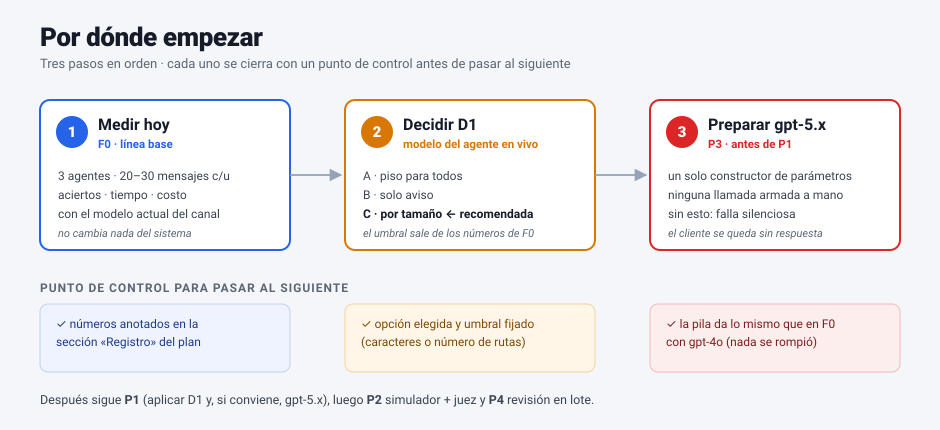
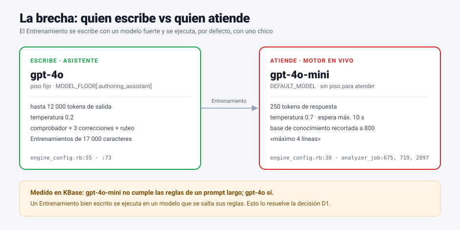
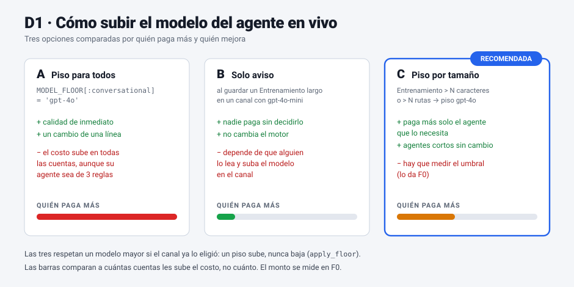
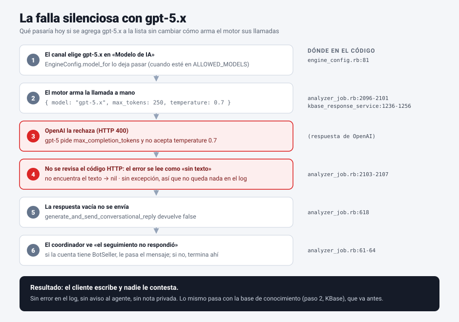
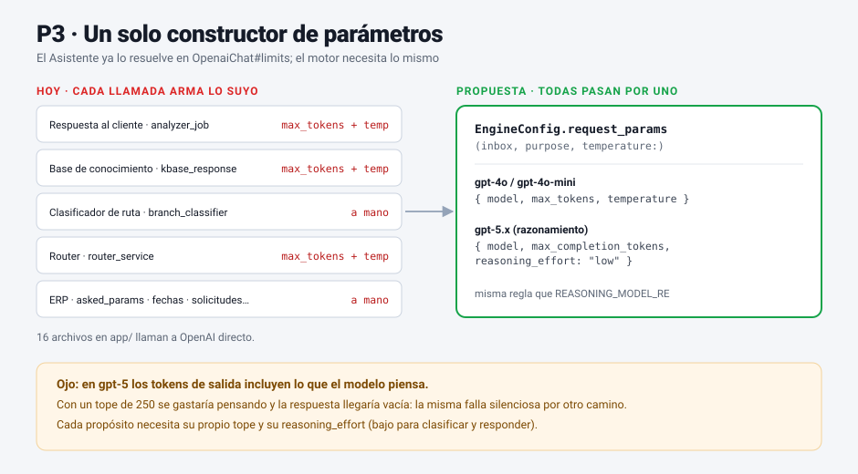

# Diagnóstico del Asistente de Agentes IA — plan de mejoras

> **Rama:** `diag/asistente_agentes_ia` (sale de `develop` en `3e58e050`)
> **Fecha:** 08/10/2026
> **Estado:** SOLO PLAN. No se ha tocado código. Se revisa punto por punto y cada uno se aprueba antes de empezarlo.

---

## 0. La pregunta y la respuesta corta

**¿El Asistente es tan inteligente como una IA de punta para generar los prompts de los agentes?**

Escribe bien. Lo que tiene alrededor del modelo (comprobador, correcciones, prueba de ruteo, optimizador) es mejor que pedirle un prompt a ChatGPT. **El punto débil no está en quién escribe el prompt, sino en lo que pasa después:**

1. El agente en vivo corre en un modelo **más chico** que el que escribió su prompt.
2. **Nadie comprueba lo que el agente contesta**, solo a qué ruta manda cada mensaje.
3. Los modelos nuevos (gpt-5.x) **no se pueden elegir**, ni para escribir ni para atender.

### Cómo está hoy

```
 ┌───────────────────────── ASISTENTE (escribe) ─────────────────────────┐
 │                                                                        │
 │  Persona ──► Chat consultor ───────► Redactor ──────► Entrenamiento    │
 │              gpt-5.4-mini            gpt-4o (piso)        │            │
 │              (DraftingChat)          (InterviewService)   │            │
 │                                          │                │            │
 │                     ┌────────────────────┤                │            │
 │                     ▼                    ▼                │            │
 │              Comprobador sin IA    Prueba de ruteo        │            │
 │              ¿se ejecuta?          ¿cada ruta se elige?   │            │
 │              (3 correcciones)      (1 corrección)         │            │
 └───────────────────────────────────────────────────────────┼────────────┘
                                                             │
                     ⚠ aquí se pierde la calidad             │
                                                             ▼
 ┌───────────────────────── MOTOR EN VIVO (atiende) ──────────────────────┐
 │  Cliente ──► Clasificador ──► Ruta ──► Respuesta al cliente            │
 │              gpt-4o-mini       │       gpt-4o-mini · 250 tokens         │
 │              (por defecto)     │       contexto recortado a 800         │
 │                                │       "máximo 4 líneas"                │
 │                                ▼                                        │
 │                     ✗ nadie califica lo que contestó                    │
 └─────────────────────────────────────────────────────────────────────────┘
```

### A dónde queremos llegar

```
  Asistente escribe ──► Motor ejecuta con el modelo adecuado
          ▲                         │
          │                         ▼
          │              Simulador de conversación (camino REAL)
          │                         │
          │                         ▼
          │              Juez: ¿cumplió las reglas del Entrenamiento?
          │                         │
          └──── propuesta de cambio ◄┘   + revisión en lote de conversaciones reales
```

---

## 0.1 Por dónde empezar

> Se lee en 5 minutos. Explica los **tres primeros pasos** y **por qué van en ese orden**. El detalle de cada punto está más abajo, en su propio apartado.



### Paso 1 · Medir cómo está hoy (F0)

**Qué es:** correr la pila de pruebas de 3 agentes con el modelo que ya tienen y anotar los números. No se cambia nada del sistema.

**Por qué primero:** todo lo que sigue cuesta dinero (un modelo mayor) o tiempo (cambiar el motor). Sin los números de hoy no hay forma de saber si un cambio mejoró algo o solo encareció. Ya pasó con KBase: el cambio de gpt-4o-mini a gpt-4o se decidió porque se midió.

**Cómo, paso a paso:**
1. Elegir los 3 agentes de referencia: ADAM v2.4 (#11833), el v6.11 (17.066 caracteres) y el de variables (#12148).
2. Escribir de 20 a 30 mensajes de cliente por agente, con la ruta a la que **deberían** ir.
3. Correr «Probar el agente» en cada uno y guardar el informe .md.
4. Anotar en la sección «Registro → F0»: aciertos de ruteo, tiempo por respuesta y costo. El costo sale por ahora del panel de uso de OpenAI de la cuenta, porque el sistema todavía no lo guarda (eso es el P6c).
5. Revisar a mano 10 respuestas por agente y marcar cuáles rompen una regla de su Entrenamiento. Este es el número que más interesa, y hoy solo se puede sacar a mano (el P2 lo automatiza).

**Se da por cerrado cuando:** los números están en el Registro.

### Paso 2 · Decidir cómo subir el modelo del agente en vivo (D1)

**Qué es:** elegir entre tres formas de que los agentes con un Entrenamiento grande dejen de correr en gpt-4o-mini.



**El problema, en una frase:** el Asistente escribe el Entrenamiento con gpt-4o y lo revisa tres veces, pero el agente que atiende al cliente lo ejecuta con gpt-4o-mini, que ya medimos que se salta las reglas de un prompt largo.



**Cómo leer las opciones:**
- **A · Piso para todos.** Es una línea de código y la calidad sube al día siguiente, pero a todas las cuentas les sube el costo, aunque su agente tenga 3 reglas.
- **B · Solo aviso.** No cuesta nada, pero depende de que alguien lea el aviso y cambie el modelo del canal.
- **C · Piso por tamaño (recomendada).** Solo sube el modelo de los agentes con un Entrenamiento grande, que son los que gpt-4o-mini no puede seguir. El umbral (caracteres o número de rutas) sale de los números del Paso 1.

**Se da por cerrado cuando:** está elegida la opción y, si es C, fijado el umbral.

> Decidir no es aplicar. La opción elegida se implementa en el P1, **después** del Paso 3.

### Paso 3 · Preparar el motor para gpt-5.x antes de usarlo (P3)

**Qué es:** hacer que todas las llamadas del motor a OpenAI armen sus parámetros en un solo lugar, para que un modelo gpt-5.x funcione en cuanto alguien lo elija.

**Por qué antes de aplicar D1:** porque si D1 termina en «conviene gpt-5.x» y se agrega a la lista tal como está hoy el motor, **el agente deja de contestar sin que nadie se entere**. Así pasaría:



**La falla, paso a paso:**
1. El canal elige gpt-5.x en «Modelo de IA».
2. El motor arma la llamada a mano con `max_tokens: 250` y `temperature: 0.7` (`contact_tracking_response_analyzer_job.rb:2096-2101`).
3. OpenAI la rechaza: los modelos gpt-5 piden `max_completion_tokens` y no aceptan esa temperatura.
4. El motor no revisa el código HTTP. Busca el texto de la respuesta, no lo encuentra y devuelve vacío. Como no hubo excepción, **no se escribe nada en el log** (`:2103-2107`).
5. La respuesta vacía no se envía (`:618`).
6. El coordinador ve que el seguimiento «no respondió». Si la cuenta tiene BotSeller, le pasa el mensaje; si no, termina ahí (`:61-64`).

**Resultado:** el cliente escribe y nadie le contesta. No hay error en el log, ni aviso al agente humano, ni nota privada. Lo mismo pasa antes en la base de conocimiento (`knowledge_base_response_service.rb:1236-1256`), que arma su llamada igual.

**El arreglo:**



1. Crear `EngineConfig.request_params`, que devuelve los parámetros correctos según el modelo. Es la misma regla que el Asistente ya usa en `OpenaiChat#limits`.
2. Pasar las llamadas del motor a ese constructor **una por una, sin cambiar todavía el modelo**. Así cualquier diferencia en la pila es culpa del cambio, no del modelo.
3. Hacer que las llamadas **revisen el código HTTP** y registren el error. Con eso, una falla futura deja rastro aunque no sea de gpt-5.
4. Correr la pila de F0 con gpt-4o: tiene que dar lo mismo que en el Paso 1.
5. Recién entonces agregar gpt-5.x a `ALLOWED_MODELS`, `MODEL_RANK` y al selector del canal (`apps.yml`), con un tope de tokens y un `reasoning_effort` por propósito.

**Se da por cerrado cuando:** ninguna llamada del motor arma sus parámetros a mano, todas registran el error de OpenAI, y la pila con gpt-4o da lo mismo que en F0.

### Después de estos tres pasos

Con los números (Paso 1), la decisión (Paso 2) y el motor listo (Paso 3), el **P1** aplica la opción elegida sin riesgo y se mide contra F0. Siguen el **P2** (simulador + juez) y el **P4** (revisión en lote).

---

## 1. Mapa de puntos

| # | Punto | Impacto | Esfuerzo | Depende de |
|---|-------|---------|----------|------------|
| F0 | Línea base: medir antes de cambiar | — | bajo | — |
| P1 | El agente en vivo corre en un modelo menor | **alto** | bajo-medio | F0 · D1 · P3 |
| P2 | Las pruebas no califican respuestas | **muy alto** | alto | P3 (deseable) |
| P3 | Los modelos gpt-5.x no se pueden elegir | alto | medio | — |
| P4 | Revisar conversaciones reales en lote | medio-alto | medio | P2 (el juez) |
| P5 | Cada edición reescribe todo el Entrenamiento | medio | medio-alto | — |
| P6 | Ajustes técnicos: esquema JSON y caché | bajo-medio | bajo | — |
| P7 | Sin Entrenamiento, el agente dice no ser bot (casi resuelto) | bajo | bajo | D7 |

### Orden propuesto

```
  F0 ──► P3 ──► P1 ──► P2 ──► P4
  (medir) (permitir   (usar    (simular  (revisar
          gpt-5.x)    mejor    y juzgar) en lote)
                      modelo)
  En paralelo, cuando haya hueco:  P6 · P7 · P5
```

P3 va antes que P1 porque P1 quiere elegir entre gpt-4o y gpt-5.x, y hoy gpt-5.x no se puede elegir. Agregarlo a la lista sin preparar el motor haría que el agente deje de contestar sin dejar rastro: ver «0.1 Por dónde empezar → Paso 3».

---

## F0 · Línea base: medir antes de cambiar

**Por qué:** sin números de hoy no podremos decir si un cambio mejoró algo. Ya pasó en KBase: el cambio de gpt-4o-mini a gpt-4o se decidió midiendo.

**Qué se mide:**

| Métrica | Cómo | Dónde existe ya |
|---------|------|-----------------|
| Aciertos de ruteo | pila de pruebas del agente | `TestBattery`, `SuggestedTests` |
| Respuestas que rompen una regla | revisión manual de N conversaciones | `ConversationReview` (una por una) |
| Correcciones por turno del redactor | `repairs` del resultado | `InterviewService#repair_grammar` |
| Tiempo por turno al editar | ya medido: 40–52 s por llamada | nota en `interview_service.rb:54` |
| Costo por turno | tokens de entrada/salida de OpenAI | **no se guarda hoy** |

**Agentes de prueba:** ADAM v2.4 (#11833), el v6.11 (17.066 caracteres) y el agente de variables (#12148).

**Pasos:**
- [ ] Elegir 3 agentes de referencia y 20–30 mensajes de cliente por agente
- [ ] Correr la pila de cada agente con el modelo actual del canal
- [ ] Anotar aciertos, tiempos y costo en la sección «Registro» de este documento
- [ ] Decidir qué número tiene que mejorar cada punto para darlo por bueno

---

## P1 · El agente en vivo corre en un modelo menor que el que lo escribió

### Problema
El Asistente escribe con **gpt-4o** (piso fijo), pero el agente que atiende clientes usa lo que diga el canal, y **por defecto es gpt-4o-mini**. Ya está medido en KBase que gpt-4o-mini **no cumple las reglas de un prompt largo**. Un Entrenamiento bien escrito se ejecuta en un modelo que se salta sus reglas.

Además, la respuesta al cliente sale con límites muy cortos.

### Evidencia
| Qué | Dónde |
|-----|-------|
| `DEFAULT_MODEL = 'gpt-4o-mini'` | `app/services/contact_trackings/engine_config.rb:30` |
| Piso de modelo solo para el Asistente y solicitudes, **no** para atender | `engine_config.rb:73` |
| Respuesta conversacional: 250 tokens, temperatura 0.7 | `engine_config.rb:42` · `contact_tracking_response_analyzer_job.rb:2097-2100` |
| Base de conocimiento recortada a 800 caracteres | `contact_tracking_response_analyzer_job.rb:675` |
| «Máximo 4 líneas» | `contact_tracking_response_analyzer_job.rb:719-721` |
| Tiempo de espera de 10 s en esa llamada | `contact_tracking_response_analyzer_job.rb:2090` |

### Propuesta (opciones a decidir)

```
  Opción A — Piso por propósito          Opción B — Aviso, sin forzar
  ───────────────────────────────        ──────────────────────────────
  MODEL_FLOOR[:conversational]           Al guardar un Entrenamiento largo
    = 'gpt-4o'                           en un canal con gpt-4o-mini,
  Todos los agentes suben de golpe.      el Asistente avisa: "este agente
  + calidad inmediata                    no va a seguir sus reglas en
  − costo sube en todas las cuentas      gpt-4o-mini; súbelo en el canal".
                                         + nadie paga sin decidir
                                         − depende de que lo lean

  Opción C — Piso por tamaño del Entrenamiento (recomendada)
  ───────────────────────────────────────────────────────────
  Si el Entrenamiento pasa de N caracteres o de N rutas → piso gpt-4o.
  Si es corto → se respeta lo que diga el canal.
  + paga más solo quien tiene un agente que lo necesita
```

Los límites (250 tokens, 800 caracteres y 4 líneas) se revisan **aparte** y solo con la medición de F0: subirlos alarga las respuestas en WhatsApp, y eso también es una decisión de producto.

### Pasos
- [ ] Decidir A, B o C (decisión **D1**)
- [ ] Si es C: fijar el umbral con los agentes de F0
- [ ] Implementar en `EngineConfig` (un solo lugar, como pide su propia cabecera)
- [ ] Revisar si el tope de 10 s alcanza con gpt-4o (y con gpt-5.x, ver P3)
- [ ] Medir los límites 250 / 800 / 4 líneas por separado (decisión **D2**)
- [ ] Repetir la pila de F0 y comparar

### Riesgos
- **Costo.** gpt-4o cuesta varias veces lo que gpt-4o-mini. Hay que medirlo con tráfico real antes de subirlo para todos.
- Respuestas más lentas en el canal.

---

## P2 · Las pruebas no califican lo que contesta el agente

### Problema
Todo lo que existe para probar revisa **a qué ruta va** un mensaje y **qué fragmentos trae** la fuente. Nada revisa **qué le contestaría el agente al cliente**. Un agente puede rutear perfecto y aun así:
- inventar un precio,
- prometer algo que su Entrenamiento prohíbe,
- tratar de usted cuando debía tutear,
- no pedir el dato que la ruta exige.

Fue una decisión **deliberada** (`dry_run_service.rb:20-33`): la respuesta la arma `KnowledgeBaseResponseService#generate_contextual_reply`, atado a una conversación real, y armar una «respuesta parecida» por otro camino sería mentir. **La decisión era correcta; lo que falta es poder correr el camino real sin una conversación real.**

### Evidencia
| Qué | Dónde |
|-----|-------|
| La prueba en seco no redacta la respuesta | `app/services/contact_trackings/assistant/dry_run_service.rb:20` |
| Los tests sugeridos solo pasan por el clasificador | `suggested_tests.rb` |
| La pila de pruebas arranca con botón (costo) | `test_battery.rb` (decisión D4 del plan de importar) |

### Propuesta

```
  1. Conversación simulada           2. Camino REAL                 3. Juez
  ──────────────────────────         ─────────────────────          ─────────────────────
  Objeto en memoria con la          generate_contextual_reply       Modelo fuerte (gpt-4o
  misma forma que Conversation:     recibe la simulación en vez     o gpt-5.x) recibe:
  mensajes, contacto, canal,        de la conversación real.        · el Entrenamiento
  variables.                        ✗ no crea Message                · la pregunta
  Sin escribir en la base.          ✗ no envía nada                  · la respuesta
                                    ✗ no abre casos                  · los fragmentos
                                                                    y devuelve, regla por
                                                                    regla: cumple / rompe
                                                                    / no aplica, con cita.
```

- El juez **no corrige**, solo señala. La corrección la sigue haciendo el chat del Asistente si la persona la pide, igual que hoy con `ConversationReview`.
- Escenarios de **varios turnos**, no solo un mensaje suelto (pedir un dato, que el cliente no lo dé, que lo dé después).
- Las fuentes externas en vivo (Discourse, Contpaq, ERP, hoja en modo Datos) se siguen marcando como «no se corre en seco», o se les da una respuesta grabada.

### Pasos
- [ ] Leer `generate_contextual_reply` completo y listar todo lo que toma de la conversación real
- [ ] Diseñar la conversación simulada (decisión **D3**: objeto en memoria o transacción con rollback)
- [ ] Hacer que el camino real acepte la simulación **sin cambiar** lo que hace con una conversación real
- [ ] Escribir el juez con salida en esquema estricto (ver P6)
- [ ] Agregar el informe del juez al informe .md de la pila de pruebas
- [ ] Probar con ADAM y el v6.11: ¿encuentra lo que ya sabemos que está mal?

### Riesgos
- **El más alto:** que la simulación se salga y escriba en una conversación real. Recordar que el entorno de pruebas corre contra `chatwoot_dev` y ya borró conversaciones reales.
- Costo: cada escenario es una respuesta más una calificación. Se queda con botón, nunca automático.
- Un juez con un modelo chico opina en vez de verificar. Se usa el modelo fuerte.

---

## P3 · Los modelos gpt-5.x no se pueden elegir

### Problema
La lista de modelos permitidos solo conoce gpt-4 y gpt-3.5. Aunque alguien quiera usar gpt-5.x para atender o para escribir, **no puede**. Y no basta con agregarlo a la lista: el motor en vivo arma sus llamadas a mano con `max_tokens` y `temperature`, **parámetros que los modelos gpt-5 no aceptan**. El Asistente ya resuelve esto (`OpenaiChat#limits`); el motor no.

### Evidencia
| Qué | Dónde |
|-----|-------|
| `ALLOWED_MODELS = %w[gpt-4o-mini gpt-4o gpt-4-turbo gpt-3.5-turbo]` | `engine_config.rb:35` |
| `MODEL_RANK` solo ordena esos cuatro | `engine_config.rb:75` |
| El selector del canal tiene el mismo enum | `config/integration/apps.yml:31` |
| El Asistente ya distingue modelos de razonamiento | `assistant/openai_chat.rb:24` (`REASONING_MODEL_RE`) y `:59-62` |
| El motor manda `max_tokens` + `temperature` a mano | `knowledge_base_response_service.rb:1236-1256` · `contact_tracking_response_analyzer_job.rb:2096-2101` · `branch_classifier_service.rb:74` · `router_service.rb:209` · `external_db/asked_params.rb:85` |
| Archivos que llaman a OpenAI directo | 16 en `app/` |
| El chat consultor ya midió gpt-5.x | `drafting_chat.rb:26-29` (gpt-5.5: nivel ChatGPT, pero 55 s) |

### Propuesta

```
                    ┌──────────────────────────────┐
  cada llamada ───► │ EngineConfig.request_params  │ ──► { model, max_tokens, temperature }
  del motor         │ (model, purpose, temp)       │       o
                    └──────────────────────────────┘     { model, max_completion_tokens,
                                                           reasoning_effort }
```

- Un solo constructor de parámetros, igual al que ya tiene `OpenaiChat`, para que ninguna llamada vuelva a armarlos a mano.
- Agregar gpt-5.x a `ALLOWED_MODELS`, `MODEL_RANK` y `apps.yml` (el spec `engine_config_spec.rb` ya verifica que coincidan).
- **Ojo con el razonamiento:** en gpt-5 los tokens de salida incluyen lo que el modelo piensa. Un tope de 250 se gastaría pensando y la respuesta llegaría vacía. Cada propósito necesita su tope y su `reasoning_effort` (bajo para clasificar y responder).
- Revisar los tiempos de espera: 10 s en la respuesta al cliente puede no alcanzar.

### Pasos
- [ ] Listar las 16 llamadas y cuáles son del motor de seguimientos
- [ ] Crear el constructor de parámetros en `EngineConfig`
- [ ] Pasar las llamadas del motor a ese constructor, una por una, sin cambiar el modelo todavía
- [ ] Que cada llamada revise el código HTTP y registre el error de OpenAI (hoy un rechazo se lee como «sin texto» y no deja log: `contact_tracking_response_analyzer_job.rb:2103-2107`)
- [ ] Correr la pila de F0 con gpt-4o: tiene que dar lo mismo
- [ ] Agregar gpt-5.x a la lista, al orden y al selector del canal
- [ ] Decidir qué modelo usa el redactor del Asistente (decisión **D4**)
- [ ] Medir con F0: aciertos, tiempo y costo de gpt-4o contra gpt-5.x

### Riesgos
- Una llamada que se quede con `max_tokens` falla **en silencio** con gpt-5 (el motor devuelve nil y el cliente no recibe nada).
- Latencia: gpt-5.5 tardó 55 s en el chat consultor. Para atender clientes sirve un modelo rápido, no el más grande.

---

## P4 · Revisar conversaciones reales en lote

### Problema
`ConversationReview` funciona bien (separa si la causa es el Entrenamiento, la configuración o el motor), pero **una conversación a la vez**, pegando el link en el chat. Nadie revisa sistemáticamente cómo le va a un agente con clientes reales.

### Evidencia
| Qué | Dónde |
|-----|-------|
| Revisión de una conversación | `assistant/conversation_review.rb` |
| Copia vieja del Entrenamiento en seguimientos | ya detectado: los seguimientos usan una copia vieja |

### Propuesta

```
  Botón «Revisar las últimas N conversaciones» del agente
     │
     ├─► ConversationReview por cada una (lo que ya existe)
     │
     ├─► Agrupar hallazgos: misma regla rota en 7 de 20 → un solo hallazgo
     │
     └─► Informe: lo que más se repite primero, con links a la evidencia,
         y una propuesta de cambio que el chat del Asistente aplica si se pide
```

### Pasos
- [ ] Decidir cuántas conversaciones y cuáles: últimas N, solo las que pasaron a humano, solo las de una etiqueta (decisión **D5**)
- [ ] Correrlo como job con avance (como la pila de pruebas), nunca en la petición
- [ ] Agrupar hallazgos repetidos
- [ ] Reusar el juez de P2 para que las dos herramientas califiquen igual

### Riesgos
- Costo: N revisiones con gpt-4o. Con botón y tope de N.
- Privacidad: el informe trae texto de clientes. Se queda dentro de la cuenta.

---

## P5 · Cada edición reescribe todo el Entrenamiento

### Problema
Para cambiar una regla, el modelo devuelve el Entrenamiento **completo**. En el v6.11 eso son 17.066 caracteres y más de 4.000 tokens de salida por llamada, con **40–52 s** por llamada. El turno tiene un tope de **200 s**: con tres correcciones más la del ruteo, se queda sin tiempo. Ya hay una red (`repair_edit` detecta lo destructivo que no se pidió), pero reescribir todo es la causa de que haga falta.

### Evidencia
| Qué | Dónde |
|-----|-------|
| Se pide el Entrenamiento completo | `assistant/interview_service.rb:25-34` |
| 40–52 s por llamada, proxy corta a 300 s | `interview_service.rb:54-59` |
| Tope de salida subido a 12.000 por esto | `engine_config.rb:49-55` |

### Propuesta

```
  Hoy                                    Propuesta
  ───────────────────────────────        ──────────────────────────────────
  Modelo devuelve 17.000 caracteres      Modelo devuelve solo las piezas tocadas:
  → se compara contra lo que había       [{ "pieza": "@ruta(soporte)",
  → si borró algo, se le regresa           "nuevo": "…texto…" }]
                                         → DraftPieces las reemplaza
                                         → el resto NO puede cambiar
```

- Ya existe `DraftPieces` (lo usa el optimizador para restaurar piezas), así que la base está.
- Al **crear** se sigue pidiendo completo. Esto es solo para **editar**.

### Pasos
- [ ] Confirmar que `DraftPieces` sabe partir y reemplazar cualquier pieza (secciones y rutas)
- [ ] Contrato nuevo de salida para editar: lista de piezas
- [ ] Mantener el contrato viejo como respaldo si el modelo devuelve completo
- [ ] Medir tiempo y costo contra F0 con el v6.11

### Riesgos
- Cambios que cruzan piezas (renombrar una etiqueta usada en 5 rutas) necesitan que el modelo devuelva las 5. El comprobador lo detecta.

---

## P6 · Ajustes técnicos: esquema JSON y caché

### 6a · Esquema estricto en vez de JSON libre
**Hoy:** `response_format: { type: 'json_object' }` (`assistant/openai_chat.rb:49`). OpenAI garantiza que la respuesta sea JSON, pero **no qué llaves trae**. Por eso existen `EmptyPromise` (ni preguntó ni entregó) y la vuelta extra cuando falta `modo`.
**Propuesta:** `json_schema` con `strict: true` para `mensaje`, `entrenamiento`, `modo`, `toca` y `cambios`.
- [ ] Definir el esquema del redactor, del chat consultor y del juez (P2)
- [ ] Medir si bajan las vueltas extra

### 6b · Caché de prompts
**Hoy:** el prompt del redactor se arma como *contrato fijo → inventario de la cuenta → instrucciones fijas → …* (`interview_service.rb:350-358`). OpenAI cachea **el principio común** del prompt, así que el inventario en medio corta la parte fija.
**Propuesta:** todo lo fijo primero y lo de la cuenta después.
- [ ] Reordenar y comprobar que el modelo se comporte igual (pila de F0)
- [ ] Guardar los tokens cacheados que devuelve OpenAI para ver el ahorro

### 6c · Registrar costo
Hoy no se guarda cuántos tokens gasta cada turno. Sin eso, F0 y P1 se deciden a ciegas.
- [ ] Guardar los tokens de entrada, salida y caché por llamada del Asistente

---

## P7 · El agente sin Entrenamiento dice no ser bot

### Estado: casi resuelto

El caso grave **ya está corregido**. Con ADAM, la respuesta que se daba cuando la fuente no resolvía fingía ser una persona y tuteaba. Se arregló en el commit `5784ce86` (importar extenso F5–F7, entró a develop con el PR #65, decisión D5 del 29/09/2026). Hoy, **si el agente tiene Entrenamiento**, manda el Entrenamiento: su trato, su tono, y si le preguntan si es persona, no lo afirma (`contact_tracking_response_analyzer_job.rb:706-715`).

### Lo que queda
**Sin Entrenamiento**, la instrucción sigue diciendo:

> «Responde como un humano amable y conocedor del tema. NUNCA menciones que eres un bot o sistema automático.» (`:708-709`)

Solo afecta a los seguimientos que no tienen Entrenamiento cargado.

- [ ] Decidir si un seguimiento sin Entrenamiento puede negar que es bot (decisión **D7**)
- [ ] Si no: cambiar la frase por la misma regla del caso con Entrenamiento («si te preguntan si eres una persona, no lo afirmes»)
- [ ] Borrar `conversational_fallback` (`:726`): no lo llama nadie en `app/`, `lib/` ni `spec/`. Es código muerto que todavía dice «un asesor te contactará».

---

## 2. Decisiones abiertas

| # | Decisión | Opciones | Recomendación |
|---|----------|----------|---------------|
| D1 | Cómo subir el modelo del agente en vivo | A piso para todos · B solo aviso · C piso por tamaño | **C**, con umbral medido en F0 |
| D2 | ¿Se tocan los límites 250 tokens / 800 caracteres / 4 líneas? | sí · no · por agente | medir primero, decidir después |
| D3 | Conversación simulada | objeto en memoria · transacción con rollback | **en memoria**: no hay escritura que revertir |
| D4 | Modelo del redactor del Asistente | gpt-4o (hoy) · gpt-5.4-mini · gpt-5.5 | medir con F0; ojo con el tope de 200 s |
| D5 | Qué conversaciones revisa el lote | últimas N · las que pasaron a humano · por etiqueta | las que pasaron a humano: ahí falló algo |
| D6 | ¿El juez y la pila corren solos alguna vez? | solo con botón · programado | **solo con botón** (costo) |
| D7 | ¿Un seguimiento sin Entrenamiento puede negar que es bot? | sí (como hoy) · no | **no**: misma regla que con Entrenamiento («si te preguntan si eres persona, no lo afirmes») |

---

## 3. Registro por fase

> Al cerrar cada pieza se anota aquí: qué se hizo, cómo funciona, la pila de pruebas y cómo pedírselo al Asistente.

### F0 · Línea base
- **Qué se hizo:**
- **Resultados:**
- **Pila de pruebas:**

### P3 · Modelos gpt-5.x
- **Qué se hizo:**
- **Cómo funciona:**
- **Pila de pruebas:**
- **Cómo pedírselo al Asistente:**

### P1 · Modelo del agente en vivo
- **Qué se hizo:**
- **Cómo funciona:**
- **Pila de pruebas:**
- **Cómo pedírselo al Asistente:**

### P2 · Simulador y juez
- **Qué se hizo:**
- **Cómo funciona:**
- **Pila de pruebas:**
- **Cómo pedírselo al Asistente:**

### P4 · Revisión en lote
- **Qué se hizo:**
- **Cómo funciona:**
- **Pila de pruebas:**
- **Cómo pedírselo al Asistente:**

### P5 · Editar por piezas
- **Qué se hizo:**
- **Cómo funciona:**
- **Pila de pruebas:**

### P6 · Esquema, caché y costo
- **Qué se hizo:**
- **Pila de pruebas:**

### P7 · Sin Entrenamiento dice no ser bot
- **Qué se hizo:**
- **Pila de pruebas:**
