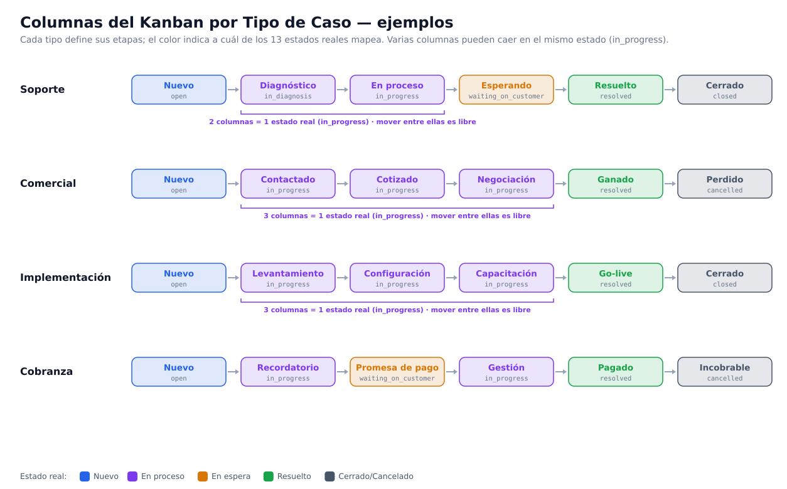

# Plan — Columnas del Kanban por Tipo de Caso

> Estado: 📋 **solo plan** (2026-07-28). Nada implementado.
> Alcance elegido: **Opción A+** — la columna se **guarda en el ticket** como
> sub-estado. `status` sigue siendo el estado canónico para SLA, reglas,
> reportes y portal; la columna solo refina dónde cae dentro de ese estado.
> Relacionado: [[Plan-Practicidad-osTicket]] · [[case_type-tabla-configurable]] · [[Pendiente]]

---

## 0. Qué se va a programar (resumen)

Solo el **tablero Kanban de tickets** (`@tickets_cases`). Nada de esto toca el
enum `status`, `VALID_TRANSITIONS`, SLA, reglas, reportes ni el portal.

### Base de datos — 1 tabla nueva + 1 columna nueva

- [ ] Tabla `case_type_columns`: `account_id`, `case_type_id`, `label`, `color`, `position`, `statuses` (jsonb), timestamps. FK a `case_types` con `on_delete: :cascade`.
- [ ] Columna `case_tickets.case_type_column_id` (bigint, nullable) + índice + FK con `on_delete: :nullify`.

### Backend — 4 piezas

- [ ] **Modelo `CaseTypeColumn`**: asociaciones, `scope :ordered`, validación de `statuses` (subset del enum, no vacío). **Sin** validación de solape — el solape es la funcionalidad.
- [ ] **`CaseType`**: `has_many :case_type_columns, dependent: :destroy`.
- [ ] **Hook `resync_type_column` en `CaseTicket`** — `before_save` cuando cambia `status` o `case_type_id`: si el puntero deja de cumplir el invariante, se pone en `NULL`. **Es la pieza crítica del plan.**
- [ ] **Controller + rutas** anidados bajo `case_types` en `path: 'columns'`: `index`, `create`, `update`, `destroy` + `PUT replace` (guarda el set completo del tipo en una transacción, valida cobertura de los 13 estados y limpia punteros que quedaron fuera).

### Backend — mover un ticket

- [ ] Extender el endpoint de mover con dos ramas:
      **misma columna-estado** → solo cambia el puntero, `status` intacto, siempre legal;
      **otro estado** → lógica de hoy contra `can_transition_to`, cambia estado y puntero juntos.
- [ ] Registrar el cambio de columna en `case_events` (una línea; habilita reportes por etapa después).

### Backend — serialización

- [ ] `columns` dentro del JSON de `case_types` (evita un round-trip en el Kanban).
- [ ] `case_type_column_id` en el JSON del ticket y en **`push_event_data`** (`case_ticket.rb:197`), o el realtime deja los tickets en la columna equivocada.

### Frontend — configuración

- [ ] `api/caseTypeColumns.js` (calcado de `caseTypeFields.js`).
- [ ] Store `caseTickets.js`: estado `typeColumns`, getters, actions, mutations.
- [ ] Panel **"Columnas"** en `TicketTypes.vue`: CRUD, orden por arrastre, helper de cobertura, aviso informativo de solape.
- [ ] Claves i18n en `gestorTickets.json`.

### Frontend — tablero

- [ ] `<select>` de Tipo de Caso en la barra de filtros (el endpoint ya lo soporta).
- [ ] `columns()` lee del store, con fallback a las constantes de hoy.
- [ ] `grouped()` ubica por `case_type_column_id`, con fallback por `status`.
- [ ] `onDrop()` con atajo de mismo-estado: **sin abrir el modal de cambio de estado**.
- [ ] `columnLabel()` soporta `label` de BD.

### Fase 4 (diferible)

- [ ] Matriz completa de `VALID_TRANSITIONS` disponible en el front.
- [ ] Aviso al guardar cuando dos columnas contiguas de estados distintos no tienen camino legal entre ellas.

---

## 1. Por qué

Hoy las columnas del tablero son **dos constantes JS hardcodeadas** en
`app/javascript/dashboard/views/gestorTickets/Kanban.vue:22` y `:41`:

```
 COLUMNS (modo ITIL, 6)                SIMPLE_COLUMNS (modo simple, 5)
 ─────────────────────────────         ────────────────────────────────
 new       open, classified            new       open
 assigned  assigned, in_diagnosis      progress  classified, assigned,
 progress  in_progress, escalated                in_diagnosis, in_progress,
 waiting   waiting_on_*                          escalated
 resolved  resolved, validating        waiting   waiting_on_*
 closed    closed, cancelled           resolved  resolved, validating
                                       closed    closed, cancelled
```

Se elige una u otra con el flag `itilEnabled` (`Kanban.vue:117`). Todas las
cuentas y **todos los tipos de caso** ven exactamente el mismo tablero.

El problema de negocio: un ticket de *Reparación* y uno de *Comercial* no tienen
el mismo recorrido, pero el tablero los obliga a compartir columnas.

### Por qué A+ y no A (decisión 2026-07-28)

La versión anterior de este plan proponía la **Opción A**: la columna como
*vista derivada* de `status` (agrupar y reetiquetar los 13 estados, sin guardar
nada en el ticket). Más barata, pero con un techo duro:

> Dos columnas del mismo tipo no pueden mapear al mismo estado. El `find` de
> `Kanban.vue:131` devuelve la primera y la segunda queda siempre vacía.

Eso obliga a que **todo flujo real quepa dentro de los 13 estados**. La prueba
para saber si A alcanzaba era listar los tipos reales y contar cuántas columnas
caerían en el mismo estado. **Esa prueba no se puede correr**, y por una razón
estructural, no por falta de datos:

```
   MGCI es multi-cuenta.  Cada cuenta define SUS tipos, con SUS nombres
   y SUS flujos.  Los 5 tipos sembrados (Soporte, Comercial, Implementación,
   Seguimiento interno, Incidente del sistema) son un default, no el universo.

   Cuenta A → "Reparación", "Garantía", "Instalación"
   Cuenta B → "Cobranza", "Licitación", "Postventa"
   Cuenta C → tipos que todavía no existen
              ▲
              └── no hay forma de verificar hoy que ninguno pida
                  dos columnas sobre el mismo estado
```

Un flujo comercial o de implementación es una **secuencia de etapas de trabajo**,
no un ciclo de vida de soporte; sus etapas intermedias son todas `in_progress`:

```
   Comercial       Nuevo → Contactado → Cotizado → Negociación → Ganado
                             ▲            ▲          ▲
                             └── in_progress las tres     ✖ A no da

   Implementación  Nuevo → Levantamiento → Configuración → Capacitación → Go-live
                             ▲               ▲               ▲
                             └── in_progress las tres        ✖ A no da
```

Ejemplos de flujos reales por tipo, con el estado real (de los 13) al que mapea
cada etapa. El corchete marca las columnas que caen sobre el mismo `in_progress`:



Construir A y migrar a A+ después cuesta más que hacer A+ de entrada: A+ **añade
una columna a `case_tickets`** y un hook de resincronización, y a cambio elimina
la validación de solape de A. No es una opción "más grande", es una opción
distinta con casi el mismo tamaño.

> **Alcance:** este plan es **solo del tablero Kanban de tickets**
> (`@tickets_cases` → `views/gestorTickets/Kanban.vue`). El Tablero de
> Oportunidades (`kanban_processes` / `conversations`) es otro módulo, con otros
> datos y otro ciclo de vida: no se reutiliza, no se toca y no sirve de
> referencia. Todo lo que sigue vive sobre `case_types` / `case_tickets`.

### Lo que ya juega a favor

| Pieza | Estado | Dónde |
|---|---|---|
| `CaseType` ya carga config propia por tipo | ✅ existe | `case_type_fields` (2K), mismo molde |
| Endpoint del board acepta `case_type_id` | ✅ existe | `case_tickets_controller.rb:88` |
| `can_transition_to` viaja en cada ticket | ✅ existe | `case_tickets_controller.rb:705` |
| Drag&drop valida transición al soltar | ✅ existe | `Kanban.vue:235-244` |
| Selector de tipo en el Kanban | ❌ falta | filtros hoy: `q`, `ticket_kind`, `priority`, `affected_service_id`, `assignee_id` |
| Columnas en BD + puntero en el ticket | ❌ falta | — |

---

## 2. Alcance

**Dentro:**
1. Cada Tipo de Caso define sus columnas: cantidad libre, etiqueta libre, color y **orden**.
2. Cada columna cubre uno o más `status` del enum existente. **Varias columnas pueden cubrir el mismo estado** — ese es el punto de A+.
3. El ticket guarda en qué columna está (`case_type_column_id`).
4. El Kanban, **filtrado por un tipo**, pinta las columnas de ese tipo.
5. Sin tipo seleccionado (o tipo sin columnas configuradas) → caen las columnas de hoy.
6. Invariante de consistencia + resincronización automática (§7). **Es la pieza crítica del plan.**

**Fuera (sería Opción B, otro plan):**
- Estados propios por tipo. `status` sigue siendo el enum global de 13.
- Transiciones propias por tipo. `VALID_TRANSITIONS` no se toca.
- SLA, reglas, reportes o portal leyendo la columna. Solo leen `status`.

---

## 3. Cómo se ve el resultado

```
 ┌─ Kanban ─────────────────────────────────────────────────────────────┐
 │  Tipo: [ Comercial ▾ ]   Mis Tickets │ Sin Asignar │ Todos │ SLA      │
 ├──────────┬─────────────┬───────────┬─────────────┬─────────┬─────────┤
 │ Nuevo    │ Contactado  │ Cotizado  │ Negociación │ Ganado  │ Perdido │
 │ (open)   │(in_progress)│(in_progress)│(in_progress)│(resolved,│(closed,│
 │          │             │           │             │ closed) │ cancel.)│
 └──────────┴─────────────┴───────────┴─────────────┴─────────┴─────────┘
                  ▲            ▲            ▲
                  └────────────┴────────────┘
                  tres columnas, un solo estado real.
                  Mover entre ellas NO toca la máquina de estados: es libre.

 ┌─ Kanban ─────────────────────────────────────────────────────────────┐
 │  Tipo: [ Soporte ▾ ]                                                 │
 ├──────────┬──────────────┬───────────┬────────────┬──────────┬────────┤
 │ Nuevo    │ Diagnóstico  │ En proceso│ Esperando  │ Resuelto │ Cerrado│
 │ (open)   │(classified,  │(in_prog., │(waiting_*) │(resolved,│(closed,│
 │          │ assigned,    │ escalated)│            │validating)│cancel.)│
 │          │ in_diagnosis)│           │            │          │        │
 └──────────┴──────────────┴───────────┴────────────┴──────────┴────────┘
                  ▲
                  └── un flujo de soporte cabe en los 13 estados sin repetir:
                      A habría bastado para este tipo, no para el de arriba.
```

Distinto número de columnas, distinto orden, mismos 13 estados por debajo.

---

## 4. Modelo de datos

```
 accounts
    │
    └─ case_types                       (ya existe)
          ├─ case_type_fields           (ya existe — 2K, campos por tipo)
          └─ case_type_columns   ◀── NUEVO
                 id
                 account_id      FK
                 case_type_id    FK
                 label           string   "Cotizado"
                 color           string   "#f59e0b"
                 position        integer  orden en el tablero (0..n)
                 statuses        jsonb[]  ["in_progress"]
                 created_at / updated_at

 case_tickets
    └─ case_type_column_id   ◀── NUEVO, FK nullable
```

**Migración** `db/migrate/XXXXXXXX_create_case_type_columns.rb`:

```ruby
create_table :case_type_columns do |t|
  t.bigint  :account_id,   null: false
  t.bigint  :case_type_id, null: false
  t.string  :label,    null: false
  t.string  :color,    null: false, default: '#64748b'
  t.integer :position, null: false, default: 0
  t.jsonb   :statuses, null: false, default: []
  t.timestamps
end
add_index :case_type_columns, %i[case_type_id position],
          name: 'index_case_type_columns_on_type_and_position'
add_foreign_key :case_type_columns, :accounts,   column: :account_id
add_foreign_key :case_type_columns, :case_types, column: :case_type_id, on_delete: :cascade

add_column :case_tickets, :case_type_column_id, :bigint, null: true
add_index  :case_tickets, :case_type_column_id
add_foreign_key :case_tickets, :case_type_columns,
                column: :case_type_column_id, on_delete: :nullify
```

`on_delete: :nullify` en el puntero del ticket es deliberado: borrar una columna
no puede borrar tickets, y un `case_type_column_id` en `NULL` cae solo al
fallback por `status` (§5). Borrar una columna es una operación segura.

Sin migración de datos: los tipos existentes arrancan sin columnas, todos los
tickets con `case_type_column_id = NULL`, y el tablero se comporta como hoy.

---

## 5. Las dos reglas que definen A+

Todo el plan se sostiene sobre estas dos. El resto es CRUD.

### Regla 1 — Ubicación: puntero primero, `status` de respaldo

```js
// Kanban.vue — grouped()
const col = t.case_type_column_id
  ? columns.find(c => c.id === t.case_type_column_id)   // sub-estado guardado
  : columns.find(c => c.statuses.includes(t.status));   // fallback por estado
```

El fallback no es un caso raro, es el camino normal para todo lo que no nace en
el tablero: tickets viejos, alta por API, intake de IA, reglas (`case_rules`),
escalado por SLA, cambios desde el detalle del ticket y desde el portal. Todos
esos dejan el puntero en `NULL` y el ticket cae en la **primera columna (por
`position`) que cubra su estado**.

### Regla 2 — Invariante: la columna nunca contradice al estado

```
   INVARIANTE:   ticket.case_type_column_id == NULL
                 ∨  ticket.status ∈ columna.statuses
```

La columna **refina** el estado, nunca lo contradice. Si algo cambia el `status`
por fuera del tablero y el puntero deja de cumplir el invariante, el puntero se
recalcula solo (§7). Esta es la única diferencia de fondo con A —y toda la deuda
que A+ introduce.

---

## 6. Backend

### `app/models/case_type_column.rb` (nuevo)

```ruby
class CaseTypeColumn < ApplicationRecord
  belongs_to :account
  belongs_to :case_type
  has_many   :case_tickets, dependent: :nullify

  validates :label, presence: true, length: { maximum: 60 }
  validates :color, presence: true

  validate :statuses_are_valid   # subset de CaseTicket.statuses.keys, no vacío

  scope :ordered, -> { order(:position, :id) }
end
```

`CaseType` gana `has_many :case_type_columns, dependent: :destroy`.

Validaciones, y qué tapa cada una:

| Validación | Nivel | Qué evita |
|---|---|---|
| `statuses` no vacío y subset del enum | columna | columna que nunca recibe tickets |
| **cobertura total de los 13 estados** | tipo | un ticket con puntero `NULL` en un estado no cubierto no se pinta en ninguna columna |
| ~~sin solape entre columnas~~ | — | **ELIMINADA en A+** — el solape es justamente la funcionalidad |

La cobertura total se valida **a nivel del tipo**, no de la columna suelta (una
columna aislada no sabe qué cubren sus hermanas). Sitio natural: un servicio
`CaseTypeColumns::ReplaceService` que reciba el set completo del tipo y lo
guarde en una transacción — igual que se guarda hoy el panel de campos. Guardar
columna por columna haría imposible pasar por un estado intermedio inválido.

UX de la cobertura: botón *"asignar estados restantes a la última columna"*
(§8). El plan B, si la validación estricta estorba al configurar, es permitir
huecos y mostrar *"N tickets fuera del tablero"*.

### `app/controllers/api/v1/accounts/case_type_columns_controller.rb` (nuevo)

CRUD calcado de `case_type_fields_controller.rb`, anidado igual:

```ruby
# config/routes.rb — junto a la línea 169
resources :case_types, only: [...] do
  resources :case_type_fields,  only: [...], path: 'fields'   # ya existe
  resources :case_type_columns, only: [:index, :create, :update, :destroy],
            path: 'columns' do                                 # NUEVO
    collection { put :replace }   # guarda el set completo del tipo
  end
end
```

```
GET    /api/v1/accounts/:id/case_types/:case_type_id/columns
PUT    /api/v1/accounts/:id/case_types/:case_type_id/columns/replace   ◀ el que usa el panel
POST   /api/v1/accounts/:id/case_types/:case_type_id/columns
PATCH  /api/v1/accounts/:id/case_types/:case_type_id/columns/:id
DELETE /api/v1/accounts/:id/case_types/:case_type_id/columns/:id
```

### Mover un ticket de columna

El endpoint de mover ya existe y valida transición. Se le añade el puntero:

```
 ¿la columna destino cubre el status actual del ticket?
   │
   ├─ SÍ  →  solo  case_type_column_id = destino.id
   │         status NO cambia · VALID_TRANSITIONS no interviene · siempre legal
   │         (esto es "Cotizado → Negociación": movimiento libre)
   │
   └─ NO  →  elegir el primer status de destino.statuses que esté en
             can_transition_to  →  cambiar status Y puntero, en la misma
             transacción.  Si ninguno es alcanzable → rechazo (como hoy).
```

Que la rama SÍ no toque el estado es exactamente lo que A no podía dar.

### Serialización

- `case_types_controller.rb` ya devuelve `custom_fields` por tipo (lo consume
  `TicketTypes.vue:315`). Añadir `columns` al mismo JSON evita un round-trip:
  al cargar los tipos ya vienen sus columnas.
- `case_type_column_id` debe viajar en el JSON del ticket, junto a
  `can_transition_to` (`case_tickets_controller.rb:705`), **y en
  `push_event_data`** (`case_ticket.rb:197`) — si no, un ticket movido por otro
  agente llega por websocket sin puntero y salta a la columna equivocada hasta
  el próximo refresh.

---

## 7. La deuda que A+ introduce: la desincronización

Con A la columna era derivada, así que no podía desincronizarse. Con A+ sí.
**Este apartado es el que hay que leer con cuidado antes de escribir código.**

```
  1. Agente arrastra el ticket a "Negociación"
     → status = in_progress, case_type_column_id = 42   ✔ invariante OK

  2. Otro agente abre el detalle y lo marca "Resuelto"
     → status = resolved,    case_type_column_id = 42   ✖ la col. 42 es in_progress

  3. El tablero lo seguiría pintando en "Negociación".
     Está resuelto y nadie lo ve.
```

Un ticket puede cambiar de `status` por seis vías que no pasan por el tablero:
detalle del ticket, reglas (`case_rules`), escalado por SLA, API, intake de IA y
portal del cliente. Cazarlas una por una es garantía de olvidar alguna.

**Solución: un solo hook en el modelo, no seis parches.**

```ruby
# app/models/case_ticket.rb
before_save :resync_type_column, if: -> { status_changed? || case_type_id_changed? }

def resync_type_column
  return if case_type_column_id.nil?
  col = CaseTypeColumn.find_by(id: case_type_column_id)
  # sigue siendo válida si es del tipo actual y cubre el estado nuevo
  return if col && col.case_type_id == case_type_id && col.statuses.include?(status)

  self.case_type_column_id = nil   # → cae al fallback por status (Regla 1)
end
```

Dejarlo en `NULL` en vez de reasignar a la primera columna del estado nuevo es
deliberado: `NULL` significa *"nadie ha decidido el sub-estado"*, que es la
verdad en ese momento, y el fallback ya lo pinta donde toca. Reasignar
inventaría una decisión que nadie tomó.

El cambio de `case_type_id` entra en el mismo hook por la misma razón: la
columna pertenecía al tipo viejo y no existe en el nuevo.

### Casos límite a cubrir en pruebas

| Caso | Esperado |
|---|---|
| Cambio de status desde el detalle | puntero a `NULL`, ticket salta a la columna correcta |
| Regla / SLA cambia el status en background | igual, sin intervención del agente |
| Se borra la columna donde estaba el ticket | FK `nullify` → fallback, ticket visible |
| Se edita `statuses` de una columna y deja fuera tickets que ya apuntaban | **no lo cubre el hook** — ver abajo |
| Cambia el tipo del ticket | puntero a `NULL` |
| Ticket viejo, anterior a la feature | puntero `NULL` desde siempre → fallback |

El cuarto caso es el único que el hook del ticket no ve, porque el que cambia es
la columna. Se resuelve en el servicio de guardado del panel: tras un `replace`,
un `UPDATE` que ponga a `NULL` los punteros que dejaron de cumplir el invariante.
Una query, en la misma transacción del guardado.

---

## 8. Frontend

### Archivos

| Archivo | Acción |
|---|---|
| `api/caseTypeColumns.js` | **nuevo** — calcado de `caseTypeFields.js` |
| `store/modules/caseTickets.js` | estado `typeColumns`, getters, actions CRUD, mutations |
| `views/gestorTickets/TicketTypes.vue` | **panel nuevo "Columnas"** junto al de Campos |
| `views/gestorTickets/Kanban.vue` | selector de tipo + `columns()` + `grouped()` + `onDrop()` |
| `i18n/.../gestorTickets.json` | claves del panel y del validador |

### `Kanban.vue` — los tres cambios

```js
// :117  columns() — fallback intacto
columns() {
  const custom = this.columnsForSelectedType;   // [] si no hay tipo o no tiene config
  if (custom.length) return custom;
  return this.itilEnabled ? COLUMNS : SIMPLE_COLUMNS;
}

// :131  grouped() — puntero primero (Regla 1). ÚNICO cambio real de A → A+
const col = t.case_type_column_id
  ? this.columns.find(c => c.id === t.case_type_column_id)
  : this.columns.find(c => c.statuses.includes(t.status));

// :235  onDrop() — atajo cuando la columna destino ya cubre el estado
if (target.statuses.includes(ticket.status)) {
  return this.moveColumnOnly(ticket, target);   // sin modal de cambio de estado
}
// ...si no, la lógica de hoy: filtrar contra can_transition_to
```

`columnLabel()` (`:185`) devuelve el `label` de BD cuando la columna es custom, y
la clave i18n cuando es de las fijas.

Se añade `case_type_id` a `data.filters` y su `<select>` en la barra — el
endpoint ya lo soporta (`case_tickets_controller.rb:88`), solo falta exponerlo.

**Detalle de UX que conviene no saltarse:** cuando el movimiento es solo de
columna (mismo estado) no debe abrirse el modal de cambio de estado. Si se abre,
mover "Cotizado → Negociación" pide justificar un cambio de estado que no está
ocurriendo, y el flujo comercial —el motivo entero de A+— queda incómodo de usar.

### Panel de configuración

Reusa el patrón del modal de Campos (`TicketTypes.vue:159` abre, `:461` pinta):

```
 ┌─ Columnas de "Comercial" ────────────────────────────────────┐
 │  ⣿ 1. Nuevo         [#3b82f6]  estados: open           [✎][🗑]│
 │  ⣿ 2. Contactado    [#8b5cf6]  estados: in_progress    [✎][🗑]│
 │  ⣿ 3. Cotizado      [#f59e0b]  estados: in_progress    [✎][🗑]│
 │  ⣿ 4. Negociación   [#f97316]  estados: in_progress    [✎][🗑]│
 │  ⣿ 5. Ganado        [#10b981]  estados: resolved       [✎][🗑]│
 │  ⣿ 6. Perdido       [#64748b]  estados: closed,cancelled     │
 │                                                              │
 │  ℹ 3 columnas comparten «in_progress». Mover un ticket entre │
 │    ellas no cambia su estado — es correcto y esperado.       │
 │                                                              │
 │  ⚠ Sin cubrir: classified, assigned, in_diagnosis,           │
 │    waiting_on_*, escalated, validating                       │
 │    [ Asignar a la última columna ]                           │
 │                                                              │
 │  [+ Añadir columna]                          [Guardar]       │
 └──────────────────────────────────────────────────────────────┘
```

El aviso ℹ del solape es informativo, no un error: en A era la validación que
bloqueaba, en A+ es la funcionalidad. Vale la pena decirlo en la UI porque quien
configure va a dudar.

Orden por arrastre (`⣿`), que persiste `position`. Mismo mecanismo que ya usa
`case_type_fields.position` en el panel de Campos del mismo módulo.

---

## 9. La otra trampa: el orden no crea transiciones

Sigue vigente en A+, pero **solo entre columnas de estados distintos**.

**Ordenar columnas no cambia qué movimientos son legales.** El orden lo dibuja el
usuario en la config; al cruzar de un estado a otro manda `VALID_TRANSITIONS`.

```
  Columnas del tipo:  [ Nuevo ]  ──arrastrar──▶  [ Asignado ]
  Estados mapeados:     open                       assigned

  VALID_TRANSITIONS['open'] = ['classified', 'cancelled']
                                  ▲
                                  └── 'assigned' NO está  ✖ drop rechazado
```

El repo ya tropezó con esto y dejó la solución escrita en `Kanban.vue:38-40`: la
columna "En proceso" del modo simple **incluye `classified`** para que
`open → classified` haga el puente. La regla de diseño:

> Si dos columnas contiguas están en estados distintos, el conjunto de la segunda
> debe incluir el estado-puente que la vuelve alcanzable desde la primera.

A+ suaviza esto bastante: dentro de un mismo estado el movimiento es libre, así
que la trampa solo aparece en las fronteras del flujo, no en cada paso.

### Validador de flujo (Fase 4)

Al guardar, recorrer las columnas en orden y comprobar cada par contiguo:

```
  para i en 0..n-2:
    origen  = columnas[i].statuses
    destino = columnas[i+1].statuses
    si  origen ∩ destino ≠ ∅        → OK, movimiento libre (mismo estado)
    si  ninguna transición VALID_TRANSITIONS[o] ∋ d   (o ∈ origen, d ∈ destino)
    →   ⚠ "No se podrá arrastrar de «Nuevo» a «Asignado».
           Añade 'classified' a «Asignado» para conectarlas."
```

`VALID_TRANSITIONS` ya se expone al front por ticket (`can_transition_to`), pero
para el validador conviene un endpoint con la **matriz completa** — o embeberla
como constante compartida, ya que es estática.

Aviso, no bloqueo: hay flujos legítimos donde una columna se alcanza saltando
(p. ej. "Cerrado" desde cualquier lado), así que impedir el guardado sería peor.

---

## 10. Límites de A+

Lo que A+ **sí** resuelve y A no: cualquier número de columnas sobre el mismo
estado. Techo práctico de columnas por tipo: el que aguante la pantalla.

Lo que A+ **sigue sin** resolver, y sería Opción B:

| Límite | Consecuencia |
|---|---|
| Los 13 estados son globales | dos tipos no pueden tener SLA o reglas distintas por etapa; solo por `status` |
| `VALID_TRANSITIONS` es global | un flujo que necesite `open → in_progress` directo choca, y hay que puentear con `classified` |
| Reportes agregan por `status` | "¿cuántos llevan 3 días en Negociación?" no sale de los reportes actuales — la columna no se historiza en `case_events` |

El tercero es el que más probablemente se pida después. Si se quiere dejar la
puerta abierta sin construirlo ahora, basta con **registrar el cambio de columna
en `case_events`** desde el principio (una línea en el servicio de mover): el
historial queda desde el día uno y el reporte se puede escribir cuando se pida,
sobre datos que ya existen. Sin eso, el día que se pida habrá que empezar a
acumular desde cero.

---

## 11. Fases

```
 F1  Backend        migración (tabla + case_tickets.case_type_column_id)
                    CaseTypeColumn + validación de cobertura
                    hook resync_type_column  ◀ la pieza crítica (§7)
                    CRUD + replace + `columns` en el JSON de case_types
                    case_type_column_id en el JSON del ticket y en push_event_data
                    ────────────────────────────────────────── sin UI, testeable por consola

 F2  Config UI      panel "Columnas" en TicketTypes.vue (CRUD + drag para orden
                    + helper de cobertura + aviso de solape)
                    ────────────────────────────────────────── ya se configura, aún no se usa

 F3  Kanban         selector de tipo en la barra de filtros
                    columns() con fallback · grouped() por puntero
                    onDrop() con atajo de mismo-estado (sin modal)
                    ────────────────────────────────────────── ✅ funcionalidad completa

 F4  Validador      matriz de transiciones al front + aviso de columnas
                    contiguas sin camino legal
                    ────────────────────────────────────────── blindaje contra tableros muertos
```

F1→F3 es el mínimo entregable. F4 se puede diferir, pero sin él la primera
configuración mal armada va a parecer un bug del tablero.

Dentro de F1, `resync_type_column` es lo primero que hay que dejar bien: si el
invariante falla, el síntoma no es un error visible sino tickets que aparecen en
la columna equivocada — el peor tipo de bug para depurar después.

---

## 12. Pruebas

**Backend (consola):**
- Tipo sin columnas → el board responde igual que hoy.
- Columna con estado fuera del enum → rechazada.
- **Tres columnas del mismo tipo con `in_progress` → aceptadas** (regresión de A).
- Guardar un set que deja estados sin cubrir → rechazado (o avisado, según §6).
- Mover a columna del mismo estado → cambia el puntero, `status` intacto, sin evento de cambio de estado.
- Mover a columna de otro estado sin transición legal → rechazado, nada cambia.
- Cambiar `status` desde el modelo → `case_type_column_id` queda en `NULL`.
- Cambiar `case_type_id` → `case_type_column_id` queda en `NULL`.
- Borrar una columna con tickets dentro → tickets intactos, puntero en `NULL`.
- `replace` que reduce los `statuses` de una columna → los punteros que quedan fuera se limpian.
- Borrar un tipo → sus columnas se van en cascada.

**Navegador:**
- Tipo A con 3 columnas y tipo B con 7 → cambiar el selector repinta el tablero.
- "Todos los tipos" → columnas fijas de hoy (5 o 6 según `itilEnabled`).
- Arrastrar entre dos columnas del mismo estado → mueve directo, **sin modal**.
- Arrastrar entre estados bien conectados → abre el modal de mover.
- Arrastrar a una columna sin transición legal → toast `INVALID_MOVE`, sin cambio.
- Con dos navegadores: A mueve de columna, B lo ve saltar en tiempo real (push_event_data).
- Con dos navegadores: A cambia el estado desde el detalle, B lo ve saltar a la columna correcta.
- Reordenar columnas en la config y volver al tablero → orden nuevo respetado.

**Regresión:** modo simple y modo ITIL siguen intactos con tipos sin configurar;
el filtro `case_type_id` del listado (`Index.vue`) no se ve afectado.
